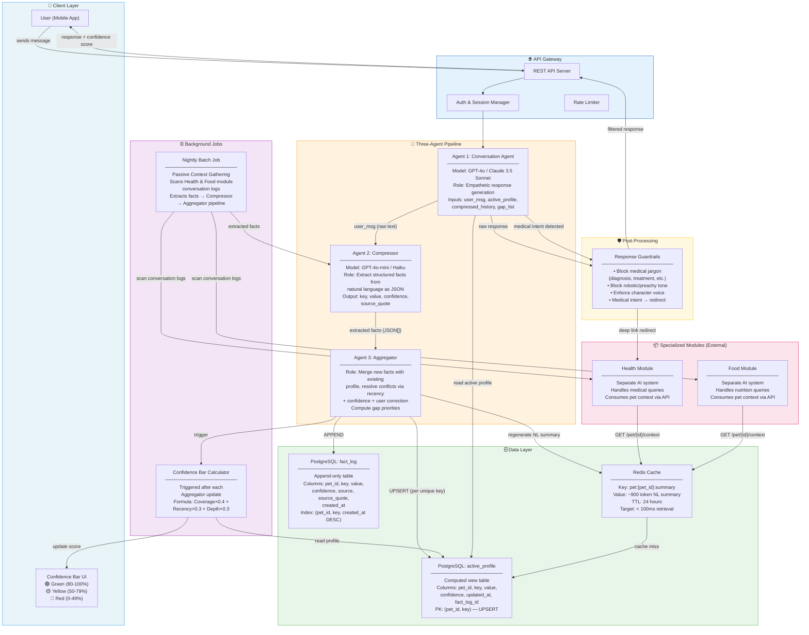
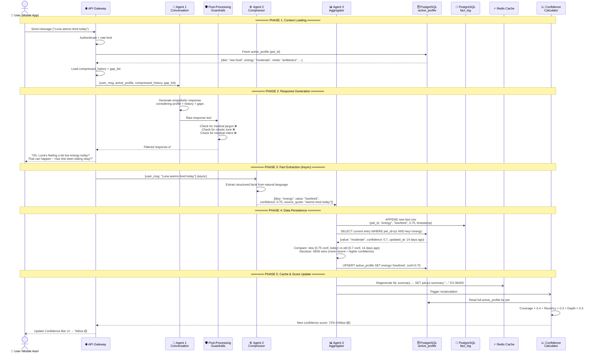
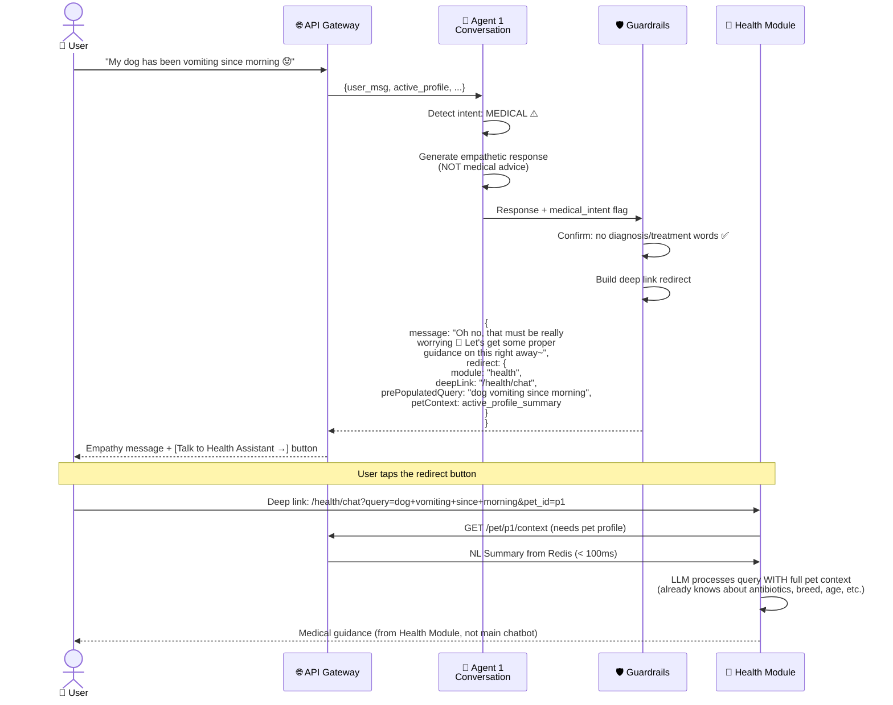
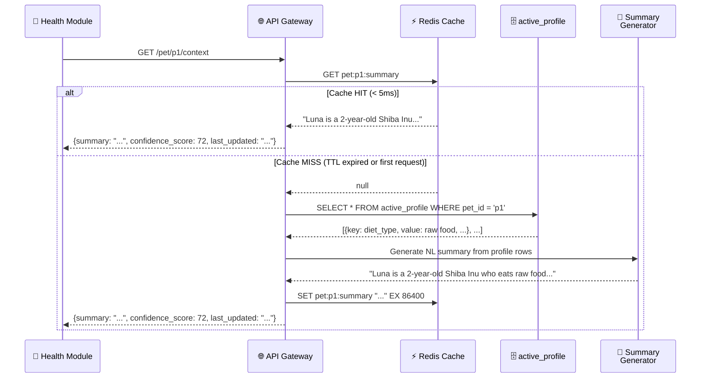
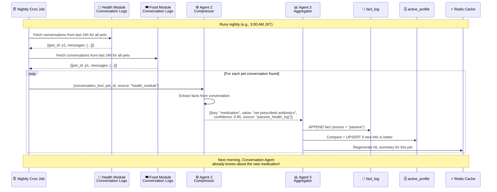

# Pet Health Companion — System Design Document

> **Version:** 1.0
> **Date:** 2026-02-24
> **Status:** Draft

---

## Table of Contents

1. [System Overview](#1-system-overview)
2. [System Architecture Diagram](#2-system-architecture-diagram)
3. [Data Flow Diagram (Sequence)](#3-data-flow-diagram-sequence)
4. [Core Agents — The Three-Agent Pipeline](#4-core-agents--the-three-agent-pipeline)
5. [Data Architecture](#5-data-architecture)
6. [Confidence Bar — Calculation Logic](#6-confidence-bar--calculation-logic)
7. [Information Priority Schema](#7-information-priority-schema)
8. [Integration with Specialized Modules](#8-integration-with-specialized-modules)
9. [Redirection Logic — Guardrails & Deep Links](#9-redirection-logic--guardrails--deep-links)
10. [Passive Context Gathering](#10-passive-context-gathering)
11. [Conversation Context Management](#11-conversation-context-management)
12. [Quality Assurance & Filters](#12-quality-assurance--filters)
13. [User Onboarding Flow](#13-user-onboarding-flow)
14. [Future Roadmap](#14-future-roadmap)

---

## 1. System Overview

This system is a **multi-agent AI companion** designed for pet parents. It is NOT a diagnostic tool, teacher, or data-entry form. Its purpose is to build a long-term relationship with the user by conversationally gathering and maintaining a rich pet profile over time.

**Core Value Proposition:** *"You understand without me having to say everything."*

### Key Characteristics

| Aspect | Description |
|---|---|
| **Architecture** | Three-agent pipeline (Conversation → Compressor → Aggregator) |
| **Data Strategy** | Append-only fact log + computed active profile |
| **Integration** | Serves context to Health & Food modules via REST + Redis |
| **Guardrails** | Never answers medical/nutritional questions directly; redirects to specialized modules |
| **Tone** | Warm, friendly, non-judgmental. No medical jargon. No robotic patterns. |
| **Engagement** | Confidence Bar (green/yellow/red) motivates users to keep information current |

---

## 2. System Architecture Diagram



---

## 3. Data Flow Diagram (Sequence)

### 3.1 Primary Conversation Flow

This sequence diagram shows the complete data flow when a user sends a message and receives a response.



### 3.2 Medical Query — Redirection Flow

This diagram shows what happens when the user asks a medical question that triggers the guardrail redirect.



### 3.3 External Module — Context Retrieval Flow

Shows how Health/Food modules fetch pet context, including the Redis cache-miss fallback.



### 3.4 Nightly Batch — Passive Context Gathering

Shows how the system learns from other modules' conversations without the user explicitly telling it.



---

## 4. Core Agents — The Three-Agent Pipeline

### 4.1 Agent 1: Conversation Agent

| Property | Detail |
|---|---|
| **Responsibility** | Generate empathetic, on-brand responses. This is the ONLY agent the user directly interacts with. |
| **Model** | GPT-4o or Claude 3.5 Sonnet (high emotional intelligence, nuance in Japanese) |
| **Inputs** | `user_message`, `active_profile`, `compressed_history`, `gap_list`, `life_stage` |
| **Output** | Natural language response (passed through guardrail filter before reaching user) |
| **Key Constraint** | Ask only 1–3 questions per session. Never force consecutive questions. |

**What goes into the prompt:**

```
System Prompt:
├── Character guidelines (warm, friendly, not childish, no jargon)
├── Active Profile (~200-500 tokens)
│   ├── Pet: Luna, Shiba Inu, 2 years
│   ├── Diet: raw food (conf: 0.95)
│   ├── Energy: low/tired (conf: 0.75, today)
│   └── Medication: antibiotics (conf: 0.85)
├── Gap List (1-3 highest priority unknowns)
│   ├── Feeding frequency (Rank A, never asked)
│   └── Exercise level (Rank B, 45 days stale)
└── Compressed History (~200-400 tokens)
    └── "Last session: user was worried about appetite. Seemed anxious."

Total context: ~800-1200 tokens — well within limits
```

### 4.2 Agent 2: Compressor

| Property | Detail |
|---|---|
| **Responsibility** | Convert natural language into structured JSON facts |
| **Model** | GPT-4o-mini or Claude Haiku (fast, cheap — this is a structured extraction task) |
| **Input** | Raw user message text |
| **Output** | Array of `{key, value, confidence, source_quote}` |

**Extraction categories:**

- **Nutrition:** diet_type, feeding_frequency, appetite, treats
- **Behavior:** energy_level, sleep_pattern, social_traits
- **Health Flags:** chronic_conditions, medications, recent_symptoms, vet_visits
- **Life Context:** home_alone_frequency, exercise_level, weight_changes

**Example:**

```json
// Input: "Luna seems tired today, she barely touched her kibble this morning"
// Output:
[
  {
    "key": "energy_level",
    "value": "low/tired",
    "confidence": 0.75,
    "source_quote": "seems tired today"
  },
  {
    "key": "appetite",
    "value": "decreased — barely ate",
    "confidence": 0.80,
    "source_quote": "barely touched her kibble this morning"
  },
  {
    "key": "diet_type",
    "value": "kibble",
    "confidence": 0.60,
    "source_quote": "her kibble"
  }
]
```

Note: `diet_type: kibble` has low confidence (0.60) because the user didn't explicitly say "she eats kibble" — she might eat multiple things and kibble was just mentioned.

### 4.3 Agent 3: Aggregator

| Property | Detail |
|---|---|
| **Responsibility** | Merge new facts with existing profile, resolve conflicts, identify gaps |
| **Model** | No LLM needed — this is deterministic logic (code, not AI) |
| **Input** | Extracted facts from Agent 2 + current active_profile rows |
| **Output** | Updated active_profile, updated gap_list, trigger for confidence recalculation |

**Conflict resolution rules (in priority order):**

1. **User explicit correction** always wins (e.g., user says "Actually she eats raw food, not kibble")
2. **Higher confidence + more recent** beats lower confidence + older
3. **Same confidence** → more recent wins
4. **Same recency** → higher confidence wins

**Aggregator is NOT an LLM call.** It's pure application logic:

```
function aggregate(newFact, currentEntry):
    // Always append to fact_log first
    appendToFactLog(newFact)

    if currentEntry is null:
        // First time we see this key — insert
        insertActiveProfile(newFact)
        return

    if newFact.source == "user_correction":
        // Explicit user correction always wins
        upsertActiveProfile(newFact)
        return

    if newFact.timestamp > currentEntry.timestamp AND newFact.confidence >= currentEntry.confidence * 0.8:
        // Newer and reasonably confident — update
        upsertActiveProfile(newFact)
        return

    // Otherwise, keep current entry (old data was better)
    // The new fact is still in fact_log for audit
```

---

## 5. Data Architecture

### 5.1 Two-Layer Storage Design

The system uses **two layers** to balance auditability with performance:

| Layer | Purpose | Write Pattern | Read Pattern |
|---|---|---|---|
| **fact_log** (JSONL / append-only table) | Full history of every fact ever extracted. Used for audit, rollback, trend analysis, conversation compaction. | APPEND only — never update or delete | Rarely read in real-time. Used by nightly jobs and trend analysis. |
| **active_profile** (computed view table) | Current best-known value for each unique key per pet. This is what agents actually use. | UPSERT — one row per (pet_id, key) | Read every conversation turn. Fast indexed lookups. |

### 5.2 Why Append-Only?

- **Rollback safety:** If Agent 2 hallucinates a fact, the old correct value still exists in the log. We revert the active_profile entry and point it at the previous log row.
- **Trend analysis:** "Luna's appetite has been declining over 3 months" — requires historical rows.
- **Conversation compaction:** When summarizing old conversations, we have the full log. If compaction fails, nothing is lost.
- **Debugging:** Every fact has a `source_quote` and timestamp. We can trace exactly where any piece of information came from.

### 5.3 Why active_profile Doesn't Grow Unboundedly

The active_profile has a `PRIMARY KEY (pet_id, key)`. The number of rows per pet = number of unique keys you define (typically 15-30). It never grows beyond that. The fact_log grows over time but is never read in real-time conversation flows.

### 5.4 PostgreSQL Schema

```sql
-- ============================================
-- FACT LOG — append-only audit trail
-- ============================================
CREATE TABLE fact_log (
    id            SERIAL PRIMARY KEY,
    pet_id        UUID NOT NULL,
    household_id  UUID NOT NULL,
    key           VARCHAR(50) NOT NULL,       -- "diet_type", "energy_level", "medication"
    value         TEXT NOT NULL,
    confidence    FLOAT NOT NULL CHECK (confidence >= 0 AND confidence <= 1),
    source        VARCHAR(30) NOT NULL,       -- "conversation", "user_correction", "passive_health", "passive_food"
    source_quote  TEXT,                        -- exact words from user/log that produced this fact
    created_at    TIMESTAMPTZ NOT NULL DEFAULT NOW()
);

-- Index for Aggregator lookups (targeted, not full scan)
CREATE INDEX idx_fact_log_pet_key_time
    ON fact_log(pet_id, key, created_at DESC);

-- Index for nightly trend analysis
CREATE INDEX idx_fact_log_pet_time
    ON fact_log(pet_id, created_at DESC);


-- ============================================
-- ACTIVE PROFILE — computed "current best" view
-- ============================================
CREATE TABLE active_profile (
    pet_id        UUID NOT NULL,
    key           VARCHAR(50) NOT NULL,
    value         TEXT NOT NULL,
    confidence    FLOAT NOT NULL,
    source        VARCHAR(30) NOT NULL,
    updated_at    TIMESTAMPTZ NOT NULL DEFAULT NOW(),
    fact_log_id   INT REFERENCES fact_log(id),  -- link back to the winning log entry
    PRIMARY KEY (pet_id, key)                    -- unique constraint: one row per key per pet
);


-- ============================================
-- PET — basic pet identity
-- ============================================
CREATE TABLE pet (
    id            UUID PRIMARY KEY DEFAULT gen_random_uuid(),
    household_id  UUID NOT NULL,
    name          VARCHAR(100) NOT NULL,
    species       VARCHAR(20) NOT NULL,        -- "dog", "cat"
    breed         VARCHAR(100),
    date_of_birth DATE,
    life_stage    VARCHAR(20),                  -- "puppy", "adult", "senior" (computed from DOB)
    created_at    TIMESTAMPTZ NOT NULL DEFAULT NOW()
);


-- ============================================
-- CONVERSATION LOG — for compaction & history
-- ============================================
CREATE TABLE conversation_log (
    id            SERIAL PRIMARY KEY,
    pet_id        UUID NOT NULL,
    household_id  UUID NOT NULL,
    session_id    UUID NOT NULL,
    role          VARCHAR(10) NOT NULL,         -- "user" or "assistant"
    content       TEXT NOT NULL,
    created_at    TIMESTAMPTZ NOT NULL DEFAULT NOW()
);

CREATE INDEX idx_convo_pet_session
    ON conversation_log(pet_id, session_id, created_at);


-- ============================================
-- COMPRESSED HISTORY — summarized past sessions
-- ============================================
CREATE TABLE compressed_history (
    id            SERIAL PRIMARY KEY,
    pet_id        UUID NOT NULL,
    summary       TEXT NOT NULL,                -- LLM-generated summary of past conversations
    sessions_covered UUID[] NOT NULL,           -- which session_ids were compacted
    token_count   INT,
    created_at    TIMESTAMPTZ NOT NULL DEFAULT NOW()
);

CREATE INDEX idx_compressed_pet
    ON compressed_history(pet_id, created_at DESC);
```

### 5.5 Aggregator UPSERT Example

```sql
-- The Aggregator runs this after deciding the new fact wins:
INSERT INTO active_profile (pet_id, key, value, confidence, source, updated_at, fact_log_id)
VALUES ($1, $2, $3, $4, $5, NOW(), $6)
ON CONFLICT (pet_id, key)
DO UPDATE SET
    value       = EXCLUDED.value,
    confidence  = EXCLUDED.confidence,
    source      = EXCLUDED.source,
    updated_at  = EXCLUDED.updated_at,
    fact_log_id = EXCLUDED.fact_log_id;
```

---

## 6. Confidence Bar — Calculation Logic

### 6.1 Formula

```
Confidence Score = (Coverage × 0.4) + (Recency × 0.3) + (Depth × 0.3)
```

### 6.2 Component Breakdown

| Component | Weight | What it measures | How it's calculated |
|---|---|---|---|
| **Coverage** | 40% | How many priority items (Rank A/B/C) have been answered | `answered_items / total_priority_items` |
| **Recency** | 30% | How fresh is the data | Weighted average of individual item freshness scores |
| **Depth** | 30% | How detailed are the answers | Based on word count + semantic richness of stored values |

### 6.3 Recency Decay Table

| Data Age | Recency Score |
|---|---|
| 0–7 days | 1.0 |
| 8–14 days | 0.9 |
| 15–30 days | 0.7 |
| 31–60 days | 0.5 |
| 61–90 days | 0.4 |
| 91+ days | 0.3 |

### 6.4 Life Stage Modifiers

The decay rate is adjusted based on how fast the pet's biology changes:

| Life Stage | Decay Modifier | Rationale |
|---|---|---|
| Puppy/Kitten (0–6 months) | 1.5× faster decay | Rapid growth — info becomes stale quickly |
| Junior (6 months – 2 years) | 1.0× (baseline) | Standard rate |
| Adult (2–7 years) | 0.75× slower decay | Stable period — info stays valid longer |
| Senior (7+ years) | 1.0× (baseline) | Health can shift, back to standard monitoring |

### 6.5 Status Indicators

| Score Range | Color | Meaning |
|---|---|---|
| 80–100% | 🟢 Green | System is well-informed with recent, detailed data |
| 50–79% | 🟡 Yellow | Information is missing or becoming outdated |
| 0–49% | 🔴 Red | Significant information gaps exist |

### 6.6 When Confidence is Recalculated

- After every Aggregator update (real-time, per conversation)
- After nightly batch job completes (passive extraction may fill gaps)
- Time-based recalculation (a daily cron to decay scores even if no new conversation)

---

## 7. Information Priority Schema

Data collection is prioritized by clinical and lifestyle relevance. The Aggregator uses this to determine which gaps to fill first.

### Rank A — Required (Highest Priority)

These are asked first during onboarding conversations.

| Key | Example Value |
|---|---|
| `chronic_illness` | "None" / "Hip dysplasia" |
| `medications` | "Antibiotics (since 2024-03-18)" |
| `diet_type` | "Raw food" / "Kibble" / "Home-cooked" |
| `feeding_frequency` | "Twice daily" |
| `toilet_timing` | "Regular, 3x daily" |

### Rank B — Life Context

| Key | Example Value |
|---|---|
| `home_alone_frequency` | "8 hours on weekdays" |
| `exercise_level` | "30 min walk daily" |
| `recent_weight_change` | "Lost 0.5kg last month" |

### Rank C — Resolution (Detail)

| Key | Example Value |
|---|---|
| `personality` | "Shy with strangers, playful at home" |
| `favorite_toys` | "Squeaky ball, rope toy" |
| `grooming_frequency` | "Monthly professional grooming" |

### Rank E — Emotional (Relationship Building)

| Key | Example Value |
|---|---|
| `happiest_moment` | "When we go to the beach" |
| `unforgettable_memory` | "The day we adopted her" |

**Gap prioritization:** When the Aggregator computes the gap_list for the next session, it sorts by: Rank A first → Rank B → Rank C. Rank E items are asked opportunistically when the conversation flows naturally.

---

## 8. Integration with Specialized Modules

### 8.1 Architecture

The main chatbot system serves as a **context provider** for Health and Food modules. These modules are separate AI systems that handle domain-specific queries.

```
Main Chatbot System                    Health Module / Food Module
┌──────────────────┐                  ┌──────────────────────────┐
│ Owns:            │    REST API      │ Consumes:                │
│ - Pet profiles   │ ◄────────────── │ - NL Summary (~900 tok)  │
│ - Fact history   │ GET /pet/{id}/   │ - Confidence score       │
│ - Conversation   │    context       │ - Last updated timestamp │
│   history        │                  │                          │
│ - Confidence Bar │                  │ Does NOT own pet data.   │
│                  │                  │ Asks main system for it. │
└──────────────────┘                  └──────────────────────────┘
```

### 8.2 REST API Endpoint

```
GET /api/v1/pet/{pet_id}/context

Response (200):
{
  "pet_id": "uuid",
  "summary": "Luna is a 2-year-old Shiba Inu who eats raw food twice daily...",
  "confidence_score": 72,
  "last_updated": "2024-03-20T14:30:00Z",
  "life_stage": "adult",
  "high_priority_gaps": ["exercise_level", "recent_weight_change"]
}
```

### 8.3 Redis Caching Strategy

| Property | Value |
|---|---|
| **Key format** | `pet:{pet_id}:summary` |
| **Value** | NL summary string (~900 tokens) |
| **TTL** | 24 hours (86400 seconds) |
| **Target latency** | < 100ms (Redis typically responds in < 5ms) |
| **Invalidation** | Re-written after every Aggregator update + after nightly batch |
| **Cache miss** | Generate summary on-the-fly from active_profile, cache it, return |

### 8.4 When the Redis Summary is Generated

| Trigger | When | Why |
|---|---|---|
| After every conversation | Real-time | User just provided new info, summary should reflect it immediately |
| After nightly batch job | 3:00 AM | Passive extraction may have added new facts from Health/Food logs |
| On cache miss (fallback) | On demand | TTL expired or first ever request for this pet |

### 8.5 NL Summary Example

```
"Luna is a 2-year-old Shiba Inu living with one owner who works from home.
She eats raw food twice daily and has moderate energy levels. She was recently
prescribed antibiotics by her vet (as of 3 days ago). No known chronic
conditions. Owner tends to be anxious about health changes. Luna's personality
is playful and she loves squeaky toys. Exercise level and recent weight are unknown."
```

---

## 9. Redirection Logic — Guardrails & Deep Links

### 9.1 Why Redirect?

The main chatbot is a **companion**, not a medical or nutritional advisor. If it answered health questions, it would risk:
- Providing incorrect medical advice
- Creating legal liability
- Breaking user trust if advice is wrong

Instead, it provides **empathy + immediate handoff** to the specialized module.

### 9.2 Intent Detection

The Conversation Agent (or a pre-processing classifier) flags messages as medical/nutritional intent based on keywords and context:

| Intent Type | Example Triggers | Redirect Target |
|---|---|---|
| Medical | "vomiting", "bleeding", "lump", "limping", "not eating" | Health Module |
| Nutritional | "what should I feed", "is X food safe", "diet change" | Food Module |
| General | "how's your day", "Luna played a lot", "she's happy" | No redirect — normal conversation |

### 9.3 Deep Link with Query Pre-population

**Deep Link** = A URL that navigates the user directly into the target module's chat interface (not just its homepage).

**Query Pre-population** = The user's original message is automatically filled into the target module's input field, so they don't have to re-type it.

```
Redirect payload:
{
  "module": "health",
  "deepLink": "/health/chat",
  "prePopulatedQuery": "My dog has been vomiting since morning",
  "petContext": "pet:p1:summary"    // Health module fetches this from Redis
}

Rendered in mobile app as:
┌──────────────────────────────────────┐
│ Oh no, that must be really           │
│ worrying 💛 Let's get some proper    │
│ guidance on this right away~         │
│                                      │
│  ┌──────────────────────────────┐    │
│  │  🏥 Talk to Health Assistant → │   │
│  └──────────────────────────────┘    │
└──────────────────────────────────────┘
```

When the user taps the button:
1. App navigates to `/health/chat`
2. Input field pre-filled with: "My dog has been vomiting since morning"
3. Health Module auto-fetches pet context from Redis
4. User gets medical guidance with full pet context — zero repetition

---

## 10. Passive Context Gathering

### 10.1 Purpose

The system's value prop is *"You understand without me having to say everything."* Passive context gathering makes this real by learning from conversations the user has with OTHER modules.

### 10.2 How It Works

1. **Nightly cron job** runs (e.g., 3:00 AM)
2. Fetches last 24h of conversation logs from Health and Food modules
3. For each conversation, runs it through Agent 2 (Compressor) to extract facts
4. Facts are marked with `source: "passive_health"` or `source: "passive_food"`
5. Agent 3 (Aggregator) processes them the same way — append to log, UPSERT if better
6. Redis summary is regenerated

### 10.3 Example

**Yesterday (Health Module):**
> User: "The vet prescribed Luna antibiotics for her ear infection."
> Health Module: "Got it. Make sure she takes them with food..."

**Nightly batch extracts:**
```json
[
  {"key": "medications", "value": "antibiotics (ear infection)", "confidence": 0.85, "source": "passive_health"},
  {"key": "recent_symptoms", "value": "ear infection", "confidence": 0.80, "source": "passive_health"}
]
```

**Next morning (Main Chatbot):**
> Agent 1: "Hey! How's Luna doing with her ear? Hope the antibiotics are going well~"

The user never told the main chatbot about this. It learned passively.

### 10.4 Safety Considerations

- Passive-extracted facts should have a slightly lower confidence by default (multiply by 0.9) since they come from indirect sources
- If a passive fact conflicts with a direct user statement, the direct statement always wins
- Log the source clearly so debugging is possible

---

## 11. Conversation Context Management

### 11.1 The Problem

LLMs have context limits. A user who chats daily for months would generate thousands of messages. We can't pass all of them into Agent 1's prompt every turn.

### 11.2 The Solution — Compressed History

```
Raw Conversations (stored in conversation_log table)
│
│ After N sessions (or when token count exceeds threshold)
▼
Compaction Job:
│   Input: Last 5-10 sessions of raw conversation
│   Process: LLM summarizes into ~200-400 token paragraph
│   Output: Compressed summary stored in compressed_history table
│
▼
Agent 1 receives:
├── Active Profile (~200-500 tokens)     ← WHAT we know
├── Compressed History (~200-400 tokens) ← relationship context & past concerns
├── Gap List (~50-100 tokens)            ← WHAT to ask next
└── Current session messages             ← recent turns
    Total: ~800-1200 tokens of context
```

### 11.3 What Compressed History Contains

Not raw messages. A semantic summary of the relationship:

```
"User has been chatting about Luna (Shiba Inu, 2y) for 3 months.
Key themes: Owner is anxious about health changes, especially appetite.
Last 3 sessions focused on a vet visit for an ear infection and adjusting
to new medication. Owner mood has been improving since Luna started recovering.
Owner prefers short conversations and appreciates when the system notices
small changes."
```

This preserves the **emotional context** and **relationship dynamics** — not the word-by-word transcript.

### 11.4 Compaction Strategy

| Setting | Value |
|---|---|
| **Trigger** | Every 5 sessions OR when raw conversation_log exceeds 3000 tokens |
| **Compaction model** | Small/fast model (Haiku or GPT-4o-mini) |
| **Keeps raw logs?** | Yes — conversation_log table is never deleted (append-only for safety) |
| **Compressed history format** | Natural language paragraph, ~200-400 tokens |
| **If compaction fails?** | Raw logs are safe in conversation_log. Retry next time. No data loss. |

---

## 12. Quality Assurance & Filters

### 12.1 Post-Processing Filter (Guardrail Layer)

Every response from Agent 1 passes through automated filters BEFORE reaching the user:

| Filter | What it catches | Action |
|---|---|---|
| **Medical jargon** | Words like "diagnosis", "treatment", "prescription", "prognosis" | Replace with softer language or trigger redirect |
| **Robotic patterns** | "I understand your concern", "As an AI assistant" | Rephrase or regenerate |
| **Preachy tone** | "You should...", "You need to...", "It's important that..." | Soften to suggestions: "Maybe we could try~" |
| **Consecutive questions** | More than 3 questions in one response | Trim to max 1-2 questions |
| **Medical intent missed** | Agent 1 accidentally started giving health advice | Block response, trigger redirect to Health module |

### 12.2 Human Review Protocol

| Phase | Review Rate | Purpose |
|---|---|---|
| Pre-launch | 100% of responses reviewed | Calibrate tone, catch systematic issues |
| Month 1 | 50% sampling | Monitor quality, build confidence |
| Month 2-3 | 20% sampling | Focus on edge cases and new patterns |
| Post month 3 | 5% sampling + flagged responses | Ongoing quality maintenance |

---

## 13. User Onboarding Flow

There is no traditional form-based onboarding. The system replaces forms with conversation. The Confidence Bar starts at RED and naturally moves toward GREEN over multiple sessions.

```
Step 1: Sign Up
├── User creates account
└── Adds pet basics: name, species, breed, DOB
    (This is the ONLY form — minimal fields)

Step 2: First Conversation (Confidence Bar: 🔴 ~10%)
├── Agent 1 initiates: "Hey! I'm so happy to meet Luna 🐾 ~ tell me a bit about her day?"
├── Gap list focuses on Rank A items (chronic illness, diet, medications)
├── Asks 1-2 questions max this session
└── Compressor + Aggregator store first facts

Step 3: Days 2-7 (Confidence Bar: 🔴→🟡 ~30-60%)
├── Agent picks up where it left off
├── Fills more Rank A gaps, starts on Rank B
├── Compressed history begins forming
└── User sees bar moving — motivation to continue

Step 4: Weeks 2-4 (Confidence Bar: 🟡→🟢 ~60-85%)
├── Rank A mostly covered, working on Rank B/C
├── Rank E questions start appearing naturally
├── Passive context gathering adds data from Health/Food modules
└── User feels: "This app really knows my pet"

Step 5: Ongoing (Confidence Bar: 🟢 maintenance)
├── Recency decay pulls bar down over time
├── Agent naturally re-confirms stale info
├── Bar motivates periodic re-engagement
└── Life stage changes trigger faster decay → more questions
```

---

## 14. Future Roadmap

### Short-Term
- **Multi-pet intelligence:** Comparative questions like "Which of my pets eats more?"
- **Push notifications:** Alert when confidence bar drops to Yellow

### Medium-Term
- **Voice-to-text interaction:** Speak instead of type
- **Image context extraction:** Upload a photo of a food bowl → system extracts diet info

### Long-Term
- **Longitudinal trend detection:** "Luna's appetite has been gradually decreasing over the past month" — proactive notification
- **Predictive health signals:** Combine behavior patterns to suggest vet visits before problems become visible

---

## Appendix: Technology Stack Summary

| Component | Technology | Rationale |
|---|---|---|
| Conversation Agent (Agent 1) | GPT-4o / Claude 3.5 Sonnet | Best emotional intelligence and nuance |
| Compressor (Agent 2) | GPT-4o-mini / Claude Haiku | Fast + cheap structured extraction |
| Aggregator (Agent 3) | Application code (no LLM) | Deterministic logic — doesn't need AI |
| Primary Database | PostgreSQL | Reliable, supports UPSERT, JSONB, indexing |
| Cache | Redis | In-memory, < 5ms reads, TTL support |
| NL Summary Generation | Template-based (v1) → LLM (v2) | Start simple, upgrade when needed |
| Post-Processing Filters | Rule-based + regex | Fast, predictable, no LLM cost |
| Nightly Batch | Cron job (or cloud scheduler) | Simple, reliable, runs during off-peak |
| API | REST (JSON) | Standard, well-understood by all modules |
