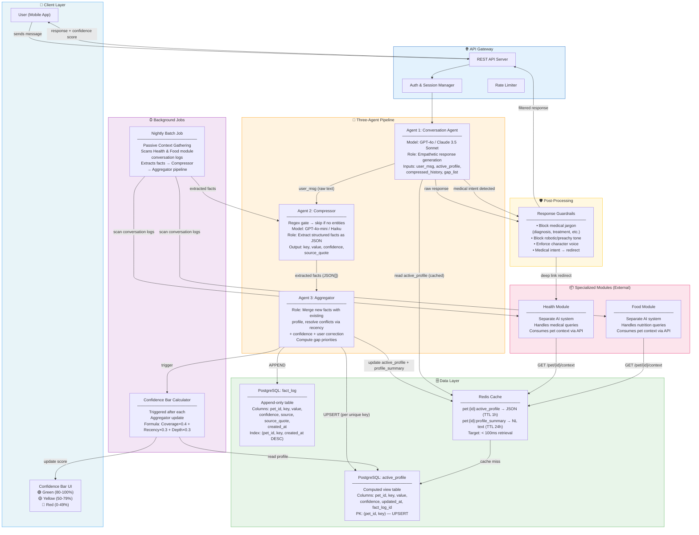
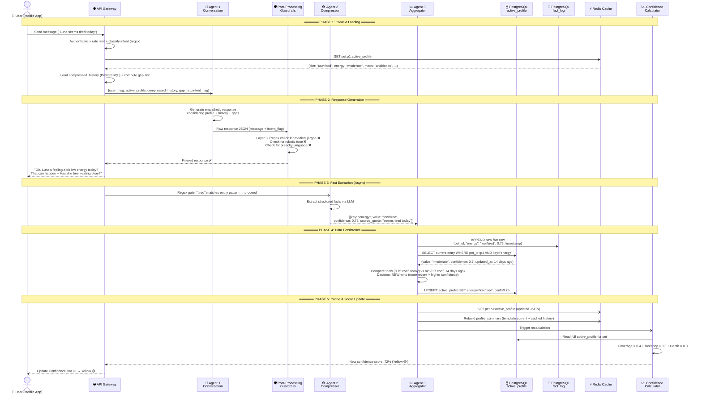
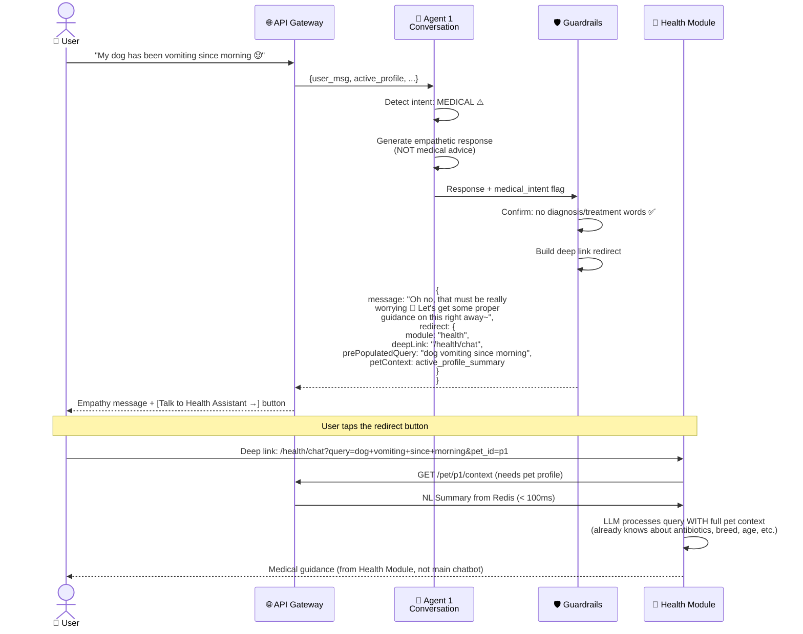
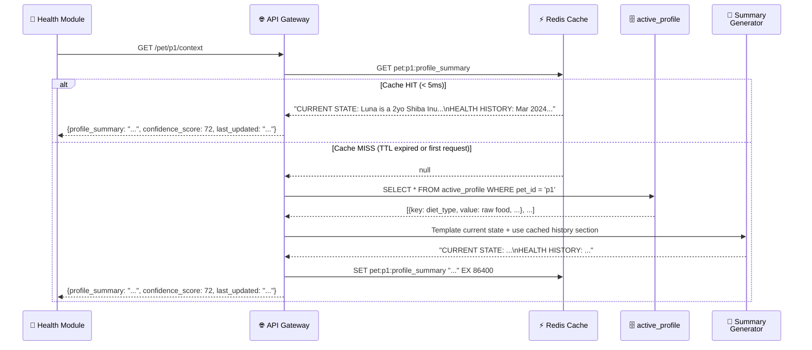
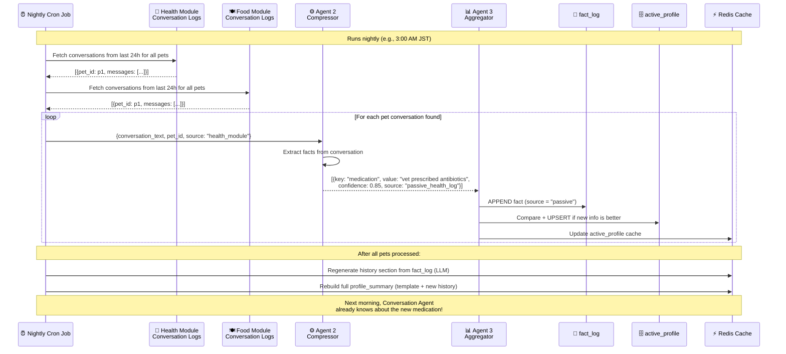

# Pet Health Companion — System Design Document

## Table of Contents

1. [My Approach](#1-my-approach)
2. [Delivery Plan](#2-delivery-plan)
3. [System Architecture Diagram](#3-system-architecture-diagram)
4. [Data Flow Diagram (Sequence)](#4-data-flow-diagram-sequence)
5. [Core Agents — The Three-Agent Pipeline](#5-core-agents--the-three-agent-pipeline)
   - 5.1 [Agent 1: Conversation Agent](#51-agent-1-conversation-agent)
   - 5.2 [Agent 2: Compressor](#52-agent-2-compressor)
   - 5.3 [Agent 3: Aggregator](#53-agent-3-aggregator)
   - 5.4 [Context Building Strategy](#54-context-building-strategy)
6. [Data Architecture](#6-data-architecture)
7. [Confidence Bar — Calculation Logic](#7-confidence-bar--calculation-logic)
   - 7.5 [Depth Score Calculation](#75-depth-score-calculation)
   - 7.6 [Complete Calculation Example](#76-confidence-bar-calculation--complete-example)
8. [Information Priority Schema](#8-information-priority-schema) *(includes Rank D)*
9. [Integration with Specialized Modules](#9-integration-with-specialized-modules)
10. [Redirection Logic — Guardrails & Deep Links](#10-redirection-logic--guardrails--deep-links) *(urgency field added)*
11. [Passive Context Gathering](#11-passive-context-gathering)
12. [Conversation Context Management](#12-conversation-context-management)
    - 12.5 [Session Management](#125-session-management) *(new)*
13. [Quality Assurance & Filters (Three-Layer Defense)](#13-quality-assurance--filters)
14. [User Onboarding Flow](#14-user-onboarding-flow)
15. [Future Roadmap](#15-future-roadmap)
16. [Architecture Decisions & PRD Gap Log](#16-architecture-decisions--prd-gap-log) *(new)*

> **Notes:**
>
> - **Evaluation strategy** is documented separately in [evaluation-strategy.md](evaluation-strategy.md) and will be reviewed and incorporated as the prototype matures.
> - **Technology stack** choices (Python/FastAPI, PostgreSQL, Redis, GPT-4o/Claude Sonnet for Agent 1, GPT-4o-mini/Haiku for Agent 2, deterministic code for Agent 3 in the prototype — designed with a clean interface so it can be upgraded to an LLM reasoning model later) are documented in context within each section rather than as a separate appendix.
> - **Language:** The primary language of AnyMall-chan is **Japanese**; English is secondary. All Agent 1 prompts, character voice, and response guidelines must reflect Japanese-first. This is currently a placeholder note — full Japanese prompt engineering is deferred to MVP phase.
> - **Cost estimation and production monitoring** are intentionally deferred until MVP is validated and scaling decisions become concrete.

---

## 1. My Approach

### How I Think About Building

For every technical problem, my process follows the same discipline:

**Understand first, build second.** Before I write a single line of code, I need the full picture — the product vision, the users, every building block, and how they fit together. I break the problem into components, identify the unknowns, and document my understanding. This document itself is that process in action.

### The Process

```
Step 1: Understand the Problem
├── Read the PRD. Not skim — read.
├── Identify every feature, constraint, and user expectation
├── Break down the system into components
├── Map how components interact with each other
└── Ask questions about anything unclear BEFORE designing

Step 2: Document the Design
├── Write a system design document (this document)
├── Draw architecture diagrams and data flows
├── Define data models, API contracts, and prompt templates
├── Think through edge cases and trade-offs ON PAPER
└── Get alignment from the team before coding

Step 3: Build a Prototype (Internal Review)
├── Build the riskiest/hardest component first
├── Get it working end-to-end, even if rough
├── Internal team reviews: does the approach work?
├── Catch fundamental design mistakes early
└── Prototype is throwaway — it's for learning, not shipping

Step 4: Build the MVP (User Testing)
├── Rebuild with production patterns informed by prototype learnings
├── Ship the minimum slice that delivers the core value prop
├── Test with real users — does it actually feel like
│   "You understand without me having to say everything"?
└── Collect feedback and measure quality (see Evaluation Strategy)

Step 5: Iterate to Maturity
├── Each iteration adds one capability layer
├── Update this document as assumptions get validated or invalidated
├── Keep the document as living history — don't delete old decisions,
│   annotate why they changed
└── Gradually move from MVP to production quality
```

### Why This Approach Works for THIS Problem

This system is a **multi-agent AI product**. Multi-agent systems have a specific challenge: you can't predict how LLMs will behave until you run them. The Compressor might hallucinate facts. The Conversation Agent might accidentally give medical advice. The Aggregator's conflict resolution logic might not match real-world patterns.

**You can't design this perfectly upfront.** You MUST prototype, test, measure, and iterate. But you also can't just start coding blindly — without understanding the full system, you'll build components that don't fit together.

This approach balances both: **think deeply upfront, then validate quickly through iteration.**

---

## 2. Delivery Plan

```
PROTOTYPE (Weeks 1-3)                    MVP (Weeks 4-8)
Internal review only                     Real users testing
─────────────────────                    ────────────────────
Goal: Prove the 3-agent                 Goal: Deliver core value
pipeline works end-to-end               "You understand without
                                        me having to say everything"

                    ITERATE (Weeks 9+)
                    Feature-by-feature
                    ─────────────────────
                    Goal: Add modules,
                    polish, scale
```

---

## 3. System Architecture Diagram



---

## 4. Data Flow Diagram (Sequence)

### 4.1 Primary Conversation Flow

This sequence diagram shows the complete data flow when a user sends a message and receives a response.



### 4.2 Medical Query — Redirection Flow

This diagram shows what happens when the user asks a medical question that triggers the guardrail redirect.



### 4.3 External Module — Context Retrieval Flow

Shows how Health/Food modules fetch pet context, including the Redis cache-miss fallback.



### 4.4 Nightly Batch — Passive Context Gathering

Shows how the system learns from other modules' conversations without the user explicitly telling it.



---

## 5. Core Agents — The Three-Agent Pipeline

### 5.1 Agent 1: Conversation Agent

| Property           | Detail                                                                                            |
| ------------------ | ------------------------------------------------------------------------------------------------- |
| **Responsibility** | Generate empathetic, on-brand responses. This is the ONLY agent the user directly interacts with. |
| **Model**          | GPT-4o or Claude Sonnet (high emotional intelligence, nuance in Japanese — see language note above) |
| **Inputs**         | `user_message`, `active_profile`, `compressed_history`, `gap_list`, `life_stage`, `relationship_context`, `message_reading_key` |
| **Output**         | Natural language response (passed through guardrail filter before reaching user)                  |
| **Key Constraint** | Ask only 1–3 questions per session. Never force consecutive questions.                            |

> **Input definitions:**
> - `compressed_history` — NL summary of what the pet has done/experienced in past sessions (pet facts, health history, behavioral patterns)
> - `relationship_context` — NL summary about the **user** (emotional patterns, interaction style, tone preferences, session count) — see Section 6.4 for storage
> - `message_reading_key` — Boolean flag set by the API layer when a message appears to be high-importance (medical emergency, first mention of a critical condition). When `true`, Agent 1 gives the message extra weight. **Prototype note:** This flag is currently redundant with Layer 1 intent classification (Section 13.1) — in practice, Agent 1 already adjusts based on `intent_flag`. Consider removing this field in MVP and relying on `intent_flag` alone.

**Prompt Template:**

```
SYSTEM:
You are a warm, friendly pet companion for {{pet_name}}, a {{age}} {{breed}} {{species}}.
You are NOT a vet. You NEVER diagnose, prescribe, or give medical/nutritional advice.
Primary language: Japanese. Secondary: English. Always respond in the user's language.

## Character Rules
- Use gentle sentence endings like "~maybe!" and "~" (e.g., 「元気そうですね～！」)
- Never be preachy, robotic, or judgmental
- Ask at most {{max_questions}} questions this session
- If user mentions anything medical/health-related, respond with empathy ONLY
  and set intent_flag to "medical" or "nutritional" in your response JSON
- If message_reading_key is true, treat this message as high-importance — respond
  with extra care and attention

## Pet Profile (current known facts)
{{active_profile_formatted}}

## Information Gaps (pick 1-2 to naturally ask about)
{{gap_list}}

## Pet History (summary of past sessions — what happened with {{pet_name}})
{{compressed_history}}

## User Relationship Context (how this user interacts — their tone, emotional patterns)
{{relationship_context}}

## Current Session
{{current_session_messages}}

Respond in JSON format:
{
  "message": "your response text",
  "intent_flag": "general" | "medical" | "nutritional",
  "questions_asked_count": number
}

USER: {{user_message}}
```

**What goes into the prompt (token budget):**

```
System Prompt:
├── Character guidelines (~150 tokens, static)
├── Active Profile (~200-500 tokens, from Redis)
│   ├── Pet: Luna, Shiba Inu, 2 years
│   ├── Diet: raw food (conf: 0.95)
│   ├── Energy: low/tired (conf: 0.75, today)
│   └── Medication: antibiotics (conf: 0.85)
├── Gap List (~50-100 tokens, computed)
│   ├── Feeding frequency (Rank A, never asked)
│   └── Exercise level (Rank B, 45 days stale)
├── Pet History / Compressed History (~200-400 tokens, from PostgreSQL)
│   └── "Last session: user was worried about Luna's appetite. Vet visit for ear infection."
├── User Relationship Context (~100-200 tokens, from user_relationship_context table)
│   └── "Owner tends to be anxious. Prefers short replies. 7 sessions total. Usually chats in evenings."
└── Current session messages (~200-500 tokens, last N turns)

Total context: ~900-1700 tokens — well within limits
```

### 5.2 Agent 2: Compressor

| Property           | Detail                                                                           |
| ------------------ | -------------------------------------------------------------------------------- |
| **Responsibility** | Convert natural language into structured JSON facts                              |
| **Model**          | GPT-4o-mini or Claude Haiku for prototype. **Note:** The PRD recommends a full model (GPT-4o / Claude Sonnet) for Agent 2, arguing that structured extraction errors compound downstream. Since the regex gate already filters ~50% of messages before this agent runs, a full model is more affordable than it appears. Revisit this decision after evaluating prototype extraction quality. |
| **Input**          | Raw user message text (current session message only — past sessions are already in `compressed_history`) |
| **Output**         | Array of `{key, value, confidence, time_scope, uncertainty, source_quote, timestamp}` |

#### Regex Pre-filter (Skip unnecessary LLM calls)

Before calling the Compressor LLM, a simple regex check determines if the message contains any extractable entities. Messages like "ok", "thanks", "haha" are skipped entirely — no LLM cost.

```python
ENTITY_PATTERNS = [
    r"\b(eat|ate|food|kibble|raw|diet|feed|meal|treat)\b",
    r"\b(tired|energy|sleep|active|lazy|playful|lethargic)\b",
    r"\b(vet|medicine|pill|medication|antibiotics|vaccine)\b",
    r"\b(walk|exercise|run|play|park)\b",
    r"\b(weight|gained|lost|kg|pounds|fat|thin)\b",
    r"\b(poop|pee|toilet|bathroom|diarrhea|constipat)\b",
    r"\b(groom|bath|brush|fur|coat|shed)\b",
    r"\b(scared|anxious|aggressive|shy|friendly|bark)\b",
    r"\b(vomit|bleed|lump|limp|swollen|cough|sneez)\b",
    r"\b(allerg|itch|scratch|rash|skin)\b",
]

def has_extractable_entities(message: str) -> bool:
    return any(re.search(p, message, re.IGNORECASE) for p in ENTITY_PATTERNS)

# Usage:
# "Luna seems tired today" → True (matches "tired") → call Compressor
# "haha okay thanks!"      → False                  → skip Compressor
```

**Why regex and not an LLM gate:** An LLM call to decide whether to make another LLM call adds cost, latency, and a failure point. The Compressor model (Haiku) costs ~$0.0001 per call — the savings from an LLM gate are negligible. A regex check is free, instant (~1ms), and catches 40-60% of casual messages.

#### Compressor Prompt Template

```
SYSTEM:
Extract structured facts from this pet conversation message.
For each fact, provide:
- key: one of [diet_type, feeding_frequency, appetite, energy_level,
  sleep_pattern, chronic_conditions, medications, recent_symptoms,
  exercise_level, weight_change, personality, home_alone_frequency,
  toilet_timing, grooming_frequency, favorite_toys, vet_visits]
- value: the extracted information
- confidence: 0.0-1.0 (how certain this is what the user meant)
- time_scope: "current" | "historical" | "unknown"
  ("current" = true right now, "historical" = happened in the past, "unknown" = unclear)
- uncertainty: any caveats or ambiguities about this fact (empty string if none)
  e.g., "mentioned casually, not a clear statement", "user may have multiple pets"
- source_quote: exact words from the message that support this
- timestamp: leave as null — the API layer will fill this with server time

Rules:
- Only extract what is explicitly stated or strongly implied
- Casual mentions get lower confidence (e.g., 0.5-0.6)
- Definitive statements get higher confidence (e.g., 0.8-0.95)
- If user says "Actually, X" — mark source as "user_correction"
- Return empty array [] if nothing is extractable

USER: {{user_message}}
```

**Extraction categories:**

- **Nutrition:** diet_type, feeding_frequency, appetite, treats
- **Behavior:** energy_level, sleep_pattern, social_traits
- **Health Flags:** chronic_conditions, medications, recent_symptoms, vet_visits
- **Life Context:** home_alone_frequency, exercise_level, weight_changes

**Example:**

```json
// Input: "Luna seems tired today, she barely touched her kibble this morning"
// Output:
[
  {
    "key": "energy_level",
    "value": "low/tired",
    "confidence": 0.75,
    "time_scope": "current",
    "uncertainty": "casual observation — may not persist",
    "source_quote": "seems tired today",
    "timestamp": null
  },
  {
    "key": "appetite",
    "value": "decreased — barely ate",
    "confidence": 0.8,
    "time_scope": "current",
    "uncertainty": "",
    "source_quote": "barely touched her kibble this morning",
    "timestamp": null
  },
  {
    "key": "diet_type",
    "value": "kibble",
    "confidence": 0.6,
    "time_scope": "current",
    "uncertainty": "not explicitly confirmed as primary diet — may eat other things too",
    "source_quote": "her kibble",
    "timestamp": null
  }
]
```

Note: `diet_type: kibble` has low confidence (0.60) because the user didn't explicitly say "she eats kibble" — she might eat multiple things and kibble was just mentioned. `time_scope` matters for the Aggregator: a `historical` fact (e.g., "Luna had ear infections last year") should update `fact_log` but may not replace a current `active_profile` entry.

### 5.3 Agent 3: Aggregator

| Property           | Detail                                                                         |
| ------------------ | ------------------------------------------------------------------------------ |
| **Responsibility** | Merge new facts with existing profile, resolve conflicts, identify gaps        |
| **Model**          | No LLM needed — this is deterministic logic (code, not AI)                     |
| **Input**          | Extracted facts from Agent 2 + current active_profile rows                     |
| **Output**         | Updated active_profile, updated gap_list, trigger for confidence recalculation |

**Conflict resolution rules (in priority order):**

1. **User explicit correction** always wins (e.g., user says "Actually she eats raw food, not kibble")
2. **Higher confidence + more recent** beats lower confidence + older
3. **Low-confidence new fact cannot beat high-confidence old fact** (new ≥ 0.8× old confidence threshold before it can win)
4. **Same confidence** → more recent wins
5. **Confirmation of existing value** → boost confidence by +0.05 and update timestamp (don't change the value — just mark it as "still true")
6. **True conflicts where both seem equally valid** → store both in `fact_log`, keep existing in `active_profile`, flag for human review (never delete a fact)

**`time_scope` rule:** If Agent 2 tags a fact as `time_scope: "historical"` (e.g., "Luna had ear infections last year"), it is appended to `fact_log` as usual but does NOT overwrite the current `active_profile` entry for that key. It contributes to trend analysis only.

**Aggregator is NOT an LLM call.** It's pure deterministic application logic. The interface is designed so an LLM reasoning model can replace this code later with no changes to the surrounding pipeline:

```
function aggregate(newFact, currentEntry):
    // Always append to fact_log first (append-only, never delete)
    appendToFactLog(newFact)

    // Historical facts don't overwrite current profile
    if newFact.time_scope == "historical":
        return  // stored in log for trend analysis, not current state

    if currentEntry is null:
        // First time we see this key — insert
        insertActiveProfile(newFact)
        return

    if newFact.source == "user_correction":
        // Explicit user correction always wins (Rule 1)
        upsertActiveProfile(newFact)
        return

    if newFact.value == currentEntry.value:
        // Confirmation — same value repeated (Rule 5)
        boostConfidence(currentEntry, delta=0.05)
        updateTimestamp(currentEntry)
        return

    if newFact.confidence < currentEntry.confidence * 0.8:
        // New fact too uncertain to beat existing (Rule 3)
        // Fact is still logged — just doesn't win active_profile
        return

    if newFact.timestamp > currentEntry.timestamp:
        // Newer and sufficiently confident — update (Rules 2 & 4)
        upsertActiveProfile(newFact)
        return

    // True conflict — keep existing, flag for review (Rule 6)
    flagConflictForReview(newFact, currentEntry)
```

### 5.4 Context Building Strategy

This is the logic that assembles everything Agent 1 needs before each response. It runs on every user message.

```python
async def build_agent_context(pet_id: str, session_id: str, user_message: str) -> dict:
    """Build the full context for Agent 1 (Conversation Agent)."""

    # Step 1: Get active profile from Redis (fast path)
    profile_json = await redis.get(f"pet:{pet_id}:active_profile")
    if not profile_json:
        # Cache miss — read from PostgreSQL, re-cache
        profile_rows = await db.query(
            "SELECT key, value, confidence, updated_at FROM active_profile WHERE pet_id = $1",
            pet_id
        )
        profile_json = serialize(profile_rows)
        await redis.set(f"pet:{pet_id}:active_profile", profile_json, ex=3600)

    active_profile = deserialize(profile_json)

    # Step 2: Get compressed history (pet facts from past sessions)
    compressed = await db.query_one(
        "SELECT summary FROM compressed_history WHERE pet_id = $1 ORDER BY created_at DESC LIMIT 1",
        pet_id
    )

    # Step 3: Get current session messages (only this session, not all history)
    session_msgs = await db.query(
        "SELECT role, content FROM conversation_log WHERE session_id = $1 ORDER BY created_at",
        session_id
    )

    # Step 4: Compute gap list from active_profile vs priority schema
    all_priority_keys = get_priority_keys_by_rank()  # Rank A → B → C
    filled_keys = {row["key"] for row in active_profile}
    missing = [k for k in all_priority_keys if k not in filled_keys]

    pet = await db.query_one("SELECT life_stage FROM pet WHERE id = $1", pet_id)
    stale = [
        row for row in active_profile
        if is_stale(row["updated_at"], pet["life_stage"])
    ]
    stale_keys = [row["key"] for row in stale]

    gap_list = (missing + stale_keys)[:3]  # Top 3 gaps for this session

    # Step 5: Get relationship context (user-level emotional/behavioral summary)
    # This is about the USER, not the pet — tone, anxiety level, session count, preferences
    user_id = await db.query_one("SELECT user_id FROM pet WHERE id = $1", pet_id)
    rel_context = await db.query_one(
        "SELECT summary, session_count, last_updated FROM user_relationship_context WHERE user_id = $1",
        user_id["user_id"]
    )

    # Step 6: Determine message_reading_key
    # True if pre-processing layer already flagged this as high-importance (medical/critical)
    # In prototype this is set by Layer 1 intent classifier in API gateway
    message_reading_key = await redis.get(f"session:{session_id}:message_reading_key") == "true"

    # Step 7: Assemble and return
    return {
        "active_profile": format_profile_for_prompt(active_profile),
        "compressed_history": compressed["summary"] if compressed else "First session with this pet.",
        "relationship_context": rel_context["summary"] if rel_context else "New user — no interaction history yet.",
        "gap_list": gap_list,
        "current_session": session_msgs,
        "user_message": user_message,
        "life_stage": pet["life_stage"],
        "message_reading_key": message_reading_key,
    }
```

**Staleness check uses life stage modifiers:**

```python
DECAY_MULTIPLIERS = {
    "puppy": 1.5,    # 0-6 months — info goes stale 50% faster
    "junior": 1.0,   # 6 months - 2 years — baseline
    "adult": 0.75,   # 2-7 years — info stays valid 25% longer
    "senior": 1.0,   # 7+ years — back to baseline
}

def is_stale(updated_at: datetime, life_stage: str) -> bool:
    age_days = (now() - updated_at).days
    multiplier = DECAY_MULTIPLIERS.get(life_stage, 1.0)
    effective_age = age_days * multiplier
    return effective_age > 30  # Stale if effectively older than 30 days
```

---

## 6. Data Architecture

### 6.1 Two-Layer Storage Design

The system uses **two layers** to balance auditability with performance:

| Layer                                    | Purpose                                                                                                       | Write Pattern                        | Read Pattern                                                       |
| ---------------------------------------- | ------------------------------------------------------------------------------------------------------------- | ------------------------------------ | ------------------------------------------------------------------ |
| **fact_log** (JSONL / append-only table) | Full history of every fact ever extracted. Used for audit, rollback, trend analysis, conversation compaction. | APPEND only — never update or delete | Rarely read in real-time. Used by nightly jobs and trend analysis. |
| **active_profile** (computed view table) | Current best-known value for each unique key per pet. This is what agents actually use.                       | UPSERT — one row per (pet_id, key)   | Read every conversation turn. Fast indexed lookups.                |

### 6.2 Why Append-Only?

- **Rollback safety:** If Agent 2 hallucinates a fact, the old correct value still exists in the log. We revert the active_profile entry and point it at the previous log row.
- **Trend analysis:** "Luna's appetite has been declining over 3 months" — requires historical rows.
- **Conversation compaction:** When summarizing old conversations, we have the full log. If compaction fails, nothing is lost.
- **Debugging:** Every fact has a `source_quote` and timestamp. We can trace exactly where any piece of information came from.

**Enforcing append-only at the database level:**

```sql
-- Revoke UPDATE and DELETE on fact_log from the application role
REVOKE UPDATE, DELETE ON fact_log FROM app_user;

-- Or use a trigger as a safety net
CREATE OR REPLACE FUNCTION prevent_fact_log_mutation()
RETURNS TRIGGER AS $$
BEGIN
    RAISE EXCEPTION 'fact_log is append-only. UPDATE and DELETE are not allowed.';
END;
$$ LANGUAGE plpgsql;

CREATE TRIGGER no_update_fact_log
    BEFORE UPDATE OR DELETE ON fact_log
    FOR EACH ROW EXECUTE FUNCTION prevent_fact_log_mutation();
```

At the application layer, the `fact_log` repository exposes only an `insert()` method — no `update()` or `delete()`.

### 6.3 Why active_profile Doesn't Grow Unboundedly

The active_profile has a `PRIMARY KEY (pet_id, key)`. The number of rows per pet = number of unique keys you define (typically 15-30). It never grows beyond that. The fact_log grows over time but is never read in real-time conversation flows.

### 6.4 PostgreSQL Schema

```sql
-- ============================================
-- FACT LOG — append-only audit trail
-- ============================================
CREATE TABLE fact_log (
    id            SERIAL PRIMARY KEY,
    pet_id        UUID NOT NULL,
    household_id  UUID NOT NULL,
    key           VARCHAR(50) NOT NULL,       -- "diet_type", "energy_level", "medication"
    value         TEXT NOT NULL,
    confidence    FLOAT NOT NULL CHECK (confidence >= 0 AND confidence <= 1),
    source        VARCHAR(30) NOT NULL,       -- "conversation", "user_correction", "passive_health", "passive_food"
    source_quote  TEXT,                        -- exact words from user/log that produced this fact
    created_at    TIMESTAMPTZ NOT NULL DEFAULT NOW()
);

-- Index for Aggregator lookups (targeted, not full scan)
CREATE INDEX idx_fact_log_pet_key_time
    ON fact_log(pet_id, key, created_at DESC);

-- Index for nightly trend analysis
CREATE INDEX idx_fact_log_pet_time
    ON fact_log(pet_id, created_at DESC);


-- ============================================
-- ACTIVE PROFILE — computed "current best" view
-- ============================================
CREATE TABLE active_profile (
    pet_id        UUID NOT NULL,
    key           VARCHAR(50) NOT NULL,
    value         TEXT NOT NULL,
    confidence    FLOAT NOT NULL,
    source        VARCHAR(30) NOT NULL,
    updated_at    TIMESTAMPTZ NOT NULL DEFAULT NOW(),
    fact_log_id   INT REFERENCES fact_log(id),  -- link back to the winning log entry
    PRIMARY KEY (pet_id, key)                    -- unique constraint: one row per key per pet
);


-- ============================================
-- PET — basic pet identity
-- ============================================
CREATE TABLE pet (
    id            UUID PRIMARY KEY DEFAULT gen_random_uuid(),
    household_id  UUID NOT NULL,
    name          VARCHAR(100) NOT NULL,
    species       VARCHAR(20) NOT NULL,        -- "dog", "cat"
    breed         VARCHAR(100),
    date_of_birth DATE,
    life_stage    VARCHAR(20),                  -- "puppy", "adult", "senior" (computed from DOB)
    created_at    TIMESTAMPTZ NOT NULL DEFAULT NOW()
);


-- ============================================
-- CONVERSATION LOG — for compaction & history
-- ============================================
CREATE TABLE conversation_log (
    id            SERIAL PRIMARY KEY,
    pet_id        UUID NOT NULL,
    household_id  UUID NOT NULL,
    session_id    UUID NOT NULL,
    role          VARCHAR(10) NOT NULL,         -- "user" or "assistant"
    content       TEXT NOT NULL,
    created_at    TIMESTAMPTZ NOT NULL DEFAULT NOW()
);

CREATE INDEX idx_convo_pet_session
    ON conversation_log(pet_id, session_id, created_at);


-- ============================================
-- COMPRESSED HISTORY — summarized past sessions (PET facts)
-- ============================================
CREATE TABLE compressed_history (
    id            SERIAL PRIMARY KEY,
    pet_id        UUID NOT NULL,
    summary       TEXT NOT NULL,                -- LLM-generated summary of past conversations (about the PET)
    sessions_covered UUID[] NOT NULL,           -- which session_ids were compacted
    token_count   INT,
    created_at    TIMESTAMPTZ NOT NULL DEFAULT NOW()
);

CREATE INDEX idx_compressed_pet
    ON compressed_history(pet_id, created_at DESC);


-- ============================================
-- USER RELATIONSHIP CONTEXT — USER-level emotional/behavioral profile
-- (Distinct from compressed_history which is about the PET)
-- ============================================
CREATE TABLE user_relationship_context (
    id            SERIAL PRIMARY KEY,
    user_id       UUID NOT NULL UNIQUE,         -- one row per user (not per pet)
    summary       TEXT NOT NULL,                -- NL summary about the USER's interaction patterns
    -- Example: "User tends to be anxious about health changes. Prefers short, warm responses.
    --           Usually chats in the evenings. Has been using the app for 3 months.
    --           Often follows up on previous topics."
    session_count INT NOT NULL DEFAULT 0,       -- total sessions this user has had
    last_updated  TIMESTAMPTZ NOT NULL DEFAULT NOW()
);

-- Updated after every session compaction (nightly or after 5 sessions)
-- Built by LLM summarizing user's tone, patterns, and emotional history across sessions
```

### 6.5 Aggregator UPSERT Example

```sql
-- The Aggregator runs this after deciding the new fact wins:
INSERT INTO active_profile (pet_id, key, value, confidence, source, updated_at, fact_log_id)
VALUES ($1, $2, $3, $4, $5, NOW(), $6)
ON CONFLICT (pet_id, key)
DO UPDATE SET
    value       = EXCLUDED.value,
    confidence  = EXCLUDED.confidence,
    source      = EXCLUDED.source,
    updated_at  = EXCLUDED.updated_at,
    fact_log_id = EXCLUDED.fact_log_id;
```

---

## 7. Confidence Bar — Calculation Logic

### 7.1 Formula

```
Confidence Score = (Coverage × 0.4) + (Recency × 0.3) + (Depth × 0.3)
```

### 7.2 Component Breakdown

| Component    | Weight | What it measures                                        | How it's calculated                                      |
| ------------ | ------ | ------------------------------------------------------- | -------------------------------------------------------- |
| **Coverage** | 40%    | How many priority items (Rank A/B/C) have been answered | `answered_items / total_priority_items`                  |
| **Recency**  | 30%    | How fresh is the data                                   | Weighted average of individual item freshness scores     |
| **Depth**    | 30%    | How detailed are the answers                            | Based on word count + semantic richness of stored values |

### 7.3 Recency Decay Table

| Data Age   | Recency Score |
| ---------- | ------------- |
| 0–7 days   | 1.0           |
| 8–14 days  | 0.9           |
| 15–30 days | 0.7           |
| 31–60 days | 0.5           |
| 61–90 days | 0.4           |
| 91+ days   | 0.3           |

### 7.4 Life Stage Modifiers

The decay rate is adjusted based on how fast the pet's biology changes:

| Life Stage                  | Decay Modifier     | Rationale                                     |
| --------------------------- | ------------------ | --------------------------------------------- |
| Puppy/Kitten (0–6 months)   | 1.5× faster decay  | Rapid growth — info becomes stale quickly     |
| Junior (6 months – 2 years) | 1.0× (baseline)    | Standard rate                                 |
| Adult (2–7 years)           | 0.75× slower decay | Stable period — info stays valid longer       |
| Senior (7+ years)           | 1.0× (baseline)    | Health can shift, back to standard monitoring |

### 7.5 Depth Score Calculation

Depth measures the **quality of information** stored in the profile — not just whether a key is filled, but how meaningful the value is.

**Word-count formula (MVP implementation — no LLM needed):**

| Value word count | Depth score | Example                                              |
| ---------------- | ----------- | ---------------------------------------------------- |
| 0 words (empty)  | 0.0         | Key filled but value is `""`                         |
| 1–5 words        | 0.5         | `"kibble"`, `"twice daily"`, `"yes"`                 |
| 6–20 words       | 0.8         | `"raw food, twice daily, with supplements"`          |
| 21+ words        | 1.0         | `"raw food twice daily — chicken + rice mix. Started Jan 2024 after vet recommended."` |
| Rich contextual  | 1.2 (bonus) | Value includes time context, reason, or follow-up detail (detected by sub-patterns) |

```python
def compute_depth_score(value: str) -> float:
    word_count = len(value.split())
    if word_count == 0:
        return 0.0
    elif word_count <= 5:
        return 0.5
    elif word_count <= 20:
        return 0.8
    else:
        # Check for rich contextual patterns (bonus)
        rich_patterns = [r"\bsince\b", r"\bstarted\b", r"\bbecause\b", r"\bafter\b", r"\bvet\b"]
        if any(re.search(p, value, re.IGNORECASE) for p in rich_patterns):
            return 1.2
        return 1.0

def compute_overall_depth_score(active_profile: list[dict]) -> float:
    """Average depth score across all filled priority keys (A, B, C only)."""
    priority_keys = get_priority_keys_by_rank()  # Rank A + B + C
    filled = [row for row in active_profile if row["key"] in priority_keys]
    if not filled:
        return 0.0
    scores = [compute_depth_score(row["value"]) for row in filled]
    return min(sum(scores) / len(scores), 1.0)  # Cap at 1.0 for formula
```

**Why not use an LLM for depth scoring?** An LLM judge would add ~500ms latency and ~$0.001 per call to every Aggregator update. Word count catches 80% of the quality signal for a fraction of the cost. LLM-based depth scoring can be added as a nightly batch refinement in a future iteration.

### 7.6 Confidence Bar Calculation — Complete Example

```
Pet: Luna (Shiba Inu, 2 years — adult life stage)
Snapshot: 5 Rank A items, 3 Rank B items, 2 Rank C items filled

COVERAGE SCORE:
  Rank A: 5/5 filled × 10 pts = 50
  Rank B: 3/5 filled × 6 pts  = 18
  Rank C: 2/5 filled × 4 pts  = 8
  Total = 76 / 100 = 0.76

RECENCY SCORE:
  chronic_illness: 90 days old   → 0.3 (adult modifier 0.75× → effective 67.5 days → maps to 0.5)
  medications:     1 day old     → 1.0
  diet_type:       14 days old   → 0.9
  energy_level:    today         → 1.0
  toilet_timing:   30 days old   → 0.7
  ... (average across all filled keys)
  Average recency = 0.74

DEPTH SCORE:
  chronic_illness: "None" (1 word)              → 0.5
  medications:     "Antibiotics for ear infection since March 15" (7 words) → 0.8
  diet_type:       "Raw food twice daily" (4 words) → 0.5
  energy_level:    "low/tired" (1 word)          → 0.5
  toilet_timing:   "Regular, 3x daily" (3 words) → 0.5
  Average depth = 0.56

FINAL SCORE:
  (0.76 × 0.4) + (0.74 × 0.3) + (0.56 × 0.3)
  = 0.304 + 0.222 + 0.168
  = 0.694 → 69% → 🟡 Yellow
```

### 7.7 Status Indicators

| Score Range | Color     | Meaning                                            |
| ----------- | --------- | -------------------------------------------------- |
| 80–100%     | 🟢 Green  | System is well-informed with recent, detailed data |
| 50–79%      | 🟡 Yellow | Information is missing or becoming outdated        |
| 0–49%       | 🔴 Red    | Significant information gaps exist                 |

### 7.8 When Confidence is Recalculated

- After every Aggregator update (real-time, per conversation)
- After nightly batch job completes (passive extraction may fill gaps)
- Time-based recalculation (a daily cron to decay scores even if no new conversation)

---

## 8. Information Priority Schema

Data collection is prioritized by clinical and lifestyle relevance. The Aggregator uses this to determine which gaps to fill first.

### Rank A — Required (Highest Priority)

These are asked first during onboarding conversations.

| Key                 | Example Value                         |
| ------------------- | ------------------------------------- |
| `chronic_illness`   | "None" / "Hip dysplasia"              |
| `medications`       | "Antibiotics (since 2024-03-18)"      |
| `diet_type`         | "Raw food" / "Kibble" / "Home-cooked" |
| `feeding_frequency` | "Twice daily"                         |
| `toilet_timing`     | "Regular, 3x daily"                   |

### Rank B — Life Context

| Key                    | Example Value           |
| ---------------------- | ----------------------- |
| `home_alone_frequency` | "8 hours on weekdays"   |
| `exercise_level`       | "30 min walk daily"     |
| `recent_weight_change` | "Lost 0.5kg last month" |

### Rank C — Resolution (Detail)

| Key                  | Example Value                         |
| -------------------- | ------------------------------------- |
| `personality`        | "Shy with strangers, playful at home" |
| `favorite_toys`      | "Squeaky ball, rope toy"              |
| `grooming_frequency` | "Monthly professional grooming"       |

### Rank D — Digging Deeper (High-Value Detail)

These items add meaningful precision to already-known Rank A/B facts. They are asked after Rank A/B gaps are mostly filled.

| Key                       | Example Value                                                        |
| ------------------------- | -------------------------------------------------------------------- |
| `diet_brand`              | "Royal Canin Shiba Inu Adult"                                        |
| `feeding_notes`           | "Won't eat if bowl is in a different spot"                           |
| `exercise_type`           | "Morning walk 20 min + evening play session 15 min"                  |
| `medication_schedule`     | "Antibiotics twice daily with food, until March 30"                  |
| `vet_name`                | "Dr. Tanaka, Shibuya Animal Clinic"                                  |
| `allergy_trigger`         | "Reacts to chicken — switched to lamb-based food"                    |
| `training_status`         | "Basic commands trained, working on 'stay'"                          |

### Rank E — Emotional (Relationship Building)

| Key                    | Example Value             |
| ---------------------- | ------------------------- |
| `happiest_moment`      | "When we go to the beach" |
| `unforgettable_memory` | "The day we adopted her"  |

**Gap prioritization:** When the Aggregator computes the gap_list for the next session, it sorts by: Rank A first → Rank B → Rank C → Rank D. Rank E items are asked opportunistically when the conversation flows naturally. Rank D questions are never asked if Rank A gaps still exist.

---

## 9. Integration with Specialized Modules

### 9.1 Architecture

The main chatbot system serves as a **context provider** for Health and Food modules. These modules are separate AI systems that handle domain-specific queries.

```
Main Chatbot System                    Health Module / Food Module
┌──────────────────┐                  ┌──────────────────────────┐
│ Owns:            │    REST API      │ Consumes:                │
│ - Pet profiles   │ ◄────────────── │ - NL Summary (~900 tok)  │
│ - Fact history   │ GET /pet/{id}/   │ - Confidence score       │
│ - Conversation   │    context       │ - Last updated timestamp │
│   history        │                  │                          │
│ - Confidence Bar │                  │ Does NOT own pet data.   │
│                  │                  │ Asks main system for it. │
└──────────────────┘                  └──────────────────────────┘
```

### 9.2 REST API Endpoint

```
GET /api/v1/pet/{pet_id}/context

Response (200):
{
  "pet_id": "uuid",
  "profile_summary": "CURRENT STATE:\nLuna is a 2-year-old female Shiba Inu...\n\nHEALTH HISTORY:\nMar 2024: Ear infection...\n\nGAPS: Exercise level unknown.",
  "confidence_score": 72,
  "last_updated": "2024-03-20T14:30:00Z",
  "life_stage": "adult",
  "high_priority_gaps": ["exercise_level", "recent_weight_change"]
}
```

### 9.3 Redis Caching Strategy

The system caches **two things** in Redis per pet:

| Redis Key                  | What                                               | Built From                    | Updated                       | TTL      | Used By                               |
| -------------------------- | -------------------------------------------------- | ----------------------------- | ----------------------------- | -------- | ------------------------------------- |
| `pet:{id}:active_profile`  | Raw JSON of current key-values                     | `active_profile` table        | After every Aggregator UPSERT | 1 hour   | Agent 1 (context loading, every turn) |
| `pet:{id}:profile_summary` | Single NL summary (current state + health history) | `active_profile` + `fact_log` | See update strategy below     | 24 hours | Health/Food modules via REST API      |

**Target latency:** < 100ms for all Redis reads (Redis typically responds in < 5ms).

### 9.4 Profile Summary — Update Strategy

The profile summary has two sections: **current state** (cheap to rebuild) and **historical context** (expensive to rebuild). They update at different frequencies but are stored as ONE string.

```
Profile Summary = [Current State Section] + [Historical Section]
```

| Section                | How it's built                                          | When it's rebuilt             | Cost                     |
| ---------------------- | ------------------------------------------------------- | ----------------------------- | ------------------------ |
| **Current state**      | Template from `active_profile` (15-30 rows)             | After every Aggregator UPSERT | ~1-5ms, zero LLM cost    |
| **Historical context** | LLM summarizes `fact_log` health entries (last 50 rows) | Nightly batch only            | ~500ms, ~$0.001 LLM cost |

```python
# After every Aggregator UPSERT:
async def update_profile_summary(pet_id: str):
    # Rebuild current state section from active_profile (cheap, template-based)
    profile = await db.query("SELECT * FROM active_profile WHERE pet_id = $1", pet_id)
    current_section = template_current_state(profile)

    # Reuse cached historical section (don't regenerate — that's nightly only)
    cached_history = await redis.get(f"pet:{pet_id}:history_section")
    if not cached_history:
        cached_history = "Health history not yet generated."

    # Combine into one summary
    full_summary = f"{current_section}\n\n{cached_history}"
    await redis.set(f"pet:{pet_id}:profile_summary", full_summary, ex=86400)

# Nightly batch job:
async def regenerate_history_section(pet_id: str):
    # Read health-related fact_log entries (expensive, LLM-based)
    health_facts = await db.query(
        """SELECT key, value, confidence, created_at FROM fact_log
           WHERE pet_id = $1 AND key IN ('medications','chronic_conditions',
           'recent_symptoms','vet_visits','appetite','energy_level','weight_change')
           ORDER BY created_at DESC LIMIT 50""",
        pet_id
    )
    history_section = await llm_summarize_health_history(health_facts)
    await redis.set(f"pet:{pet_id}:history_section", history_section, ex=172800)  # 48h TTL

    # Also rebuild the full profile summary with the new history
    await update_profile_summary(pet_id)
```

**Why this is simple:** No patching, no severity maps, no complex logic. Current state is always rebuilt from template (~1ms). Historical section is cached and only regenerated nightly. Both combine into one summary string.

### 9.5 Profile Summary Example

The single combined summary that Health/Food modules receive:

```
"CURRENT STATE:
Luna is a 2-year-old female Shiba Inu (adult stage). Eats raw food twice
daily. Energy is currently low/tired (as of today). On antibiotics for
ear infection (started March 15). Appetite is normal. No known chronic
conditions. Personality is playful, loves squeaky toys.

HEALTH HISTORY:
Mar 2024: Ear infection diagnosed, started antibiotics. Appetite decreased
during this period, recovered by April. Jan 2024: Low energy episode
lasting ~1 week, resolved without intervention. Weight stable at 8-8.2kg
for past 6 months. No recurring patterns of concern.

GAPS: Exercise level and recent weight change are unknown."
```

This gives the Health module everything a doctor would need: who the patient is NOW + what happened BEFORE — in one artifact.

---

## 10. Redirection Logic — Guardrails & Deep Links

### 10.1 Why Redirect?

The main chatbot is a **companion**, not a medical or nutritional advisor. If it answered health questions, it would risk:

- Providing incorrect medical advice
- Creating legal liability
- Breaking user trust if advice is wrong

Instead, it provides **empathy + immediate handoff** to the specialized module.

### 10.2 Intent Detection

The Conversation Agent (or a pre-processing classifier) flags messages as medical/nutritional intent based on keywords and context:

| Intent Type | Example Triggers                                        | Redirect Target                   |
| ----------- | ------------------------------------------------------- | --------------------------------- |
| Medical     | "vomiting", "bleeding", "lump", "limping", "not eating" | Health Module                     |
| Nutritional | "what should I feed", "is X food safe", "diet change"   | Food Module                       |
| General     | "how's your day", "Luna played a lot", "she's happy"    | No redirect — normal conversation |

### 10.3 Deep Link with Query Pre-population

**Deep Link** = A URL that navigates the user directly into the target module's chat interface (not just its homepage).

**Query Pre-population** = The user's original message is automatically filled into the target module's input field, so they don't have to re-type it.

> **Important architecture note:** AnyMall-chan does **NOT** call the Health or Food module APIs directly. It returns a redirect payload to the mobile app. The app then navigates the user to the module and opens the deep link. This keeps the main chatbot stateless with respect to external modules — no direct service-to-service calls from the conversation pipeline.

```
Redirect payload (returned from AnyMall-chan API):
{
  "message": "Oh no, that must be really worrying 💛 Let's get some proper guidance~",
  "redirect": {
    "module": "health",
    "deepLink": "/health/chat",
    "prePopulatedQuery": "My dog has been vomiting since morning",
    "petContextKey": "pet:p1:summary",   // Health module fetches this from Redis itself
    "urgency": "high"                    // "high" | "medium" | "low"
    // urgency="high" → app may show the button with RED background + vibration alert
    // urgency="medium" → normal button styling
    // urgency="low" → soft suggestion styling
  }
}

Rendered in mobile app as (urgency=high):
┌──────────────────────────────────────┐
│ Oh no, that must be really           │
│ worrying 💛 Let's get some proper    │
│ guidance on this right away~         │
│                                      │
│  ┌──────────────────────────────┐    │
│  │ 🚨 Talk to Health Assistant → │   │  ← RED button for urgency=high
│  └──────────────────────────────┘    │
└──────────────────────────────────────┘
```

**Urgency classification:**

| Urgency  | Triggers                                                              | UI Treatment               |
| -------- | --------------------------------------------------------------------- | -------------------------- |
| `high`   | vomiting, bleeding, not breathing, seizure, poisoning, severe pain   | Red button, vibration alert |
| `medium` | appetite loss, limping, unusual lethargy, mild symptoms               | Standard button             |
| `low`    | general health question, diet advice, routine check-in                | Soft suggestion text link   |

When the user taps the button:

1. App navigates to `/health/chat`
2. Input field pre-filled with: "My dog has been vomiting since morning"
3. Health Module calls `GET /api/v1/pet/p1/context` to fetch pet profile from Redis
4. User gets medical guidance with full pet context — zero repetition

---

## 11. Passive Context Gathering

### 11.1 Purpose

The system's value prop is _"You understand without me having to say everything."_ Passive context gathering makes this real by learning from conversations the user has with OTHER modules.

### 11.2 How It Works

1. **Nightly cron job** runs (e.g., 3:00 AM)
2. Fetches last 24h of conversation logs from Health and Food modules
3. For each conversation, runs it through Agent 2 (Compressor) to extract facts
4. Facts are marked with `source: "passive_health"` or `source: "passive_food"`
5. Agent 3 (Aggregator) processes them the same way — append to log, UPSERT if better
6. Redis summary is regenerated

### 11.3 Example

**Yesterday (Health Module):**

> User: "The vet prescribed Luna antibiotics for her ear infection."
> Health Module: "Got it. Make sure she takes them with food..."

**Nightly batch extracts:**

```json
[
  {
    "key": "medications",
    "value": "antibiotics (ear infection)",
    "confidence": 0.85,
    "source": "passive_health"
  },
  {
    "key": "recent_symptoms",
    "value": "ear infection",
    "confidence": 0.8,
    "source": "passive_health"
  }
]
```

**Next morning (Main Chatbot):**

> Agent 1: "Hey! How's Luna doing with her ear? Hope the antibiotics are going well~"

The user never told the main chatbot about this. It learned passively.

### 11.4 Safety Considerations

- Passive-extracted facts should have a slightly lower confidence by default (multiply by 0.9) since they come from indirect sources
- If a passive fact conflicts with a direct user statement, the direct statement always wins
- Log the source clearly so debugging is possible

---

## 12. Conversation Context Management

### 12.1 The Problem

LLMs have context limits. A user who chats daily for months would generate thousands of messages. We can't pass all of them into Agent 1's prompt every turn.

### 12.2 The Solution — Compressed History

```
Raw Conversations (stored in conversation_log table)
│
│ After N sessions (or when token count exceeds threshold)
▼
Compaction Job:
│   Input: Last 5-10 sessions of raw conversation
│   Process: LLM summarizes into ~200-400 token paragraph
│   Output: Compressed summary stored in compressed_history table
│
▼
Agent 1 receives:
├── Active Profile (~200-500 tokens)     ← WHAT we know
├── Compressed History (~200-400 tokens) ← relationship context & past concerns
├── Gap List (~50-100 tokens)            ← WHAT to ask next
└── Current session messages             ← recent turns
    Total: ~800-1200 tokens of context
```

### 12.3 What Compressed History Contains

Not raw messages. A semantic summary of the relationship:

```
"User has been chatting about Luna (Shiba Inu, 2y) for 3 months.
Key themes: Owner is anxious about health changes, especially appetite.
Last 3 sessions focused on a vet visit for an ear infection and adjusting
to new medication. Owner mood has been improving since Luna started recovering.
Owner prefers short conversations and appreciates when the system notices
small changes."
```

This preserves the **emotional context** and **relationship dynamics** — not the word-by-word transcript.

### 12.4 Compaction Strategy

| Setting                       | Value                                                                  |
| ----------------------------- | ---------------------------------------------------------------------- |
| **Trigger**                   | Every 5 sessions OR when raw conversation_log exceeds 3000 tokens      |
| **Compaction model**          | Small/fast model (Haiku or GPT-4o-mini)                                |
| **Keeps raw logs?**           | Yes — conversation_log table is never deleted (append-only for safety) |
| **Compressed history format** | Natural language paragraph, ~200-400 tokens                            |
| **If compaction fails?**      | Raw logs are safe in conversation_log. Retry next time. No data loss.  |

### 12.5 Session Management

**What is a session?**

A session is a single continuous chat interaction. It starts when the user opens AnyMall-chan. It ends when:
- The user closes the widget / navigates away, OR
- 30 minutes of inactivity (server-side session timeout)

A new `session_id` (UUID) is generated on every session start.

**What does the user see?**

```
Every time the user opens AnyMall-chan, they see a FRESH chat.
There is no visible conversation history — no scrollable list of old chats.

The chat shows ONLY the current session messages.

However, the system LOADS context from previous sessions invisibly:
├── active_profile (from Redis) → what the pet is like right now
├── compressed_history → summary of past sessions about the pet
└── relationship_context → how this user tends to behave/feel

So the agent "remembers" everything — but there's no visible history UI.
```

This is intentional: AnyMall-chan is for **incremental context gathering**, not a reference archive. Users who want to look up past conversations would go to a dedicated history feature (not part of this system).

**Session lifecycle:**

```
Session Start
│
│  User opens widget
│  → New session_id generated
│  → Context loaded (Redis active_profile + compressed_history + relationship_context)
│  → Agent 1 primed with full context
│
│  [Conversation turns...]
│  Each turn: store in conversation_log(session_id), run Agent 2 + 3 async
│
Session End (close widget OR 30-min inactivity timeout)
│  → Session marked complete
│  → session_id added to compaction queue
│
Compaction Trigger (after 5 sessions OR >3000 tokens accumulated)
│  → LLM compacts raw conversation_log rows into compressed_history entry
│  → LLM updates user_relationship_context (user-level summary)
│  → Redis caches updated summaries
│
Nightly Batch (3:00 AM)
│  → Passive context gathered from Health/Food module logs
│  → History section of profile_summary rebuilt (expensive LLM call)
│  → Next session starts with all context already fresh and loaded
```

**Privacy note:** The PRD specifies that passive context gathering (reading Health/Food module logs) must disclose to users that their conversations in those modules are used to improve AnyMall-chan's understanding. An opt-out mechanism should be designed before launch. This is currently out of scope for the prototype.

---

## 13. Quality Assurance & Filters

The system uses a **three-layer defense-in-depth** approach to ensure the agent never provides medical advice and always stays in character.

### 13.1 Layer 1 — Pre-Processing Intent Classifier (BEFORE Agent 1)

A fast keyword-based classifier runs on the user's message BEFORE it reaches Agent 1. This catches obvious medical/nutritional queries early.

```python
MEDICAL_KEYWORDS = [
    "vomit", "bleed", "lump", "limp", "diarrhea", "seizure",
    "not eating", "swollen", "breathing", "pain", "sick",
    "emergency", "poison", "injured", "fever"
]
NUTRITION_KEYWORDS = [
    "what to feed", "is .+ safe", "diet change", "food recommendation",
    "how much to feed", "supplements", "calories", "nutrition"
]

def classify_intent(message: str) -> str:
    lower = message.lower()
    if any(kw in lower for kw in MEDICAL_KEYWORDS):
        return "medical"
    if any(re.search(kw, lower) for kw in NUTRITION_KEYWORDS):
        return "nutritional"
    return "general"
```

If intent is `medical` or `nutritional`, Agent 1 receives an `intent_flag` in its input so it knows to ONLY give empathy + set redirect.

### 13.2 Layer 2 — Prompt Instructions (INSIDE Agent 1)

The system prompt explicitly forbids medical advice (see Agent 1 prompt template in Section 5.1). The LLM is instructed to return `intent_flag: "medical"` in its response JSON when it detects health concerns, even if the pre-processing classifier missed it.

### 13.3 Layer 3 — Post-Processing Regex Filter (AFTER Agent 1)

Every response passes through automated regex checks BEFORE reaching the user. This is the last line of defense.

```python
FORBIDDEN_PATTERNS = [
    (r"\b(diagnos|treatment|prescri|prognosis|dosage)\b", "medical_jargon"),
    (r"\b(you should (give|take|try|use))\b", "directive_advice"),
    (r"\b(I recommend|I suggest you)\b", "directive_advice"),
    (r"\b(it could be|it might be|sounds like .+ disease)\b", "pseudo_diagnosis"),
    (r"\b(I understand your concern|As an AI)\b", "robotic_pattern"),
    (r"\b(You should|You need to|It's important that)\b", "preachy_tone"),
]

def filter_response(response: str) -> tuple[bool, list[str]]:
    violations = []
    for pattern, category in FORBIDDEN_PATTERNS:
        if re.search(pattern, response, re.IGNORECASE):
            violations.append(category)
    return (len(violations) == 0, violations)

# If violations found → regenerate with stricter prompt OR fallback to template response
```

| Filter                | What it catches                           | Action on violation                         |
| --------------------- | ----------------------------------------- | ------------------------------------------- |
| **Medical jargon**    | "diagnosis", "treatment", "prescription"  | Regenerate response with stricter prompt    |
| **Pseudo-diagnosis**  | "it sounds like", "it could be [disease]" | Block and redirect to Health module         |
| **Directive advice**  | "you should give", "I recommend"          | Soften to suggestion: "Maybe we could try~" |
| **Robotic patterns**  | "I understand your concern", "As an AI"   | Regenerate response                         |
| **Preachy tone**      | "You should...", "You need to..."         | Soften language                             |
| **Question overload** | More than 3 questions in one response     | Trim to max 1-2 questions                   |

### 13.4 Human Review Protocol

| Phase        | Review Rate                     | Purpose                                 |
| ------------ | ------------------------------- | --------------------------------------- |
| Pre-launch   | 100% of responses reviewed      | Calibrate tone, catch systematic issues |
| Month 1      | 50% sampling                    | Monitor quality, build confidence       |
| Month 2-3    | 20% sampling                    | Focus on edge cases and new patterns    |
| Post month 3 | 5% sampling + flagged responses | Ongoing quality maintenance             |

---

## 14. User Onboarding Flow

There is no traditional form-based onboarding. The system replaces forms with conversation. The Confidence Bar starts at RED and naturally moves toward GREEN over multiple sessions.

```
Step 1: Sign Up
├── User creates account
└── Adds pet basics: name, species, breed, DOB
    (This is the ONLY form — minimal fields)

Step 2: First Conversation (Confidence Bar: 🔴 ~10%)
├── Agent 1 initiates: "Hey! I'm so happy to meet Luna 🐾 ~ tell me a bit about her day?"
├── Gap list focuses on Rank A items (chronic illness, diet, medications)
├── Asks 1-2 questions max this session
└── Compressor + Aggregator store first facts

Step 3: Days 2-7 (Confidence Bar: 🔴→🟡 ~30-60%)
├── Agent picks up where it left off
├── Fills more Rank A gaps, starts on Rank B
├── Compressed history begins forming
└── User sees bar moving — motivation to continue

Step 4: Weeks 2-4 (Confidence Bar: 🟡→🟢 ~60-85%)
├── Rank A mostly covered, working on Rank B/C
├── Rank E questions start appearing naturally
├── Passive context gathering adds data from Health/Food modules
└── User feels: "This app really knows my pet"

Step 5: Ongoing (Confidence Bar: 🟢 maintenance)
├── Recency decay pulls bar down over time
├── Agent naturally re-confirms stale info
├── Bar motivates periodic re-engagement
└── Life stage changes trigger faster decay → more questions
```

---

## 15. Future Roadmap

### Short-Term

- **Multi-pet intelligence:** Comparative questions like "Which of my pets eats more?"
- **Push notifications:** Alert when confidence bar drops to Yellow

### Medium-Term

- **Voice-to-text interaction:** Speak instead of type
- **Image context extraction:** Upload a photo of a food bowl → system extracts diet info
- **Agent 2 model upgrade:** Move from mini/Haiku to full model once extraction quality is measured. The regex gate keeps costs manageable even at scale.
- **Agent 3 LLM upgrade:** Replace deterministic aggregation logic with a Reasoning Model (o1 / Claude Opus) for better conflict resolution on ambiguous cases.

### Long-Term

- **Longitudinal trend detection:** "Luna's appetite has been gradually decreasing over the past month" — proactive notification
- **Predictive health signals:** Combine behavior patterns to suggest vet visits before problems become visible

---

## 16. Architecture Decisions & PRD Gap Log

This section documents decisions made when the system design diverged from (or improved upon) the PRD, and explains the rationale. Kept as a living record for the team.

### 16.1 Agent 3: Deterministic vs LLM

| | PRD | System Design (Prototype) | Rationale |
|---|---|---|---|
| **Agent 3 model** | Reasoning Model (LLM) | Deterministic code | Prototype speed + cost. Interface designed for clean LLM swap later. |

The aggregate function in Section 5.3 has a clear interface (`newFact`, `currentEntry` → `action`). When upgrading to LLM, only the decision logic inside the function changes — surrounding pipeline is unchanged.

### 16.2 Agent 2: Model Choice

| | PRD | System Design (Prototype) | Rationale |
|---|---|---|---|
| **Agent 2 model** | Advanced model (GPT-4o / Claude Sonnet) | Mini model (GPT-4o-mini / Haiku) | Start cheap. After prototype, measure extraction quality on 100 sampled conversations and upgrade if error rate > 5%. |

### 16.3 Confidence Bar Scope

| | PRD | System Design | Rationale |
|---|---|---|---|
| **Scope** | Household-level (one bar for all pets) | Per-pet (separate bar per pet) | Per-pet is more useful to owners with multiple pets. A household aggregate can be derived from per-pet scores. Proposed improvement to PRD. |

### 16.4 message_reading_key

| | PRD | System Design | Decision |
|---|---|---|---|
| **Purpose** | Mark high-importance messages | Redundant with `intent_flag` from Layer 1 classifier | **Recommendation: remove in MVP.** Layer 1 already classifies intent before Agent 1 runs. `message_reading_key` adds no new information. If kept, treat it purely as a UI hint for higher agent attention weight. |

### 16.5 relationship_context (PRD Addition)

The PRD describes `compressed_history` as a single field covering both pet facts and user relationship dynamics. In this design, we split these into two distinct concepts:

- `compressed_history` → **pet-centric:** what happened with Luna across sessions
- `relationship_context` → **user-centric:** how this owner communicates, their emotional state, session history

This split allows the Compressor to summarize pet facts independently of user behavior, and allows relationship context to be shared across multiple pets owned by the same user.

### 16.6 Rank D (PRD Gap Fixed)

The original system design was missing the PRD's Rank D ("Digging Deeper") information tier. This has been added to Section 8. Rank D items add precision to already-known Rank A/B facts (e.g., `diet_brand`, `medication_schedule`, `vet_name`).

### 16.7 Japanese Language (PRD Gap — Prototype Deferral)

The PRD specifies Japanese as the **primary language**. The prototype Agent 1 prompt template has been updated with Japanese-first character voice placeholders (e.g., 「元気そうですね～！」). Full Japanese prompt engineering (translation of all system prompts, Japanese entity patterns for regex gate, Japanese-language evaluation rubrics) is deferred to MVP phase.

### 16.8 Privacy Disclosure for Passive Context Gathering (PRD Suggestion)

The PRD does not explicitly address user consent for passive context gathering from Health/Food module logs. We flag this as a pre-launch requirement: users should be informed (and given opt-out control) that their Health/Food conversations contribute to the main chatbot's pet profile. This should be designed before any user testing involving real health data.

### 16.9 Household vs Per-Pet Confidence Bar (PRD Improvement Proposal)

**Our proposal:** Build per-pet confidence bars as the primary metric. Expose a household-level aggregate as a secondary computed metric (average of all pet scores in the household). This gives multi-pet households a single "how well do you know all your pets?" indicator while preserving per-pet granularity.
