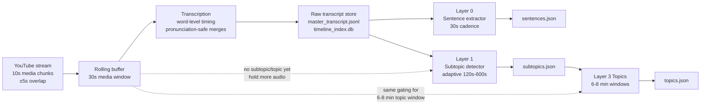
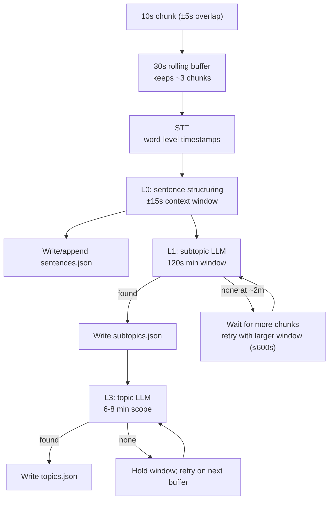

# Backend System and Prompting Overview

Plain-English walkthrough of the backend pipeline, buffering rules, prompt/preset strategy, and where JSON outputs are written. UI is intentionally omitted.

## System Diagram

## Data Flow (decisions + buffers)

## Progressive Output Timeline (like the reference image)

```mermaid
gantt
    title Progressive Output During Live Stream
    dateFormat  HH:mm
    axisFormat  %M:%S
    section Stream
    Video Downloading          :active,    vd, 00:00, 00:01
    section Layer 0 (Sentences)
    Continuous Updates         :done,      l0a, 00:00, 00:08
    First Sentences            :milestone, l0m, 00:02, 0m
    More Sentences             :active,    l0b, 00:02, 00:10
    section Layer 1 (Subtopics)
    First Subtopic Check (120s window)  :crit, l1a, 00:02, 00:02
    Subtopic Created (if found)         :milestone, l1m, 00:04, 0m
    Waiting for more (if none)          :active,    l1b, 00:04, 00:06
    More Subtopics (subsequent checks)  :done,      l1c, 00:06, 00:12
    section Layer 3 (Topics)
    Waiting for 6-8 min window          :active,    l3a, 00:00, 00:08
    First Topic Created                 :milestone, l3m, 00:08, 0m
    Topic Updates (subsequent windows)  :done,      l3b, 00:08, 00:12
```

## Buffering, Overlap, and Fidelity
- **Chunking:** FFmpeg emits 10s `.ts` segments with ±5s overlap to avoid mid-word cuts.
- **Rolling buffer:** ~30s of media retained to align STT with late gating decisions; evicts oldest when full.
- **Sentence safety:** Layer 0 uses a 30s core plus ±15s context to keep sentences unbroken.
- **Subtopic gating:** First attempt at ~120s of accumulated text; if no boundary, extend the same start point and retry up to ~600s.
- **Topic gating:** Runs when 6–8 minutes of subtopics/timeline are available; if low confidence, hold and retry with the next window.
- **Pronunciation-cut defense:** Overlap + word-level stitching keeps words intact; boundaries only cut on detected pauses/transitions, not on hard timeboxes.

## Prompting and Preset Strategy (Pre-seed)
- **Preset catalog (6 selectable options):** `budget`, `rbi_mpc`, `election`, `presser`, `earnings`, plus `other/custom`.
- **What presets provide:** domain title/description, content_type, transition phrases, important keywords, structural hints (sections, typical durations), example topics, and guidance on what counts as a topic vs. subtopic.
- **How presets are applied:** values flow into prompt builders as stream title/description/content_type and guidance text, giving the LLM a biased prior for boundaries and phrasing without hardcoding outcomes.
- **Two-stage thinking:** Layers 1 and 3 run a fast detection step (boundary/grouping) then a synthesis step (structured JSON with titles/summaries/highlights). Layer 0 is single-stage but still template-driven.
- **Guardrails:** strict JSON schemas, length limits (titles 5–8 words, summaries exactly 2 sentences where specified), word-boundary timestamps, and explicit “no-boundary/needs-more-context” paths to force retries instead of hallucinated cuts.

## Layer-by-Layer Prompting (what we send the model)
- **Layer 0 (Sentence Extraction):**
  - Inputs: word-level transcript text, context window start/end, preset-derived stream title/description/content_type.
  - Rules: only complete sentences, mark `is_complete=false` if truncated, use exact word timestamps.
  - Output: JSON `sentences` array → `data/live_output/sentences.json`.
- **Layer 1 (Subtopic Detection & Generation):**
  - Stage 1 (Detection): decides `create_new` / `extend_existing` / `no_boundary`, proposes precise boundary, flags `needs_more_context`. Uses preset guidance (e.g., “press_conference” Q&A boundaries) and timing hints (last subtopic end, gap).
  - Stage 2 (Create/Update): enforces tight title/summarization/highlight rules; timestamps must match transcript; can update existing subtopics when Stage 1 says “extend_existing”.
  - Writes to `data/live_output/subtopics.json`; also feeds ungrouped subtopics to topic layer and queues video tasks.
- **Layer 3 (Topic Grouping & Synthesis):**
  - Stage 1: groups ungrouped subtopics once cumulative duration ≥ ~480s (target 6–8 min); can leave items ungrouped if unrelated.
  - Stage 2: synthesizes parent topic, elevates 5–10 key highlights with original timestamps and `source_subtopic` tags.
  - Writes to `data/live_output/topics.json` and backfills `parent_topic_id` on subtopics.

## JSON Outputs (append-style)
- **Sentences:** `data/live_output/sentences.json` — id, text, start_time, end_time, confidence, is_complete, word_count.
- **Subtopics:** `data/live_output/subtopics.json` — id, title, summary, highlights (with timestamps/keywords), confidence, optional parent_topic_id once grouped.
- **Topics:** `data/live_output/topics.json` — id, title, summary, description, grouped subtopic_ids, elevated highlights.
- **State files:** `data/state/layer0_state.json`, `layer1_state.json`, `layer2_state.json` keep last processed positions to resume safely.

## Why the flow is resilient
- Overlap + buffers prevent pronunciation cuts; incomplete sentences are deferred, not forced.
- “No-boundary” paths at 2m (subtopic) and 6–8m (topic) trigger retries with larger context instead of bad cuts.
- Strict prompts + preset context reduce hallucinations and keep outputs in JSON schema.
- Append-only timelines and state checkpoints allow safe recovery and reprocessing.

