# Buffer Management & Overlap Strategy - Visual Guide

## 🎯 Purpose

This document explains **how we prevent pronunciation cuts** and **maintain context** using buffers and overlaps.

---

## 📊 Complete System Timeline View


---

## 🔍 Detailed View: Overlap Zone (5 seconds)

### Problem We're Solving

Without overlap, words get cut mid-pronunciation:

```
❌ WITHOUT OVERLAP:
Segment 1 (0-10s):  "Today we will discuss the ele..."  [CUT!]
Segment 2 (10-20s): "...ction results from yesterday"

Result: "ele" and "ction" are separate → Gibberish!
```

### Solution: 5-Second Overlap

```
✅ WITH OVERLAP:
Segment 1 (0-10s):    "Today we will discuss the ele..."
Segment 1 Audio (0-15s): "Today we will discuss the election res..."

Segment 2 (10-20s):   "...ction results from yesterday"
Segment 2 Audio (5-20s): "...discuss the election results from yesterday"

Overlap Zone: 10-15s appears in BOTH transcripts
```

---

## 📐 Visual Buffer Architecture

```mermaid
flowchart TB
    subgraph SEG1["Segment 00001 (Video: 0-10s)"]
        V1[Video Chunk<br/>0.0s → 10.0s]
        A1[Audio Extracted<br/>0.0s → 15.0s]
        T1[Transcript 1<br/>Words with timestamps]

        V1 --> A1
        A1 --> T1
    end

    subgraph SEG2["Segment 00002 (Video: 10-20s)"]
        V2[Video Chunk<br/>10.0s → 20.0s]
        A2[Audio Extracted<br/>5.0s → 25.0s]
        T2[Transcript 2<br/>Words with timestamps]

        V2 --> A2
        A2 --> T2
    end

    subgraph OVERLAP["Overlap Zone: 10-15s"]
        ZONE[Common Words<br/>Appear in both T1 and T2]
    end

    T1 -.->|Contains 10-15s| ZONE
    T2 -.->|Contains 10-15s| ZONE

    subgraph DEDUP["Deduplication (TimelineManager)"]
        COMP[Compare Words by:<br/>1. Text similarity<br/>2. Timestamp proximity<br/>3. Confidence scores]
        MERGE[Merge Strategy:<br/>Keep higher confidence<br/>Adjust timestamps<br/>Remove duplicates]

        ZONE --> COMP
        COMP --> MERGE
    end

    subgraph FINAL["Final Timeline"]
        CLEAN[Clean Transcript<br/>No duplicate words<br/>Seamless boundaries]
        MERGE --> CLEAN
    end

    style OVERLAP fill:#ffe6e6,color:#000
    style DEDUP fill:#e6f7ff,color:#000
    style FINAL fill:#e6ffe6,color:#000
```



---

## 🎤 Word-Level Deduplication Example

### Scenario: Word "election" split across segments

**Segment 1 Transcript (0-15s):**
```json
{
  "words": [
    {"text": "discuss", "start": 8.2, "end": 8.8, "confidence": 0.95},
    {"text": "the", "start": 8.9, "end": 9.1, "confidence": 0.98},
    {"text": "election", "start": 9.2, "end": 9.8, "confidence": 0.92},
    {"text": "results", "start": 10.0, "end": 10.5, "confidence": 0.89}
  ]
}
```

**Segment 2 Transcript (5-25s):**
```json
{
  "words": [
    {"text": "the", "start": 9.0, "end": 9.2, "confidence": 0.96},
    {"text": "election", "start": 9.3, "end": 9.9, "confidence": 0.94},
    {"text": "results", "start": 10.1, "end": 10.6, "confidence": 0.91},
    {"text": "from", "start": 10.7, "end": 11.0, "confidence": 0.97}
  ]
}
```

### Deduplication Logic

```python
def deduplicate_overlap(transcript1, transcript2, overlap_start, overlap_end):
    """
    Deduplicate words in overlap zone (10.0s - 15.0s in this case)
    """
    # Words in overlap from both transcripts
    overlap1 = [w for w in transcript1.words if overlap_start <= w.start <= overlap_end]
    overlap2 = [w for w in transcript2.words if overlap_start <= w.start <= overlap_end]

    # Match words by text + timestamp proximity
    for w1 in overlap1:
        for w2 in overlap2:
            if w1.text == w2.text and abs(w1.start - w2.start) < 0.5:  # Within 500ms
                # Same word detected twice!
                if w1.confidence > w2.confidence:
                    keep = w1  # Use higher confidence version
                    remove = w2
                else:
                    keep = w2
                    remove = w1

                # Use average timestamp for accuracy
                keep.start = (w1.start + w2.start) / 2
                keep.end = (w1.end + w2.end) / 2
                keep.confidence = max(w1.confidence, w2.confidence)

    return deduplicated_words
```

**Result:**
```json
{
  "words": [
    {"text": "discuss", "start": 8.2, "end": 8.8, "confidence": 0.95},
    {"text": "the", "start": 9.05, "end": 9.15, "confidence": 0.98},
    {"text": "election", "start": 9.25, "end": 9.85, "confidence": 0.94},
    {"text": "results", "start": 10.05, "end": 10.55, "confidence": 0.91},
    {"text": "from", "start": 10.7, "end": 11.0, "confidence": 0.97}
  ]
}
```

**Improvements:**
- ✅ No duplicate words
- ✅ Timestamps averaged for accuracy
- ✅ Higher confidence values kept
- ✅ Seamless word flow

---

## 🔵 Layer 0: Context Window Strategy

### Problem: Sentence Boundaries

```
❌ WITHOUT CONTEXT BUFFER:
Process 30-60s only:
"...and that's why we" [30s mark]
[Sentence cuts off - incomplete!]

"believe this policy" [60s mark]
[Sentence cuts off - incomplete!]
```

### Solution: ±15s Context Buffer

```
✅ WITH CONTEXT BUFFER:
Process 30-60s with ±15s buffer (total: 15-75s):

BEFORE BUFFER (15-30s):
"Yesterday the committee announced new policies"

CORE WINDOW (30-60s):
"and that's why we believe this policy will have significant impact on the economy"

AFTER BUFFER (60-75s):
"going forward into next year"

Result:
- Complete sentence: "...and that's why we believe this policy will have significant impact on the economy going forward into next year."
- No artificial cuts
- Natural boundaries detected
```

---

## 📊 Layer 0 Context Window Visualization


**Key Points:**
- **Core Content (30s)**: New content to extract sentences from
- **Before Buffer (15s)**: Captures sentence beginnings
- **After Buffer (15s)**: Captures sentence endings
- **Total Window (60s)**: Ensures complete sentences

---

## 🟢 Layer 1: Recursive Accumulation Strategy

### Concept: Keep Growing Until Natural Boundary

```mermaid
flowchart TB
    START[Stream Start<br/>t=0s]

    CYCLE1[Cycle 1: Analyze 0-120s]
    DEC1{Boundary<br/>Detected?}
    CONF1{Confidence<br/>≥ 0.75?}

    CYCLE2[Cycle 2: Analyze 0-240s<br/>Same start!]
    DEC2{Boundary<br/>Detected?}
    CONF2{Confidence<br/>≥ 0.75?}

    CYCLE3[Cycle 3: Analyze 0-360s<br/>Same start!]
    DEC3{Boundary<br/>Detected?}
    CONF3{Confidence<br/>≥ 0.75?}

    CREATE[Create Subtopic<br/>0-Xs]
    RESET[Reset start = X<br/>Next accumulation begins]

    START --> CYCLE1
    CYCLE1 --> DEC1
    DEC1 -->|Yes| CONF1
    DEC1 -->|No| CYCLE2
    CONF1 -->|No| CYCLE2
    CONF1 -->|Yes| CREATE

    CYCLE2 --> DEC2
    DEC2 -->|Yes| CONF2
    DEC2 -->|No| CYCLE3
    CONF2 -->|No| CYCLE3
    CONF2 -->|Yes| CREATE

    CYCLE3 --> DEC3
    DEC3 -->|Yes| CONF3
    DEC3 -->|No| CYCLE3
    CONF3 -->|Yes| CREATE
    CONF3 -->|No| CYCLE3

    CREATE --> RESET
    RESET --> CYCLE1

    style DEC1 fill:#ffe6e6,color:#000
    style DEC2 fill:#ffe6e6,color:#000
    style DEC3 fill:#ffe6e6,color:#000
    style CREATE fill:#e6ffe6,color:#000
```



**Why This Works:**
- ✅ No forced cuts at arbitrary times
- ✅ Natural topic boundaries respected
- ✅ Confidence threshold ensures quality
- ✅ Maximum 600s prevents infinite growth

---

## 📈 Complete Buffer Stack Visualization

```
┌─────────────────────────────────────────────────────────────────┐
│                    COMPLETE BUFFER STACK                        │
└─────────────────────────────────────────────────────────────────┘

┌─────────────────────────────────────────────────────────────────┐
│ LEVEL 1: VIDEO SEGMENTS (10s chunks)                           │
├─────────────────────────────────────────────────────────────────┤
│ [Seg 1: 0-10s] [Seg 2: 10-20s] [Seg 3: 20-30s] [Seg 4: 30-40s]│
└─────────────────────────────────────────────────────────────────┘
                           ↓
┌─────────────────────────────────────────────────────────────────┐
│ LEVEL 2: AUDIO EXTRACTION (10s + 5s overlap)                   │
├─────────────────────────────────────────────────────────────────┤
│ Audio 1: [0────────15s]                                         │
│ Audio 2:      [10s──────25s]                                    │
│ Audio 3:           [20s──────35s]                               │
│ Audio 4:                [30s──────45s]                          │
│                                                                 │
│ Overlap Zones: 10-15s, 20-25s, 30-35s                          │
└─────────────────────────────────────────────────────────────────┘
                           ↓
┌─────────────────────────────────────────────────────────────────┐
│ LEVEL 3: TRANSCRIPTS (Word-level, deduplicated)                │
├─────────────────────────────────────────────────────────────────┤
│ Timeline: Clean, continuous word stream                         │
│ [0.0s]──[8.2s]──[9.1s]──[10.5s]──[15.3s]──[20.8s]──[...]       │
│  "Today" "we"   "will"  "discuss" "the"    "election"           │
└─────────────────────────────────────────────────────────────────┘
                           ↓
┌─────────────────────────────────────────────────────────────────┐
│ LEVEL 4: LAYER 0 CONTEXT WINDOWS (60s total)                   │
├─────────────────────────────────────────────────────────────────┤
│ Window 1: [Before: 0-15s][Core: 15-45s][After: 45-60s]        │
│ Window 2: [Before: 30-45s][Core: 45-75s][After: 75-90s]       │
│                                                                 │
│ Extracts: Complete sentences only                              │
└─────────────────────────────────────────────────────────────────┘
                           ↓
┌─────────────────────────────────────────────────────────────────┐
│ LEVEL 5: LAYER 1 RECURSIVE WINDOWS (120-600s)                  │
├─────────────────────────────────────────────────────────────────┤
│ Attempt 1: [0───────────────────────120s]                      │
│ Attempt 2: [0─────────────────────────────────240s]            │
│ Attempt 3: [0───────────────────────────────────────360s]      │
│                                                                 │
│ Creates: Subtopic when boundary detected                       │
└─────────────────────────────────────────────────────────────────┘
                           ↓
┌─────────────────────────────────────────────────────────────────┐
│ LEVEL 6: LAYER 2 CUMULATIVE (≥480s)                            │
├─────────────────────────────────────────────────────────────────┤
│ Subtopic 1: [0─────235s] (235s)                                │
│ Subtopic 2: [235s──415s] (180s)                                │
│ Subtopic 3: [415s──560s] (145s)                                │
│ Total: 560s ≥ 480s → Trigger grouping                          │
│                                                                 │
│ Creates: Parent topic from related subtopics                   │
└─────────────────────────────────────────────────────────────────┘
```

---

## 🎯 Summary: Why This Architecture Works

### 1. **Segment Overlap (±5s)**
- **Purpose**: Prevent mid-word cuts in transcription
- **Mechanism**: Each audio extraction includes 5s before/after
- **Result**: Words are complete, no "ele...ction" splits

### 2. **Word-Level Deduplication**
- **Purpose**: Remove duplicate words from overlap zones
- **Mechanism**: Compare text + timestamp + confidence
- **Result**: Clean, seamless transcript timeline

### 3. **Layer 0 Context Buffer (±15s)**
- **Purpose**: Capture complete sentences
- **Mechanism**: 60s total window (30s core + 30s buffer)
- **Result**: No mid-sentence cuts, natural boundaries

### 4. **Layer 1 Recursive Accumulation**
- **Purpose**: Find natural topic boundaries
- **Mechanism**: Keep same start, grow window until boundary
- **Result**: No forced cuts, high-quality subtopics

### 5. **Layer 2 Cumulative Threshold**
- **Purpose**: Group related content meaningfully
- **Mechanism**: Wait for ≥480s of content before grouping
- **Result**: Coherent parent topics with ~6-8 min content

---

## 🔧 Configuration Reference

```yaml
# In your config/settings.yaml or code

segment_duration: 10          # Video segments (seconds)
overlap_buffer: 5             # Audio extraction overlap (seconds)

layer0:
  trigger_interval: 30        # Process every 30 seconds
  context_window: 60          # Total analysis window (seconds)
  before_buffer: 15           # Context before core (seconds)
  after_buffer: 15            # Context after core (seconds)

layer1:
  min_duration: 120           # First analysis at 120s
  max_duration: 600           # Give up after 600s
  confidence_threshold: 0.75  # Minimum confidence for boundary
  check_interval: 30          # Re-check every 30s

layer2:
  cumulative_threshold: 480   # 6-8 minutes in seconds
  min_subtopics: 2            # Minimum for grouping
  check_interval: 60          # Check every 60s
```

---

**This visual guide demonstrates how every buffer, overlap, and window works together to create a seamless, accurate transcription and segmentation system.**
