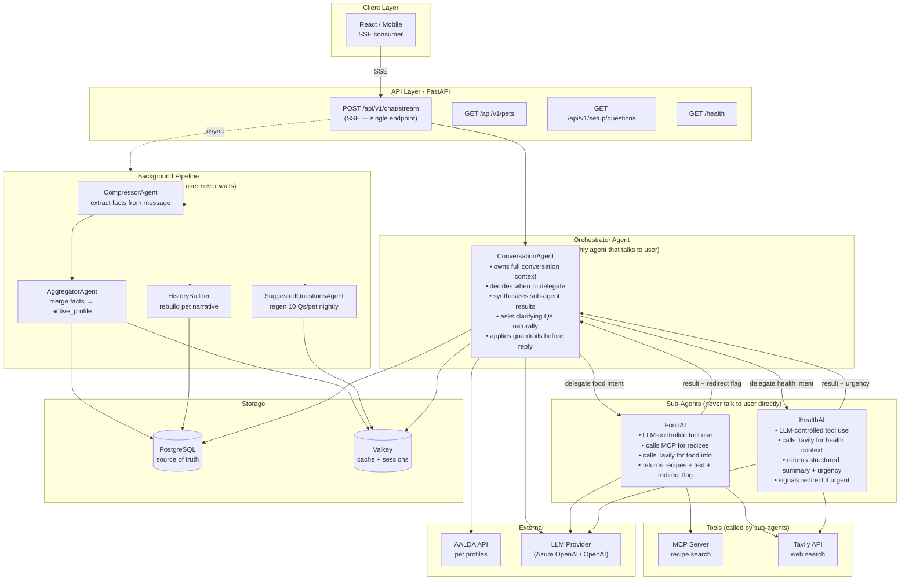
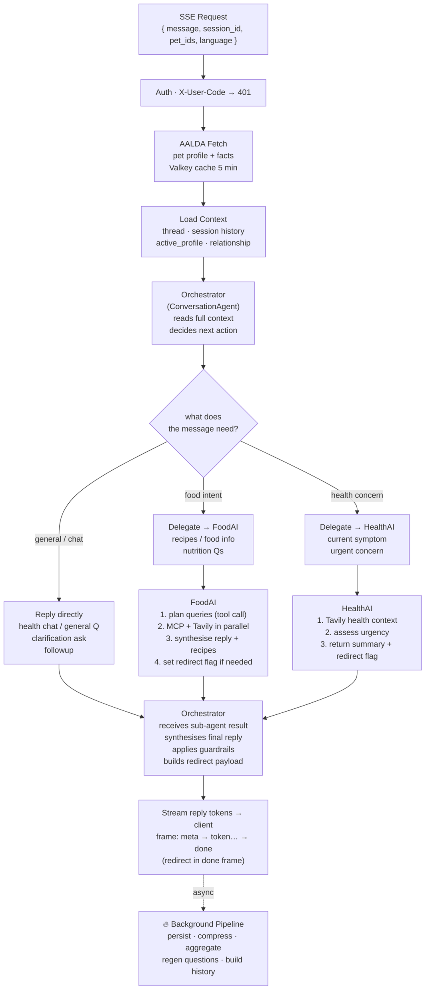
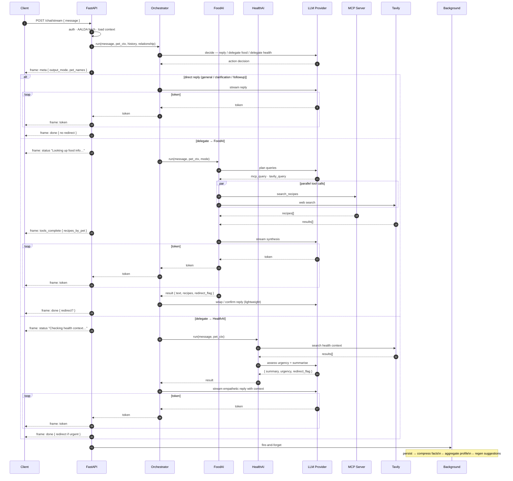
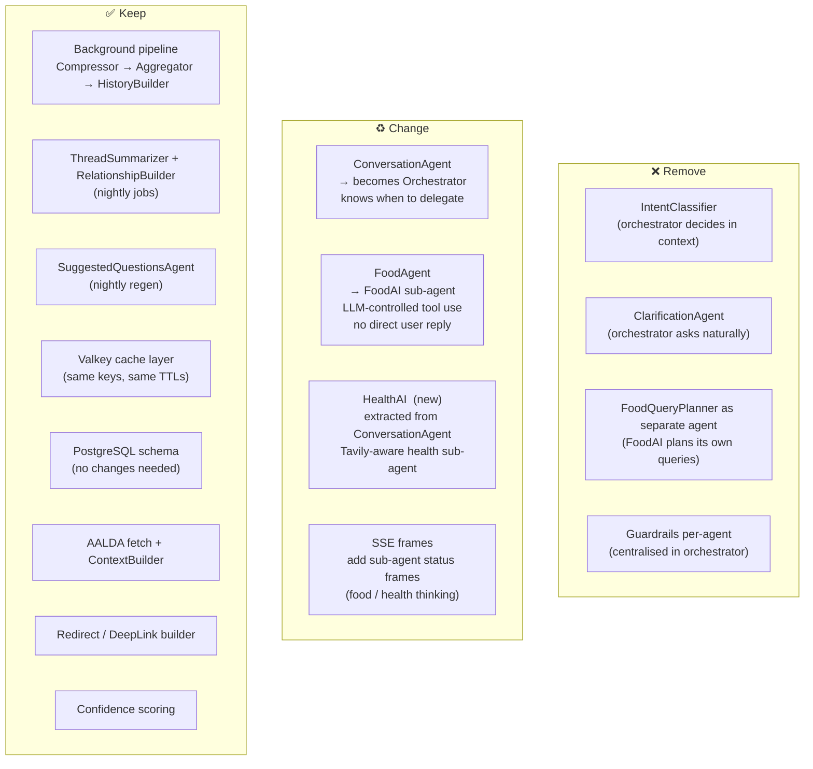

# AnyMall-Chat — Proposed Architecture (Orchestrator Pattern)

> Proposed · 2026-04-20

---

## 1. High-Level System Architecture

---

## 2. Request Flow

---

## 3. Orchestrator Decision Sequence (SSE)

---

## 4. Agent Responsibilities (Clean Boundaries)

```mermaid
graph LR
    subgraph ORC_BOX["Orchestrator  (ConversationAgent)"]
        O1["owns conversation context"]
        O2["decides to reply or delegate"]
        O3["asks clarifying questions naturally\n(no separate clarification agent)"]
        O4["synthesises sub-agent results"]
        O5["applies guardrails"]
        O6["builds redirect payload"]
        O7["only agent user sees"]
    end

    subgraph FOOD_BOX["FoodAI"]
        F1["receives: message + pet_ctx + mode"]
        F2["plans MCP + Tavily queries (LLM tool-use)"]
        F3["fetches recipes (MCP)"]
        F4["fetches web context (Tavily)"]
        F5["synthesises food reply + recipes"]
        F6["signals redirect flag to orchestrator"]
        F7["never talks to user directly"]
    end

    subgraph HLTH_BOX["HealthAI"]
        H1["receives: message + pet_ctx"]
        H2["fetches health context (Tavily)"]
        H3["assesses urgency"]
        H4["returns summary + urgency + redirect flag"]
        H5["never talks to user directly"]
    end

    subgraph BGP["Background  (unchanged)"]
        B1["CompressorAgent\nextract facts"]
        B2["AggregatorAgent\nmerge into active_profile"]
        B3["SuggestedQuestionsAgent\n10 Qs/pet nightly"]
        B4["HistoryBuilder\npet narrative"]
        B5["ThreadSummarizer\nnightly compaction"]
        B6["RelationshipBuilder\nowner style"]
    end

    ORC_BOX -->|delegates| FOOD_BOX
    ORC_BOX -->|delegates| HLTH_BOX
    FOOD_BOX -->|result| ORC_BOX
    HLTH_BOX -->|result| ORC_BOX
```

---

## 5. What Changes vs What Stays

---

## Summary

| | Current | Proposed |
|---|---------|---------|
| **Routing** | Separate IntentClassifier (brittle) | Orchestrator decides in context |
| **Clarification** | Separate ClarificationAgent | Orchestrator asks naturally in conversation |
| **User-facing agent** | Varies by intent | Always Orchestrator — one voice |
| **Food handling** | FoodAgent + FoodQueryPlanner | FoodAI sub-agent (LLM tool use) |
| **Health handling** | ConversationAgent only | HealthAI sub-agent (Tavily-aware) |
| **LLM calls per turn** | 3–4 (classifier + planner + agent) | 2–3 (orchestrator decide + sub-agent) |
| **Code complexity** | 8+ agents, complex state | 3 agents, clean delegation |
| **Tradeoff** | Parallel tools are fast | +1 LLM hop for delegation decisions |
