# Backend System Architecture - CORRECTED

## System Overview

This document provides a **corrected and accurate** representation of the Live Stream Segmentation System backend architecture.

## 🎯 Key Corrections from Original Docs

### Timing Clarifications
- **Segment Creation**: 10 seconds per video segment (.ts files)
- **Transcription Window**: Uses overlap buffers (±5s before/after)
- **Layer 0 (Sentences)**: Processes every 30 seconds with 60s context window
- **Layer 1 (Subtopics)**: Adaptive 120s-600s windows
- **Layer 2 (Topics)**: Cumulative 480s+ threshold

### Layer Naming Consistency
- **Layer 0**: Sentence Extraction
- **Layer 1**: Subtopic Detection
- **Layer 2**: Topic Grouping (NOT Layer 3)

---

## 📊 Corrected System Diagram


---

## 🔄 Detailed Data Flow: Corrected

### Phase 1: Download and Buffering (CORRECTED)


**Key Corrections:**
- Segments are **10 seconds**, not 30 seconds
- Overlap is **±5 seconds** before/after for word boundary safety
- Monitor detects files immediately (not polling)

---

### Phase 2: Transcription with Overlap (CORRECTED)


**Key Corrections:**
- Audio extraction uses **16kHz mono WAV** (standard for STT)
- Deduplication happens at **word level** using timestamps
- 5-second overlap is stitched to prevent duplicate/cut words
- Storage is **append-only** for crash safety

---

### Phase 3: Layer 0 - Sentence Extraction (CORRECTED)


**Key Corrections:**
- **60s total context window** (not 30s): 30s core + 15s buffer each side
- Deduplication uses **signature matching** (text + timestamps)
- Processing happens **every 30 seconds** but analyzes 60s
- LLM receives **word-level timestamps** for precision

---

### Phase 4: Layer 1 - Adaptive Subtopic Detection (CORRECTED)


**Key Corrections:**
- **Recursive accumulation**: Same start point until boundary found
- Minimum **120s**, maximum **600s** window
- **Two-stage process**: Detection (thinking) → Generation (fast)
- Confidence threshold: **≥0.75** required
- State resets **only on successful boundary detection**

---

### Phase 5: Layer 2 - Cumulative Topic Grouping (CORRECTED)

```mermaid
sequenceDiagram
    participant Timer
    participant L2 as Layer2Processor
    participant State as Layer2State
    participant Stage1 as Gemini Thinking
    participant Stage2 as Gemini Fast
    participant Output
    participant WS

    Note over Timer,WS: Layer 1 creates subtopics

    loop Layer 1 creates subtopics
        L1->>State: add_ungrouped_subtopic("st_001")
        L1->>State: add_ungrouped_subtopic("st_002")
        L1->>State: add_ungrouped_subtopic("st_003")
    end

    Timer->>L2: Check (every 60s)
    L2->>State: should_trigger()
    State->>State: Calculate cumulative duration
    Note over State: st_001: 235s<br/>st_002: 180s<br/>st_003: 145s<br/>Total: 560s ≥ 480s threshold ✓

    State-->>L2: true (560s ready)

    L2->>State: get_ungrouped_subtopics()
    State-->>L2: ["st_001", "st_002", "st_003"]

    L2->>Output: Load subtopic details
    Output-->>L2: Full subtopic objects

    rect rgb(255, 245, 220)
        Note over L2,Stage1: STAGE 1: GROUPING ANALYSIS
        L2->>Stage1: Analyze relationships
        Note over Stage1: Semantic similarity<br/>Thematic connections<br/>Natural groupings

        Stage1-->>L2: {<br/>  groupings: [<br/>    {ids: ["st_001", "st_002"],<br/>     rationale: "Both election"}],<br/>  ungrouped: ["st_003"]<br/>}
    end

    loop For each grouping
        rect rgb(240, 255, 240)
            Note over L2,Stage2: STAGE 2: SYNTHESIS
            L2->>Stage2: Create parent topic
            Note over Stage2: Enhanced title<br/>Synthesis summary<br/>Merged highlights

            Stage2-->>L2: ParentTopic{<br/>  id, title, description,<br/>  subtopic_ids, highlights<br/>}
        end

        L2->>Output: update_topics(parent_topic)
        L2->>Output: link_subtopics_to_parent(topic_id)
        Output->>WS: broadcast("topic", data)
    end

    L2->>State: update_on_grouping(["st_001", "st_002"])
    Note over State: Remove grouped from ungrouped list<br/>Only "st_003" remains<br/>Duration: 145s < 480s
```



**Key Corrections:**
- Triggers when **cumulative duration ≥ 480s** (6-8 minutes)
- Can leave subtopics **ungrouped** if unrelated
- **Two-stage**: Grouping analysis → Synthesis
- Updates **parent_topic_id** in subtopics
- State tracks **ungrouped subtopics** separately

---

## 🔑 Critical Corrections Summary

### 1. Timing Specifications (CORRECTED)
| Component | Timing | Purpose |
|-----------|--------|---------|
| Video segments | **10 seconds** | Raw .ts file chunks |
| Segment overlap | **±5 seconds** | Word boundary safety |
| Transcription window | **10s + overlap** | Includes buffer zones |
| Layer 0 trigger | **Every 30s** | Sentence extraction |
| Layer 0 context | **60s total** | 30s core + 30s buffer |
| Layer 1 minimum | **120s** | First subtopic analysis |
| Layer 1 maximum | **600s** | Max accumulation limit |
| Layer 2 threshold | **480s cumulative** | Topic grouping trigger |

### 2. Layer Naming (CORRECTED)
- **Layer 0**: Sentence Extraction (not "Base Layer")
- **Layer 1**: Subtopic Detection (not "Topic Layer")
- **Layer 2**: Topic Grouping (NOT "Layer 3")

### 3. Buffer Management (CORRECTED)
- **Rolling buffer**: Keeps ~30s of media for late processing
- **Context windows**: Use ±15s buffers to prevent sentence cuts
- **Overlap stitching**: Deduplicates 5s overlaps at word level
- **Recursive accumulation**: Layer 1 keeps same start until boundary found

### 4. Deduplication Strategy (CORRECTED)
- **Layer 0**: Signature-based (text + timestamp hash)
- **Layer 1**: LLM checks existing subtopics via prompt
- **Layer 2**: Grouped IDs removed from ungrouped list
- **Transcription**: Word-level comparison in 5s overlap zones

### 5. Two-Stage LLM Processing (CORRECTED)
Each layer uses **two separate LLM calls**:

**Stage 1 - Detection/Analysis:**
- Model: `gemini-2.0-flash-thinking-exp` (reasoning)
- Temperature: 0.2 (deterministic)
- Input: Plain text transcript
- Output: Decision + confidence

**Stage 2 - Generation/Enhancement:**
- Model: `gemini-2.0-flash-exp` (fast)
- Temperature: 0.3-0.4 (creative)
- Input: Timestamped transcript
- Output: Structured JSON with details

---

## 📊 Corrected Progressive Timeline

```
Time    | Segments | Transcripts | Layer 0 | Layer 1        | Layer 2
--------|----------|-------------|---------|----------------|------------
0:00    | 0        | 0           | -       | -              | -
0:10    | 1        | 1           | -       | -              | -
0:20    | 2        | 2           | -       | -              | -
0:30    | 3        | 3           | ✓ Run   | -              | -
0:40    | 4        | 4           | -       | -              | -
0:50    | 5        | 5           | -       | -              | -
1:00    | 6        | 6           | ✓ Run   | -              | -
1:10    | 7        | 7           | -       | -              | -
1:20    | 8        | 8           | -       | -              | -
1:30    | 9        | 9           | ✓ Run   | -              | -
2:00    | 12       | 12          | ✓ Run   | ✓ Check (120s) | -
2:30    | 15       | 15          | ✓ Run   | ✓ Check (150s) | -
3:00    | 18       | 18          | ✓ Run   | ✓ Check (180s) | -
4:00    | 24       | 24          | ✓ Run   | ✓ Boundary!    | -
4:00+   | -        | -           | -       | Reset (0s)     | Add ungrouped
8:00    | 48       | 48          | ✓ Run   | ✓ Boundary!    | ✓ Group (≥480s)
```

---

## 🎯 Key Insights (CORRECTED)

### Why the Timing Matters
1. **10s segments** = Optimal for real-time processing + crash recovery
2. **±5s overlap** = Prevents mid-word cuts in transcription
3. **60s context** for sentences = Full sentence boundaries captured
4. **Recursive accumulation** = Natural topic boundaries (not forced)
5. **480s threshold** = Meaningful topic groupings (~6-8 min content)

### Why Two-Stage Processing
1. **Stage 1 (Thinking)**: Fast binary decision - "Is there a boundary?"
2. **Stage 2 (Fast)**: Detailed generation - "Create the content object"
3. **Benefit**: Cheaper, faster, more accurate than single-stage

### Why Append-Only Storage
1. **Crash safety**: Never lose data mid-write
2. **Reprocessing**: Can replay from any point
3. **Debugging**: Full audit trail of what happened
4. **Performance**: No file locks, append is atomic

---

## 🔧 Implementation Checklist (CORRECTED)

- [ ] Segments are **10 seconds** (not 30s)
- [ ] Overlap is **±5 seconds** before/after
- [ ] Layer 0 processes **every 30s** with **60s context**
- [ ] Layer 1 uses **recursive accumulation** (120s-600s)
- [ ] Layer 2 triggers at **480s cumulative**
- [ ] Deduplication at **word level** in overlap zones
- [ ] Two-stage LLM: **Detection → Generation**
- [ ] Storage is **append-only** (JSONL + SQLite index)
- [ ] WebSocket broadcasts for **all layers**
- [ ] Video concat uses **FFmpeg copy mode** (no re-encode)

---

**This corrected document should be used as the source of truth for backend architecture.**
