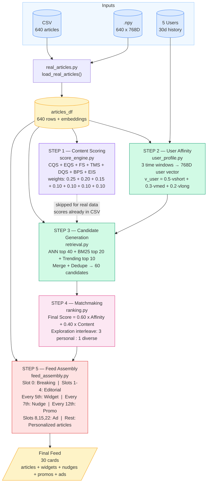

# ET Homepage Personalization — Complete Pipeline Reference

This document covers the full data flow, every formula, every parameter, and
every design decision in this prototype. Use it to cross-check against the PRD.

---

## Table of Contents

1. [Architecture Overview](#1-architecture-overview)
2. [Complete Data Flow](#2-complete-data-flow)
3. [Step 1 — Content Scoring](#3-step-1--content-scoring)
4. [Step 2 — User Affinity Model](#4-step-2--user-affinity-model)
5. [Step 3 — Candidate Generation](#5-step-3--candidate-generation)
6. [Step 4 — Matchmaking & Ranking](#6-step-4--matchmaking--ranking)
7. [Step 5 — Feed Assembly & Constraints](#7-step-5--feed-assembly--constraints)
8. [All Hyperparameters (one place)](#8-all-hyperparameters-one-place)
9. [Score Variants Table](#9-score-variants-table)
10. [Slot Template Reference](#10-slot-template-reference)
11. [Nudge Priority System](#11-nudge-priority-system)
12. [File Structure Map](#12-file-structure-map)
13. [Real vs Mock Data Differences](#13-real-vs-mock-data-differences)
14. [PRD Cross-Check Checklist](#14-prd-cross-check-checklist)

---

## 1. Architecture Overview

### System Diagram



### Text Overview (same as above, for reference)

```
INPUTS
  640 real ET articles (CSV)          5 mock users (real MSIDs)
  768D Gemini embeddings (.npy)       30-day reading history
         |                                    |
         v                                    v
  +--------------+                   +------------------+
  | real_articles|                   |  real_users.py   |
  | .py (loader) |                   |  (user builder)  |
  +--------------+                   +------------------+
         |                                    |
         +------------------+-----------------+
                            |
                            v
              +----------------------------+
              |  STEP 1: Content Scoring   |  (skipped for real data --
              |  score_engine.py           |   scores already in CSV)
              +----------------------------+
                            |
                            v
              +----------------------------+
              |  STEP 2: User Affinity     |
              |  user_profile.py           |
              |  Build 768D user vector    |
              +----------------------------+
                            |
                            v
              +----------------------------+
              |  STEP 3: Candidate Gen     |
              |  retrieval.py              |
              |  ANN + BM25 + Trending     |
              |  -> ~60 candidates         |
              +----------------------------+
                            |
                            v
              +----------------------------+
              |  STEP 4: Matchmaking       |
              |  ranking.py                |
              |  Final_Score = A*Aff + B*Cnt|
              +----------------------------+
                            |
                            v
              +----------------------------+
              |  STEP 5: Feed Assembly     |
              |  feed_assembly.py          |
              |  Slots + Widgets + Nudges  |
              +----------------------------+
                            |
                            v
                  FINAL FEED (30 cards)
           Articles + Widgets + Nudges + Ads
```

---

## 2. Complete Data Flow

```
CSV (master_input_sheet.csv)
  |-- 640 rows, each row = 1 article
  |-- Columns: Msid, title, section_l1, final_score, age_hours,
  |            views_velocity_norm, keywords, readability_score, etc.
  |
  v  [real_articles.py: load_real_articles()]
  |
  Column Rename:
    Msid               -> msid
    section_l1         -> l1
    final_score        -> content_score
    views_velocity_norm -> views_velocity
  |
  Added columns:
    kill_switch         = False
    kill_switch_active  = False
    plist_position      = 1..5 for top-5 articles, NaN for rest
    manual_lock_slot    = -1
    is_breaking_news    = True if age_hours < 2.0
    is_premium          = False
    embedding           = 768D numpy array (from .npy lookup)
    keywords_list       = parsed JSON array
  |
  v
  articles_df  (shape: 640 x N_columns)  <-- shared by all users
  |
  v  [user_profile.py: build_user_vector()]
  |
  Reading history events for user:
    {msid, l1, action, scroll_depth, timestamp}
    |
    Split into 3 time windows:
      short_events  = events within last  3 days
      medium_events = events within last 14 days
      long_events   = events within last 30 days
    |
    Per window: weighted average of article embeddings
      weight = scroll_depth of each read event
      window_vector = sum(scroll_depth_i * embedding_i) / sum(scroll_depth_i)
      normalized to unit length (||v|| = 1)
    |
    Combine:
      v_combined = 0.5 * v_short + 0.3 * v_medium + 0.2 * v_long
    |
    Subtract hidden articles (HIDE_PENALTY = 0.3):
      v_adjusted = v_combined - 0.3 * hidden_article_vector
    |
    Final normalize -> v_user  (768D unit vector)
  |
  v  [retrieval.py: generate_candidates()]
  |
  3 parallel retrieval paths:
    PATH A -- Vector Search (ANN simulation)
      cosine_similarity(v_user, all_article_embeddings)  [shape: (640,)]
      take top VECTOR_CANDIDATES = 40 by similarity score
      tag: retrieval_source = "vector"
    |
    PATH B -- Keyword Search (TF-IDF/BM25 simulation)
      extract keywords from user's last 7 days (L1 categories)
      TfidfVectorizer: unigrams + bigrams, top 500 features
      cosine_similarity(user_query_tfidf, article_title_tfidf)
      take top KEYWORD_CANDIDATES = 20 by similarity score
      tag: retrieval_source = "keyword"
    |
    PATH C -- Trending Injection
      filter articles: age_hours < 48
      sort by views_velocity DESC
      take top TRENDING_CANDIDATES = 10
      tag: retrieval_source = "trending"
    |
    Merge + Deduplicate:
      concat all three DataFrames
      drop_duplicates(subset="msid", keep="first")  [vector priority]
      remove kill_switched articles
      remove already-seen articles (scroll_depth > 60%)
      fill missing similarity scores with 0.0
      -> candidates pool (~60 articles)
  |
  v  [ranking.py: rank_candidates()]
  |
  For each candidate article:
    affinity_score = 0.50 * vector_similarity
                   + 0.30 * keyword_similarity
                   + 0.20 * category_affinity
    |
    category_affinity:
      if article.l1 == dominant_category[0]: 1.0
      if article.l1 == dominant_category[1]: 0.8
      if article.l1 == dominant_category[2]: 0.6
      else: 0.1
    |
    final_score = 0.60 * affinity_score + 0.40 * content_score
  |
  Sort by final_score DESC
  |
  Apply exploration interleaving:
    personalized = articles in user's top-3 L1 categories
    exploratory  = articles OUTSIDE user's top-3 L1 categories
    interleave: [P, P, P, E, P, P, P, E, ...]   (3:1 ratio)
  |
  Add rank column (1 = top)
  |
  v  [feed_assembly.py: assemble_feed()]
  |
  SLOT 0 (ATF):  First breaking news article (age_hours < 2)
  SLOTS 1-4:     Editorial P-list articles (sorted by plist_position)
  EVERY 5th:     Widget (personalized to user's dominant L1)
  EVERY 7th:     Nudge (based on user_status, shown once per session)
  SLOTS 8,15,22: Ad placeholders
  REMAINING:     Personalized ranked articles from ranking step
  |
  v
  final_feed (list of card dicts, 30 total)
```

### Data Flow Diagram

```mermaid
flowchart TD
    %% ── DATA LOADING ────────────────────────────────────────────────
    subgraph LOAD["DATA LOADING  (real_articles.py)"]
        direction LR
        F_CSV["master_input_sheet.csv\n640 rows"] -->|"rename columns\nMsid, section_l1,\nfinal_score,\nviews_velocity_norm"| ADF
        F_NPY["article_embeddings.npy\n640 x 768"] -->|"MSID lookup\nattach 768D vector"| ADF
        ADF[("articles_df\n640 rows\nkill_switch=False\nis_breaking_news\nplist_position 1-5\nembedding=768D")]
    end

    %% ── STEP 2 ───────────────────────────────────────────────────────
    subgraph S2["STEP 2 — USER AFFINITY  (user_profile.py)"]
        direction LR
        HIS["30-day reading history\neach event: msid, scroll_depth, timestamp"]
        HIS --> W3["3-day events\n→ v_short"]
        HIS --> W14["14-day events\n→ v_medium"]
        HIS --> W30["30-day events\n→ v_long"]
        W3 --> COM["weighted average\n0.5·vshort + 0.3·vmed + 0.2·vlong\nnormalize to unit length"]
        W14 --> COM
        W30 --> COM
        COM --> HDN["subtract hidden articles\npenalty = 0.3"]
        HDN --> VU[("v_user\n768D unit vector")]
    end

    %% ── STEP 3 ───────────────────────────────────────────────────────
    subgraph S3["STEP 3 — CANDIDATE GENERATION  (retrieval.py)"]
        direction LR
        ANN["ANN Vector Search\ncos_sim(v_user, 640 embeddings)\ntop 40 by similarity"]
        KWS["TF-IDF Keyword Search\nextract user L1 keywords\ncos_sim on article titles\ntop 20"]
        TRD["Trending Injection\nage_hours < 48\nsort by views_velocity\ntop 10"]
        ANN --> MRG
        KWS --> MRG
        TRD --> MRG
        MRG["Merge + Deduplicate\nvector wins priority\nremove kill_switch=True\nremove seen articles"] --> CANDS[("60 candidates\n+ similarity scores")]
    end

    %% ── STEP 4 ───────────────────────────────────────────────────────
    subgraph S4["STEP 4 — MATCHMAKING  (ranking.py)"]
        direction LR
        AFFS["Affinity Score\n0.50 x vector_similarity\n+ 0.30 x keyword_similarity\n+ 0.20 x category_affinity"]
        CNTS["content_score\nalready in CSV\n(skipped score_engine)"]
        AFFS --> FINS["Final Score\n0.60 x Affinity\n+ 0.40 x Content"]
        CNTS --> FINS
        FINS --> XPL["Exploration interleave\npersonalized = article.l1 IN top-3\nexploratory = article.l1 NOT IN top-3\npattern: P P P E P P P E"]
        XPL --> RNK[("Ranked list\nwith final_score\naffinity_score\nis_exploratory\nrank 1..N")]
    end

    %% ── STEP 5 ───────────────────────────────────────────────────────
    subgraph S5["STEP 5 — FEED ASSEMBLY  (feed_assembly.py)"]
        direction LR
        TMPL["Slot Template\nSlot 0     → Breaking news\nSlots 1-4  → Editorial P-list\nEvery 5th  → Widget\nEvery 7th  → Nudge\nEvery 12th → Promo\n8, 15, 22  → Ad placeholder\nAll others → Personalized article"]
        NUDGE["Nudge selection\nrule-based on user_status\nlogged_in, prime_status,\ntrial_status, renew_eligibility"]
        WDGT["Widget selection\naffinity-based\nmatch widget.l1 to\nuser dominant_categories"]
        PRMO["Promo selection\naffinity-based\nmatch AVAILABLE_PROMOS\nto dominant_categories"]
        NUDGE --> TMPL
        WDGT --> TMPL
        PRMO --> TMPL
        TMPL --> FEED[/"Final Feed\n30 cards\narticle widget nudge promo ad"/]
    end

    %% ── CONNECTIONS BETWEEN STEPS ───────────────────────────────────
    ADF --> S2
    ADF --> S3
    ADF --> S5
    VU --> S3
    CANDS --> S4
    RNK --> S5

    %% ── STYLES ──────────────────────────────────────────────────────
    style LOAD fill:#f8fafc,stroke:#94a3b8
    style S2   fill:#f0fdf4,stroke:#86efac
    style S3   fill:#f0fdf4,stroke:#86efac
    style S4   fill:#fdf4ff,stroke:#e879f9
    style S5   fill:#fff7ed,stroke:#fb923c
    style ADF  fill:#fef3c7,stroke:#f59e0b
    style VU   fill:#d1fae5,stroke:#059669
    style CANDS fill:#d1fae5,stroke:#059669
    style RNK  fill:#fce7f3,stroke:#db2777
    style FEED fill:#fef3c7,stroke:#f59e0b
```



---

## 3. Step 1 — Content Scoring

**File:** [01_content_scoring/score_engine.py](01_content_scoring/score_engine.py)

**Purpose:** Give every article a quality score between 0 and 1, using only
article data — no user data involved.

### Master Formula (PRD Section 4.1.1)

```
Final_Content_Score = (0.25 x CQS) + (0.20 x EQS) + (0.15 x FS)
                    + (0.10 x TMS) + (0.10 x DQS) + (0.10 x BPS) + (0.10 x EIS)
```

All weights sum to 1.0. All sub-scores are in range [0.0, 1.0].

### Sub-Score Details

#### CQS — Content Quality Score (weight: 0.25)

```
CQS = 0.4 * readability_score
    + 0.4 * content_relevance
    + 0.1 * length_score
    + 0.1 * explainer_bonus

length_score:
  < 200 words   -> 0.2
  200-500 words -> 0.5
  500-2500      -> 1.0  (sweet spot)
  2500-5000     -> 0.7
  > 5000        -> 0.5

explainer_bonus:
  is_explainer = True  -> 0.8
  is_explainer = False -> 0.4

sponsored_penalty:
  is_sponsored = True  -> multiply final CQS by 0.5
```

#### EQS — Engagement Quality Score (weight: 0.20)

```
EQS = 0.30 * (ctr / 0.30)                            -- CTR normalized to 0-1
    + 0.25 * scroll_depth_avg                          -- already 0-1
    + 0.20 * (avg_time_spent / 300)                   -- 5 min = perfect
    + 0.10 * (saves / views * 1000 / 10)              -- saves per 1000 views
    + 0.15 * (1 - bounce_rate)                         -- low bounce = quality
```

#### FS — Freshness Score (weight: 0.15)

```
FS = exp(-lambda * age_hours)

Decay rates (lambda):
  shelf_life = "breaking"  -> lambda = 0.30  (half-life: ~2.3 hours)
  shelf_life = "short"     -> lambda = 0.05  (half-life: ~14 hours)
  shelf_life = "medium"    -> lambda = 0.01  (half-life: ~2.9 days)
  shelf_life = "evergreen" -> lambda = 0.002 (half-life: ~14 days)

Breaking news bonus:
  if is_breaking_news AND age_hours < 3:  FS = min(1.0, FS * 1.3)
```

#### TMS — Trend Momentum Score (weight: 0.10)

```
TMS = 0.5 * min(1.0, views_velocity / 500)
    + 0.3 * clamp((ctr_velocity + 0.02) / 0.07, 0, 1)
    + 0.2 * (0.3 if notification_sent else 0.0)
```

#### DQS — Discovery / Click Quality Score (weight: 0.10)

```
quality_click_rate = ctr * (1 - bounce_rate) * scroll_depth_avg
DQS = min(1.0, quality_click_rate / 0.15)

if is_sponsored: DQS = DQS * 0.6
```

Anti-clickbait signal. High CTR + high bounce = clickbait = low DQS.

#### BPS — Business Priority Score (weight: 0.10)

```
section_scores:
  Markets  -> 0.9
  Wealth   -> 0.8
  News     -> 0.7
  Industry -> 0.7
  Tech     -> 0.65
  Careers  -> 0.6
  NRI      -> 0.65
  Magazines-> 0.5

premium_bonus = 0.1 if is_premium else 0.0

BPS = min(1.0, section_score + premium_bonus)
```

#### EIS — Editorial Intent Score (weight: 0.10)

```
if editorial_priority == "must_show":
    EIS = 1.0

elif editorial_priority == "deprioritize":
    EIS = 0.2

else:  # "normal"
    if plist_position is not None:
        EIS = max(0.1, 1.0 - (plist_position / 50) * 0.8)
    else:
        EIS = 0.4

if manual_lock_slot != -1:
    EIS = max(EIS, 0.85)
```

### Kill Switch

If `kill_switch == True`: all sub-scores = 0, final_score = 0.
Article is excluded from all feeds.

---

## 4. Step 2 — User Affinity Model

**File:** [02_user_affinity/user_profile.py](02_user_affinity/user_profile.py)

**Purpose:** Convert a user's reading history into a single 768D vector
that represents their interests in "topic space."

### Key Insight

Articles have 768D Gemini embeddings (pre-computed, stored in .npy).
Users do NOT get their own Gemini API call.
User vector = weighted average of the article embeddings they read.

### Three Time Windows (PRD Section 4.2.2)

```
SHORT  = last  3 days  (weight: 0.5) -- captures current news cycle intent
MEDIUM = last 14 days  (weight: 0.3) -- ongoing interests
LONG   = last 30 days  (weight: 0.2) -- stable preferences
```

### Window Vector Formula

For each time window with N reading events:

```
window_vector = sum(scroll_depth_i * embedding_i for i in N)
              / sum(scroll_depth_i for i in N)

then normalize: window_vector / ||window_vector||
```

Weight = scroll_depth of each article read (0.2 to 1.0).
Deeply read articles pull the user vector more.

### Combined User Vector Formula

```
v_combined = 0.5 * v_short + 0.3 * v_medium + 0.2 * v_long

Fallback if no short-term history:
  v_combined = 0.7 * v_medium + 0.3 * v_long

Fallback if no medium-term history:
  v_combined = v_long
```

### Hide Penalty (PRD Section 4.2.2)

```
HIDE_PENALTY = 0.3

v_adjusted = v_combined - HIDE_PENALTY * hidden_article_embedding

then re-normalize: v_adjusted / ||v_adjusted||
```

User explicitly hiding an article "pushes" their vector away from that topic.

### Cold Start Threshold

```
MINIMUM_HISTORY = 3  positive events (action = "read" or "save")

if len(positive_events) < 3:
    has_sufficient_history = False
    -> serve editorial feed (fallback)
```

### Output (user_profile dict)

```python
{
    "v_short":   np.ndarray(768,),   # window vector, 3 days
    "v_medium":  np.ndarray(768,),   # window vector, 14 days
    "v_long":    np.ndarray(768,),   # window vector, 30 days
    "v_user":    np.ndarray(768,),   # FINAL serving vector (normalized)
    "has_sufficient_history": bool,
    "dominant_categories": ["Markets", "News", "Wealth"],  # top 3 L1s
    "short_event_count":  int,
    "medium_event_count": int,
    "long_event_count":   int,
}
```

---

## 5. Step 3 — Candidate Generation

**File:** [03_candidate_generation/retrieval.py](03_candidate_generation/retrieval.py)

**Purpose:** From 640 articles, find the ~60 most relevant ones for this
specific user. Three parallel retrieval paths merged together.

### Candidate Pool Sizes

```
VECTOR_CANDIDATES   = 40   (ANN vector search)
KEYWORD_CANDIDATES  = 20   (TF-IDF keyword search)
TRENDING_CANDIDATES = 10   (velocity-based trending)
TOTAL_TARGET        = 60   (after merge + dedupe)
```

### Path A — Vector Search (ANN Simulation)

```
1. Stack all 640 article embeddings: shape (640, 768)
2. Reshape user vector: (768,) -> (1, 768)
3. cosine_similarity(user_vec, article_matrix) -> shape (1, 640)
4. Take top VECTOR_CANDIDATES = 40 by similarity score (no threshold)

Production equivalent: Milvus or Pinecone vector DB, HNSW index
```

Cosine similarity formula:

```
cos(A, B) = (A . B) / (||A|| * ||B||)
```

Returns 0.0 = completely different, 1.0 = identical.

**The top-40 cutoff is purely rank-based.** There is no minimum threshold.
Rank 40 gets included, rank 41 does not — regardless of actual score values.
VECTOR_CANDIDATES = 40 is a hyperparameter tuned for the candidate pool size.

### Path B — Keyword Search (TF-IDF/BM25 Simulation)

```
1. Extract user's recent reading categories (last 7 days)
   -> weighted keyword string: "markets markets markets news wealth ..."
2. TfidfVectorizer:
   - stop_words = 'english'
   - max_features = 500
   - ngram_range = (1, 2)   <-- unigrams and bigrams
3. corpus = all_article_titles + [user_keyword_string]
4. cosine_similarity(user_keyword_vector, article_tfidf_matrix)
5. Take top KEYWORD_CANDIDATES = 20

Production equivalent: Elasticsearch BM25, rank_bm25 library
```

### Path C — Trending Injection

```
1. Filter: articles where age_hours < 48
2. Sort by views_velocity DESC
3. Take top TRENDING_CANDIDATES = 10
```

Ensures timely, high-momentum content always appears even outside user interests.

### Merge + Deduplication

```
Priority order: vector > keyword > trending

1. concat(vector_results, keyword_results, trending_results)
2. Count retrieval_paths per msid (signal: appeared in 2-3 paths = very relevant)
3. drop_duplicates(subset="msid", keep="first")  <- vector wins ties
4. Remove kill_switched articles
5. Remove seen_msids (articles where user scrolled > 60%)
6. Fill NaN similarity scores with 0.0
```

An article appearing in all 3 paths is the strongest relevance signal.

---

## 6. Step 4 — Matchmaking & Ranking

**File:** [04_matchmaking/ranking.py](04_matchmaking/ranking.py)

**Purpose:** Score every candidate article for this specific user and
sort to create the personalized feed order.

### Affinity Score Formula

```
affinity_score = 0.50 * vector_similarity
               + 0.30 * keyword_similarity
               + 0.20 * category_affinity

category_affinity:
  article.l1 == dominant_categories[0]  -> 1.0   (top interest)
  article.l1 == dominant_categories[1]  -> 0.8
  article.l1 == dominant_categories[2]  -> 0.6
  article.l1 not in dominant_categories -> 0.1   (outside interests)
```

### Final Score Formula (PRD Section 4.3)

```
Final_Score = 0.60 * affinity_score + 0.40 * content_score

Where:
  AFFINITY_WEIGHT = 0.60  (how much to personalize)
  CONTENT_WEIGHT  = 0.40  (how much global quality matters)
  AFFINITY_WEIGHT + CONTENT_WEIGHT = 1.0  (always)
```

**A/B testing impact:**

```
Higher AFFINITY_WEIGHT (e.g. 0.8) -> more personalized, might miss viral stories
Higher CONTENT_WEIGHT  (e.g. 0.8) -> less personalized, more editorial/popular
Both are configurable via admin panel in production
```

### Example Calculation

```
Article: "Sensex Rally" — user loves Markets
  vector_similarity  = 0.91
  keyword_similarity = 0.74
  article.l1         = "Markets" (user's #1 category)
  category_affinity  = 1.0
  content_score      = 0.85

  affinity = 0.50*0.91 + 0.30*0.74 + 0.20*1.0 = 0.455 + 0.222 + 0.200 = 0.877
  final    = 0.60*0.877 + 0.40*0.85 = 0.526 + 0.340 = 0.866

Article: "IPL Cricket" — same user
  vector_similarity  = 0.12
  keyword_similarity = 0.03
  article.l1         = "Sports" (not in top-3)
  category_affinity  = 0.1
  content_score      = 0.92  (viral story, very high quality)

  affinity = 0.50*0.12 + 0.30*0.03 + 0.20*0.1 = 0.060 + 0.009 + 0.020 = 0.089
  final    = 0.60*0.089 + 0.40*0.92 = 0.053 + 0.368 = 0.421

Sensex Rally (0.866) >> IPL Cricket (0.421) -- personalization working!
```

### Exploration / Diversity (Epsilon-Greedy)

```
EXPLORATION_RATIO = 0.20   (20% of slots = exploratory)
PERSONALIZED_PER_EXPLORATORY = 3  (3 personalized : 1 exploratory)

Split candidates:
  personalized = articles where article.l1 IN dominant_categories
  exploratory  = articles where article.l1 NOT IN dominant_categories

Both groups sorted by final_score (quality matters even in exploration).

Interleave pattern: [P, P, P, E, P, P, P, E, ...]
```

**Why exploration?** Prevents filter bubble — user would only ever see Markets
if we only showed their top-interest articles. Every 4th slot discovers new topics.

---

## 7. Step 5 — Feed Assembly & Constraints

**File:** [05_constraints/feed_assembly.py](05_constraints/feed_assembly.py)

**Purpose:** Take the ranked article list and build the actual feed with
all business rules, editorial controls, and non-article cards.

### Slot Template

```
SLOT 0 (ATF):   Breaking news (age_hours < 2) OR high-priority promo
SLOTS 1-4:      Editorial P-list articles (sorted by plist_position)
EVERY 5th slot: Widget / Market Tool card
EVERY 7th slot: Nudge card (collapses if user doesn't qualify)
SLOTS 8,15,22:  Ad placeholders
REMAINING:      Personalized ranked articles (from Steps 3+4)

TOTAL_SLOTS = 30
```

### Editorial Controls

```
P-list (plist_position):
  Articles ranked 1-5 by editors go into Slots 1-4
  plist_position = 1 is highest editorial priority

Manual Lock Slot (manual_lock_slot):
  manual_lock_slot = -1  -> not pinned (normal)
  manual_lock_slot = 3   -> forced into slot 3

Kill Switch (kill_switch):
  kill_switch = True  -> removed from ALL feeds immediately
  Checked in BOTH retrieval (Step 3) AND feed assembly (Step 5)

Must Show (editorial_priority = "must_show"):
  -> EIS = 1.0 -> very high content_score -> bubbles up naturally
```

### Widget Selection Logic

```
Find widgets where widget.l1 IN user's dominant_categories
If no matching widgets: use most popular globally (AVAILABLE_WIDGETS[0])
Cycle through relevant widgets: widget_index % len(relevant_widgets)
```

### Nudge System (see Section 11 for full priority table)

```
Shown at every 7th slot position.
Only shown ONCE per session (nudge reset to None after first display).
If no nudge applies: slot collapses (skipped, next article fills it).
Logic runs on CLIENT SIDE in production (app, not backend).
```

### Failsafe

```
If ranked_df is empty:
  -> return editorial feed (get_editorial_articles with TOTAL_SLOTS count)
  -> feed is NEVER empty

If no breaking news: Slot 0 is skipped (editorial slots start at 1).
```

---

## 8. All Hyperparameters (one place)

These can all be changed for A/B testing or tuning:

### User Vector (user_profile.py)

| Parameter          | Value   | What it controls                                  |
| ------------------ | ------- | ------------------------------------------------- |
| SHORT_TERM_WEIGHT  | 0.5     | Weight for last 3 days of history                 |
| MEDIUM_TERM_WEIGHT | 0.3     | Weight for last 14 days                           |
| LONG_TERM_WEIGHT   | 0.2     | Weight for last 30 days                           |
| HIDE_PENALTY       | 0.3     | How much hiding an article pushes the vector away |
| MINIMUM_HISTORY    | 3       | Min positive events needed to avoid cold start    |
| Short window       | 3 days  | What counts as "recent"                           |
| Medium window      | 14 days | What counts as "ongoing"                          |
| Long window        | 30 days | What counts as "stable preference"                |

### Candidate Generation (retrieval.py)

| Parameter              | Value  | What it controls                                |
| ---------------------- | ------ | ----------------------------------------------- |
| VECTOR_CANDIDATES      | 40     | Articles fetched by ANN vector search           |
| KEYWORD_CANDIDATES     | 20     | Articles fetched by TF-IDF keyword search       |
| TRENDING_CANDIDATES    | 10     | Articles injected from trending pool            |
| TOTAL_TARGET           | 60     | Final candidate pool target size                |
| TF-IDF max_features    | 500    | Vocabulary size for keyword matching            |
| Trending age threshold | 48h    | Articles older than this excluded from trending |
| Keyword history window | 7 days | How far back to extract user keywords           |

### Matchmaking (ranking.py)

| Parameter                    | Value | What it controls                        |
| ---------------------------- | ----- | --------------------------------------- |
| AFFINITY_WEIGHT (A)          | 0.60  | Personalization weight in final score   |
| CONTENT_WEIGHT (B)           | 0.40  | Global quality weight in final score    |
| VECTOR_SIM_WEIGHT            | 0.50  | Vector search signal in affinity        |
| KEYWORD_SIM_WEIGHT           | 0.30  | Keyword search signal in affinity       |
| CATEGORY_AFF_WEIGHT          | 0.20  | Category match signal in affinity       |
| EXPLORATION_RATIO            | 0.20  | Fraction of slots that are exploratory  |
| PERSONALIZED_PER_EXPLORATORY | 3     | Personalized slots before 1 exploratory |
| category_affinity[0]         | 1.0   | Score boost for top-1 category          |
| category_affinity[1]         | 0.8   | Score boost for top-2 category          |
| category_affinity[2]         | 0.6   | Score boost for top-3 category          |
| category_affinity[other]     | 0.1   | Score for outside-interest articles     |

### Feed Assembly (feed_assembly.py)

| Parameter       | Value     | What it controls                 |
| --------------- | --------- | -------------------------------- |
| editorial_slots | [1,2,3,4] | Slot numbers reserved for P-list |
| widget_every_n  | 5         | Widget appears every N slots     |
| nudge_every_n   | 7         | Nudge appears every N slots      |
| total_slots     | 30        | Total cards in one feed batch    |
| ad_slots        | [8,15,22] | Fixed ad slot positions          |

### Content Scoring (score_engine.py)

| Weight | Value | Component                       |
| ------ | ----- | ------------------------------- |
| w_cqs  | 0.25  | Content Quality Score           |
| w_eqs  | 0.20  | Engagement Quality Score        |
| w_fs   | 0.15  | Freshness Score                 |
| w_tms  | 0.10  | Trend Momentum Score            |
| w_dqs  | 0.10  | Discovery / Click Quality Score |
| w_bps  | 0.10  | Business Priority Score         |
| w_eis  | 0.10  | Editorial Intent Score          |

### Embedding

| Parameter     | Value                | Notes                                   |
| ------------- | -------------------- | --------------------------------------- |
| VECTOR_DIM    | 768                  | Gemini gemini-embedding-001 output size |
| MODEL_NAME    | gemini-embedding-001 | Embedding model                         |
| BATCH_SIZE    | 20                   | Articles per API call                   |
| DELAY_SECONDS | 4                    | Pause between batches (rate limiting)   |

---

## 9. Score Variants Table

Different weight configurations for A/B testing content strategy:

| Variant              | CQS  | EQS  | FS   | TMS  | DQS  | BPS  | EIS  | Best used when                        |
| -------------------- | ---- | ---- | ---- | ---- | ---- | ---- | ---- | ------------------------------------- |
| balanced (default)   | 0.25 | 0.20 | 0.15 | 0.10 | 0.10 | 0.10 | 0.10 | Everyday feed                         |
| SV0_EditBaseline     | 0.05 | 0.05 | 0.05 | 0.05 | 0.05 | 0.05 | 0.70 | Control experiment (editorial drives) |
| SV1_PerformanceFirst | 0.10 | 0.45 | 0.10 | 0.20 | 0.05 | 0.05 | 0.05 | Engagement-optimized feed             |
| SV2_FreshnessFirst   | 0.10 | 0.10 | 0.50 | 0.15 | 0.05 | 0.05 | 0.05 | Budget Day / Election Day             |
| SV3_MarketsBoost     | 0.15 | 0.20 | 0.10 | 0.10 | 0.10 | 0.25 | 0.10 | Markets section push                  |
| SV7_QualityBoost     | 0.50 | 0.15 | 0.10 | 0.05 | 0.10 | 0.05 | 0.05 | Anti-clickbait campaign               |

All rows sum to 1.0.

---

## 10. Slot Template Reference

```
Feed card types and their slot rules:

Slot  | Type           | Source / Logic
------|----------------|------------------------------------------
  0   | breaking_news  | First article where is_breaking_news=True
  1   | article        | plist_position = 1 (editorial)
  2   | article        | plist_position = 2 (editorial)
  3   | article        | plist_position = 3 (editorial)
  4   | article        | plist_position = 4 (editorial)
  5   | widget         | widget_every_n=5 -> every 5th slot
  6   | article        | personalized ranked
  7   | nudge          | nudge_every_n=7 -> if applicable, else collapse
  8   | ad             | ad_slots=[8,15,22]
  9   | article        | personalized ranked
 10   | widget         | widget_every_n=5
 11   | article        | personalized ranked
 12   | article        | personalized ranked
 13   | article        | personalized ranked
 14   | nudge          | nudge_every_n=7 (nudge=None after first show)
 15   | ad             | ad_slots=[8,15,22]
 16   | article        | personalized ranked
 ...  | ...            | ...
 30   | article        | personalized ranked (or filler if exhausted)
```

Card types:

- `article` — personalized ET article
- `breaking_news` — article flagged as breaking (age < 2h)
- `widget` — market tool (Sensex Indices, Stock Reports+, etc.)
- `nudge` — conversion/engagement prompt (login, trial, renewal)
- `ad` — advertisement placeholder
- `filler` — placeholder when ranked list is exhausted

---

## 11. Nudge Priority System

Evaluated in priority order. First matching condition wins.

| Priority | Condition                                            | Nudge Shown                      | CTA                        |
| -------- | ---------------------------------------------------- | -------------------------------- | -------------------------- |
| 1        | logged_in = False                                    | "Sign in for personalized news"  | Sign In                    |
| 2        | logged_in = True, notifications_enabled = False      | "Never miss breaking news"       | Enable Notifications       |
| 3        | trial_status = "eligible"                            | "Start your 30-day free trial"   | Start Free Trial           |
| 3        | trial_status = "active"                              | "Your trial ends in 7 days"      | Subscribe Now              |
| 3        | trial_status = "expired"                             | "Your free trial has ended"      | Subscribe for Rs.299/month |
| 4        | prime_status = "active" AND renew_eligibility = True | "Renew early & save 20%"         | Renew Now                  |
| 5        | prime_status = "grace_period"                        | "Your subscription has expired"  | Renew to continue          |
| 5        | prime_status = "expired"                             | "You're missing ET Prime"        | Subscribe Now              |
| --       | None of the above                                    | (slot collapses, no nudge shown) | --                         |

User Status dict keys (feed_assembly.py expects exactly these):

```python
{
    "logged_in":             bool,
    "notifications_enabled": bool,
    "prime_status":          "active" | "expired" | "grace_period" | "none",
    "trial_status":          "eligible" | "active" | "expired" | "none",
    "renew_eligibility":     bool,
}
```

---

## 12. File Structure Map

```
prototype/
|-- README.md               Basic setup and run instructions
|-- PIPELINE.md             THIS FILE — comprehensive reference
|-- requirements.txt        pip dependencies
|-- main.py                 Mock pipeline (100 fake articles, 1 fake user)
|-- real_pipeline.py        Real pipeline (640 real articles, 5 users)
|
|-- data/
|   |-- mock_articles.py    Generate 100 dummy articles with 10D fake vectors
|   |-- mock_users.py       Generate dummy user with 30-day reading history
|   |-- real_articles.py    Load 640 real ET articles + 768D embeddings
|   |-- real_users.py       5 realistic mock users with real MSIDs
|   |-- master_input_sheet.csv   640 real ET articles (raw input)
|   |-- article_embeddings.npy   Shape (640, 768) — Gemini embeddings
|   |-- article_msids.npy        Shape (640,) — MSID order for lookup
|
|-- real_embeddings/
|   |-- gemini_embedder.py  Calls Gemini API, saves embeddings to .npy
|   |-- test_retrieval.py   Interactive tool: test similarity search
|
|-- 01_content_scoring/
|   |-- score_engine.py     7 sub-scores -> Final_Content_Score
|
|-- 02_user_affinity/
|   |-- user_profile.py     3-window weighted average -> user vector
|
|-- 03_candidate_generation/
|   |-- retrieval.py        ANN + TF-IDF + Trending -> ~60 candidates
|
|-- 04_matchmaking/
|   |-- ranking.py          Final_Score = A*affinity + B*content
|
|-- 05_constraints/
|   |-- feed_assembly.py    Slot template + editorial + nudges + widgets
```

---

## 13. Real vs Mock Data Differences

| Aspect         | Mock (main.py)              | Real (real_pipeline.py)                |
| -------------- | --------------------------- | -------------------------------------- |
| Articles       | 100 fake, random data       | 640 real ET articles from CSV          |
| Embeddings     | 10D random vectors          | 768D Gemini gemini-embedding-001       |
| Users          | 1 fake user "Sonu"          | 5 realistic users with real MSIDs      |
| Content scores | Computed by score_engine.py | Pre-computed in CSV (final_score)      |
| Step 1         | Runs score_engine.py        | SKIPPED (scores already in CSV)        |
| Sections       | Randomized                  | Real ET sections (Markets, News, etc.) |
| Keywords       | None                        | Real article keywords from CSV         |
| Breaking news  | Random flag                 | age_hours < 2.0                        |
| P-list         | Random                      | Top 5 articles by content_score        |

The pipeline code (Steps 2-5) is IDENTICAL for both.
Only the data source changes.

---

## 14. PRD Cross-Check Checklist

Use this section to verify what's implemented vs what the PRD requires.

### PRD Section 4.1.1 — Content Scoring

- [x] CQS formula (readability, relevance, word count, explainer bonus)
- [x] EQS formula (CTR, scroll depth, time spent, saves, bounce rate)
- [x] FS formula (exponential decay, shelf life categories)
- [x] TMS formula (views velocity, CTR velocity, notification bonus)
- [x] DQS formula (anti-clickbait signal)
- [x] BPS formula (section priorities, premium bonus)
- [x] EIS formula (editorial priority, P-list, manual lock)
- [x] Kill switch (score forced to 0, filtered at retrieval + assembly)
- [x] Score variants (SV0, SV1, SV2, SV3, SV7)
- [ ] MISSING: LightGBM model (PRD mentions ML-based ranking; we use weighted formula)
- [ ] MISSING: Score computation every 30 minutes (we compute once at load time)
- [ ] MISSING: Regional/geo-specific scoring (we have no geo data)

### PRD Section 4.2.1 — Candidate Generation

- [x] Vector search (ANN) — cosine similarity on embeddings
- [x] Keyword search (BM25-like) — TF-IDF on article titles
- [x] Trending injection (velocity-based)
- [x] Kill switch filtering
- [x] Seen articles removal (scroll_depth > 60%)
- [x] Merge + deduplicate with source tracking
- [ ] MISSING: Real Milvus/Pinecone vector DB (we use brute force numpy)
- [ ] MISSING: Real Elasticsearch BM25 (we use sklearn TF-IDF)
- [ ] MISSING: Separate trending pool for different time windows (1h, 6h, 24h)

### PRD Section 4.2.2 — User Affinity Model

- [x] Three time windows (3d, 14d, 30d) with configurable weights
- [x] Weighted average by scroll depth
- [x] Hide/not-interested events subtract from vector
- [x] Normalize vectors to unit length
- [x] Cold start detection (< 3 positive events)
- [x] Dominant category extraction (top 3 L1s)
- [ ] MISSING: GID (device) + SSO ID (logged-in) dual vector approach
- [ ] MISSING: Topic cluster centroids (PRD mentions clustering approach)
- [ ] MISSING: Real-time vector updates (we compute once per run)

### PRD Section 4.3 — Matchmaking

- [x] Final_Score = A _ affinity + B _ content
- [x] Affinity = 0.5*vector + 0.3*keyword + 0.2\*category
- [x] Configurable A and B weights (currently A=0.6, B=0.4)
- [x] Exploration slots (every 4th slot = outside user's top interests)
- [x] Epsilon-greedy diversity (3:1 personalized:exploratory)
- [ ] MISSING: LightGBM re-ranking pass (PRD Section 4.3 mentions this)
- [ ] MISSING: Real-time A/B test assignment (we hardcode A=0.6)

### PRD Section 4.1.1 — Feed Template / Non-Article Cards

- [x] Widget injection (every 5th slot)
- [x] Nudge injection (every 7th slot)
- [x] Ad slot positions (8, 15, 22)
- [x] Slot 0 / ATF breaking news
- [x] Editorial slots 1-4 from P-list
- [x] Widget personalization by user's dominant L1
- [ ] MISSING: Widget personalization from actual widget interaction history
- [ ] MISSING: Promo injection (we have AVAILABLE_PROMOS but don't inject promos)
- [ ] MISSING: Real ad network integration

### PRD Section 6.1 — Seen Articles

- [x] Articles with scroll_depth > 60% removed from candidates
- [ ] MISSING: Session-level deduplication (don't show same article twice in same session)
- [ ] MISSING: Pagination/infinite scroll (we only assemble one batch of 30)

### PRD Section 7 — Editorial Controls

- [x] Kill switch (removes article from all feeds)
- [x] Manual lock slot (pin article to specific position)
- [x] P-list (editorial priority list fills slots 1-4)
- [x] must_show editorial priority (EIS = 1.0)
- [x] deprioritize editorial priority (EIS = 0.2)
- [ ] MISSING: Admin UI for editorial controls (we hardcode in CSV)
- [ ] MISSING: Time-boxed editorial overrides (pin for 24 hours only)

### PRD Section 8.2 — Cold Start

- [x] Detection: < 3 positive events -> cold start
- [x] Fallback: return top-scored articles (editorial feed)
- [ ] MISSING: GID-based cross-device history (new login inherits device history)
- [ ] MISSING: Onboarding interest selection (users pick topics on first launch)

### PRD Section 11 — Failsafe

- [x] Empty ranked list -> serve editorial feed (never empty)
- [x] Filler card when ranked list exhausted
- [ ] MISSING: Retry logic for API failures
- [ ] MISSING: Circuit breaker (fall back to editorial if pipeline takes > X ms)

---

## Key Vocabulary

| Term           | Meaning                                                              |
| -------------- | -------------------------------------------------------------------- |
| MSID           | Article ID in ET's CMS (our primary key)                             |
| GID            | Growth ID — anonymous device identifier                              |
| SSO ID         | Single Sign-On — logged-in user identifier                           |
| P-list         | Editorial Priority List (editors rank top articles)                  |
| ATF            | Above The Fold (first content visible when app opens)                |
| CMS            | Content Management System ("Denmark" at ET)                          |
| ANN            | Approximate Nearest Neighbor (fast vector search)                    |
| BM25           | Okapi BM25 — probabilistic keyword relevance algorithm               |
| TF-IDF         | Term Frequency \* Inverse Document Frequency (simpler than BM25)     |
| Embedding      | Article or query converted to a vector (captures semantic meaning)   |
| Cold Start     | New user with no reading history                                     |
| Kill Switch    | Immediately remove article from ALL feeds                            |
| Manual Lock    | Force article into a specific slot position                          |
| Epsilon-greedy | Show "exploratory" items with probability epsilon (20%)              |
| HNSW           | Hierarchical Navigable Small World — fast ANN index algorithm        |
| LightGBM       | Gradient-boosted tree model (used for ranking in production)         |
| Shelf Life     | How long an article stays relevant (breaking/short/medium/evergreen) |
| Views Velocity | Rate of view growth per hour (momentum signal)                       |

---

_Generated: 2026-02-19_
_Prototype version: Real Data Pipeline (640 articles, 768D embeddings)_
