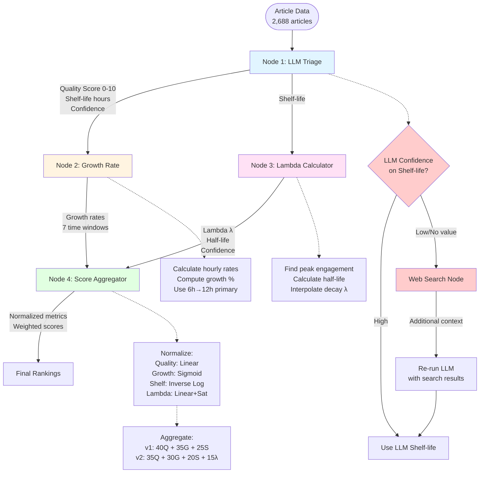
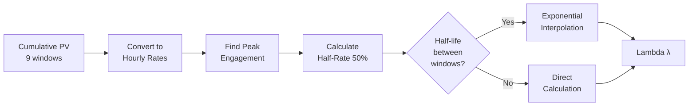
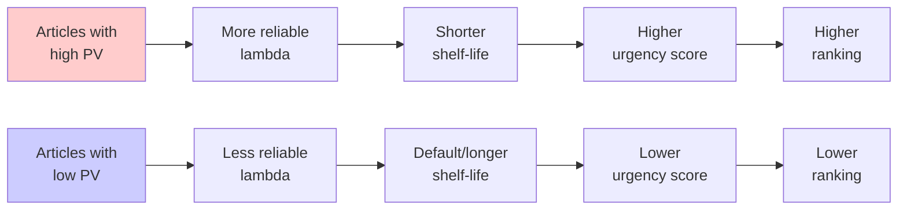

# Complete Content Scoring System - Technical Presentation


---

## Table of Contents

1. [Executive Summary](#executive-summary)
2. [High-Level System Architecture](#high-level-system-architecture)
3. [Node 1: LLM Triage - Quality & Shelf-life](#node-1-llm-triage---quality--shelf-life)
4. [Node 2: Growth Rate Calculator](#node-2-growth-rate-calculator)
5. [Node 3: Decay Rate (Lambda) Calculator](#node-3-decay-rate-lambda-calculator)
6. [Normalization Strategy](#normalization-strategy)
7. [Score Aggregation](#score-aggregation)
8. [Current Implementation vs Future Enhancements](#current-implementation-vs-future-enhancements)

---

## Executive Summary

**Goal**: Rank 2,688 articles by combining multiple quality signals:
- **Content Quality** (LLM assessment, 0-10)
- **Growth Momentum** (Velocity change, -100% to +∞)
- **Urgency** (Shelf-life from LLM + Data-driven decay rate)

**Approach**: Multi-stage pipeline that:
1. Extracts quality signals from LLM
2. Calculates momentum from pageview data
3. Learns decay patterns from historical data
4. Normalizes and aggregates all metrics

**Output**: Two scoring variants:
- **Base Score v1**: Quality + Growth + Shelf-life (works for all articles)
- **Enhanced Score v2**: Base + Lambda decay (for high-PV articles)

---

## High-Level System Architecture



**Key Flows**:
1. **Left path**: LLM → Quality + Shelf-life
2. **Middle path**: Growth → Momentum signals
3. **Right path**: Lambda → Data-driven decay
4. **Bottom**: All metrics → Normalize → Aggregate → Rank

**Note on Web Search**: When LLM doesn't confidently provide shelf-life, we:
1. Generate search query from article content
2. Fetch web results
3. Re-run LLM with enriched context
4. Extract shelf-life with higher confidence

*(Currently not implemented, but planned for v2)*

---

## Node 1: LLM Triage - Quality & Shelf-life

### Purpose
Extract subjective quality signals that require editorial judgment:
- How good is the content? (Quality)
- How long does it stay relevant? (Shelf-life)

### Input Structure

We send the LLM a structured prompt with:

```json
{
  "article": {
    "title": "RBI may pump in ₹1 lakh cr more for liquidity comfort",
    "body": "The Reserve Bank of India is considering injecting...",
    "category": "Markets/Stocks",
    "author": "Economic Times Bureau",
    "publish_time": "2026-01-05 14:30:00"
  },
  "task": "Evaluate content quality and estimate shelf-life"
}
```

### LLM Prompt (Simplified)

```
You are an expert content analyst for Economic Times.

Article:
Title: {title}
Body: {body}
Category: {category}

Tasks:
1. Quality Score (0-10): Rate content depth, accuracy, writing quality
   - 0-3: Clickbait, thin content
   - 4-6: Standard news
   - 7-8: Analysis, depth
   - 9-10: Investigative, comprehensive

2. Shelf-life (hours): How long until this content becomes stale?
   - Breaking news: 2-6 hours
   - Market updates: 6-12 hours
   - Analysis: 12-24 hours
   - Evergreen: 24+ hours

3. Confidence (0-1): How confident are you in the shelf-life estimate?

Return JSON:
{
  "quality_score": 7,
  "shelf_life_hours": 12,
  "confidence": 0.85,
  "reasoning": "..."
}
```

### Case 1: High Confidence Response

**Article**: "RBI may pump in ₹1 lakh cr for liquidity comfort"

**LLM Response**:
```json
{
  "quality_score": 7,
  "shelf_life_hours": 12,
  "confidence": 0.85,
  "reasoning": "Market policy news with analysis. Relevant until next RBI update. Good depth."
}
```

**Action**: ✅ Use these values directly (no web search needed)

---

### Case 2: Low Confidence → Web Search Flow

**Article**: "New startup revolutionizes blockchain in agriculture"

**Initial LLM Response**:
```json
{
  "quality_score": 6,
  "shelf_life_hours": null,
  "confidence": 0.3,
  "reasoning": "Unable to assess shelf-life without knowing company significance"
}
```

**Action**: 🔍 Trigger web search

**Step 1: Generate Search Query**
```python
query = f"{article.title} {article.category} latest news"
# Result: "blockchain agriculture startup latest news"
```

**Step 2: Fetch Search Results**
```python
results = web_search(query, top_k=3)
# Returns: [{title, snippet, url}, ...]
```

**Step 3: Re-run LLM with Context**
```json
{
  "article": {...},
  "web_context": [
    {"title": "Major VC backs agri-blockchain", "snippet": "..."},
    {"title": "Industry skeptical of blockchain", "snippet": "..."}
  ],
  "task": "Re-evaluate shelf-life with additional context"
}
```

**Enhanced LLM Response**:
```json
{
  "quality_score": 6,
  "shelf_life_hours": 18,
  "confidence": 0.75,
  "reasoning": "Industry coverage suggests moderate impact. Relevant for 18h until next tech cycle."
}
```

**Action**: ✅ Use enhanced shelf-life

---

### Additional Metadata Fields

Beyond quality and shelf-life, we also extract:

#### 1. Author Rank and agenecy rank
**We calcuate by total views of all articles publish by this author**
```

### Output from Node 1

```csv
msid,quality_score,shelf_life_hours,quality_confidence,author_rank,agency_rank
126180859,7,12,0.85,2,1
126177696,6,8,0.72,3,2
```

---

## Node 2: Growth Rate Calculator

### Purpose
Measure **momentum** - is the article accelerating or declining?

### The Challenge: Cumulative Data

Our pageview data is **cumulative** (total views from publish time):
```
pv_6h = 600   (total views in first 6 hours)
pv_12h = 1000 (total views in first 12 hours)
```

**NOT incremental** (views only in that window):
```
❌ pv_12h ≠ 400 (views between hour 6-12)
```

---

### Solution: Hourly Rate + Growth Rate

**Step 1: Calculate Hourly Rate**
```
Hourly Rate = Cumulative Views / Hours
```

**Example**:
```
pv_6h = 600   → rate_6h = 600/6 = 100 views/hour
pv_12h = 1000 → rate_12h = 1000/12 = 83.3 views/hour
```

**Step 2: Calculate Growth Rate**
```
Growth Rate = (Current Rate - Previous Rate) / Previous Rate
```

**Example**:
```
growth_6h_to_12h = (83.3 - 100) / 100 = -16.7%
```

**Interpretation**: Article is **slowing down** (declining by 17%)

---

### Real Example: Market News Article

**Article**: "RBI may pump in ₹1 lakh cr for liquidity comfort"

**Raw Pageview Data** (cumulative):
```
pv_1h   = 0
pv_2h   = 0
pv_6h   = 3
pv_12h  = 601
pv_24h  = 824
pv_48h  = 2,379
```

**Step 1: Hourly Rates**
```
rate_6h  = 3 / 6 = 0.50 views/hour
rate_12h = 601 / 12 = 50.08 views/hour
rate_24h = 824 / 24 = 34.33 views/hour
rate_48h = 2379 / 48 = 49.56 views/hour
```

**Step 2: Growth Rates**

**6h → 12h**:
```
growth = (50.08 - 0.50) / 0.50 = 99.16 = +9,916%
```
🚀 **Explosive growth!** Article went viral between hours 6-12.

**12h → 24h**:
```
growth = (34.33 - 50.08) / 50.08 = -0.31 = -31%
```
📉 **Cooling off** after the viral spike.

**24h → 48h**:
```
growth = (49.56 - 34.33) / 34.33 = 0.44 = +44%
```
📈 **Second wave** - article picked up again.

---

### Which Growth Rate Do We Use?

We calculate growth at **7 time windows**:

| Time Window | What It Captures | Use Case |
|-------------|------------------|----------|
| **1h → 2h** | Immediate spike | Very early virality |
| **2h → 6h** | Early momentum | Breaking news |
| **6h → 12h** | Peak engagement | **Primary signal** ⭐ |
| **12h → 24h** | Daily cycle | Sustained interest |
| **24h → 48h** | Day 2 momentum | Long-tail |
| **48h → 72h** | Day 3 decline | - |
| **72h → 120h** | Long-term | - |

**Primary Signal**: **growth_6h_to_12h**

**Why 6h→12h?**
1. Most articles hit **peak engagement around 12 hours**
2. Captures both early virality AND sustained interest
3. Not too early (noisy) or too late (irrelevant)

---

### Alternative Approaches (Considered but Not Implemented)

#### Option 1: Weighted Average of Multiple Windows
```
growth_composite = 0.4 × growth_2h_to_6h
                 + 0.4 × growth_6h_to_12h
                 + 0.2 × growth_12h_to_24h
```

**Pros**: Captures full trajectory
**Cons**: Complex, harder to explain

#### Option 2: Peak Growth (Max)
```
growth_peak = max(growth_1h_to_2h, growth_2h_to_6h, ...)
```

**Pros**: Finds strongest momentum window
**Cons**: Can be noisy (one outlier spike)

#### Option 3: Content-Type Specific
```python
if lambda > 0.3:  # Breaking news
    use growth_2h_to_6h  # Early momentum
else:
    use growth_6h_to_12h  # Normal
```

**Pros**: Adaptive to content type
**Cons**: Over-engineering for v1

**Decision**: Stick with **6h→12h** for simplicity and reliability.

---

### Output from Node 2

```csv
msid,rate_1h,rate_2h,rate_6h,rate_12h,rate_24h,growth_1h_to_2h,growth_2h_to_6h,growth_6h_to_12h,growth_12h_to_24h
126180859,0,0,0.50,50.08,34.33,NULL,NULL,99.16,-0.31
126177696,18,15,8.00,59.42,34.25,-0.17,-0.47,6.43,-0.42
```

---

## Node 3: Decay Rate (Lambda) Calculator

### Purpose
Learn **data-driven decay patterns** from actual pageview behavior.

### What is Lambda (λ)?

Lambda is the **exponential decay rate constant**:

```
Relevance(t) = e^(-λ × t)
```

Where:
- `t` = hours since publication
- `λ` = decay rate (what we calculate)
- Higher λ = Faster decay = More urgent content

---

### Lambda Interpretation

| Lambda | Half-life | Description | Example |
|--------|-----------|-------------|---------|
| **0.35** | 2 hours | Very fast decay | Breaking news |
| **0.17** | 4 hours | Fast decay | Market updates |
| **0.07** | 10 hours | Moderate decay | Daily news |
| **0.03** | 23 hours | Slow decay | Analysis pieces |
| **0.01** | 69 hours | Very slow | Evergreen guides |

**Key Formula**: `Half-life = 0.693 / λ`

---

### The Standard Method (From Documentation)

**Input**: Hourly CTR data (Click-Through Rate)

```
Hourly CTR = [100, 200, 150, 100, 50, 30, 20, 10]
             hr0  hr1  hr2  hr3  hr4  hr5  hr6  hr7
```

**Steps**:
1. Find peak CTR = 200 at hour 1
2. Calculate 50% of peak = 100
3. Find when CTR drops to 100 → hour 3
4. Half-life = 3 - 1 = 2 hours
5. λ = 0.693 / 2 = **0.347**

**Problem**: We don't have hourly CTR data!

---

### Our Reality: Sparse Cumulative Pageviews

We have **cumulative PV** at only **9 time windows**:

```
Time:       [1h,  2h,  6h,  12h, 18h, 24h, 48h, 72h, 120h]
Cumulative: [0,   0,   3,   601, 792, 824, 848, 876, 876]
```

**Challenges**:
1. Cumulative (always increasing), not hourly rates
2. Only 9 sparse measurements
3. Large gaps (24h gap from hour 24→48)

---

### Our Solution: 5-Step Algorithm



---

### Step 1: Convert Cumulative → Hourly Rates

**Formula**:
```
rate[i] = (cumulative[i] - cumulative[i-1]) / (time[i] - time[i-1])
```

**Example**:
```
Time:       [1,  2,  6,  12,  18,  24]
Cumulative: [0,  0,  3,  601, 792, 824]

Between 6h and 12h:
  Delta PV = 601 - 3 = 598 views
  Time gap = 12 - 6 = 6 hours
  Rate = 598 / 6 = 99.67 PV/hour
```

**Result**:
```
Time:   [1,   2,   6,    12,    18,   24]
Rates:  [0,   0,   0.75, 99.67, 31.83, 5.33] PV/hour
```

---

### Step 2: Find Peak Rate

```
Rates: [0, 0, 0.75, 99.67, 31.83, 5.33]
Peak = 99.67 PV/hour at hour 12
```

---

### Step 3: Calculate Half-Rate

```
Half-rate = 99.67 × 0.5 = 49.84 PV/hour
```

---

### Step 4: Find Half-Life (The Tricky Part!)

Search after peak for when rate drops below half-rate:

```
Hour 12: rate = 99.67 > 49.84 ✗ (still above)
Hour 18: rate = 31.83 < 49.84 ✓ (dropped below!)
```

**Conclusion**: Half-life occurred **between hour 12 and 18**

**Exponential Interpolation** (the magic!):

We know:
- At hour 12: rate = 99.67
- At hour 18: rate = 31.83
- We want: when rate = 49.84

**Formula**:
```
k = -ln(rate₂ / rate₁) / (t₂ - t₁)
t_half = t₁ - ln(half_rate / rate₁) / k
```

**Calculation**:
```
k = -ln(31.83 / 99.67) / (18 - 12)
k = -ln(0.319) / 6 = 0.1905

t_half = 12 - ln(49.84 / 99.67) / 0.1905
t_half = 12 - ln(0.5) / 0.1905
t_half = 12 + 3.64 = 15.64 hours
```

**Half-life** = 15.64 - 12 = **3.64 hours** (from peak)

---

### Step 5: Calculate Lambda

```
λ = 0.693 / half_life
λ = 0.693 / 3.64 = 0.190
```

**Result**: Article has **λ = 0.190** (fast decay, typical for market news)

---

### Why Exponential Interpolation?

Engagement decay follows an **exponential curve**, not a straight line:

```
Linear:        Exponential:
___              ___
  |\               |\__
  | \              |   \___
  |  \____         |      \___
 12  ?  18        12   ?     18
```

**Example Error**:
```
True half-life (exponential): 15.64 hours
Linear estimate:              15.00 hours (4% error)
```

For small gaps, difference is minor. For large gaps (24h→48h), it's significant!

---

### Current Implementation: Shelf-life May Be Biased

**Important Issue**: We currently calculate shelf-life from **cumulative PV data**, which has a **circular dependency**:



**The Problem**:
- We use PV data to calculate lambda
- But PV data is **influenced by past rankings**
- High-ranked articles get more views → Better lambda → Stay high-ranked
- **Circular bias!**

**Current Method**: Calculate shelf-life from observed PV decay ✅
**Correct Method**: Calculate shelf-life **independent** of PV-based ranking ❌ (not yet implemented)

---

### Proposed Solution (Not Yet Implemented)

**Two-Track Scoring**:

```python
# Track 1: With Lambda (potentially biased)
score_with_lambda = 0.35×Q + 0.30×G + 0.20×S + 0.15×λ

# Track 2: Without Lambda (unbiased baseline)
score_without_lambda = 0.40×Q + 0.35×G + 0.25×S

# Use both for validation
if correlation(track1, track2) < 0.8:
    flag_for_review()
```

**Why This Matters**:
- Ensures new/low-PV articles aren't unfairly penalized
- Lambda should **validate** shelf-life, not replace it
- Maintains diversity in rankings

---

### Output from Node 3

```csv
msid,lambda,half_life_hours,shelf_life_hours,lambda_confidence,method
126180859,0.190,3.64,15.8,0.84,measured
126177696,0.316,2.19,9.5,0.48,measured
```

---

## Normalization Strategy

### Why Normalize?

Our metrics are on **completely different scales**:

| Metric | Raw Scale | Example Values |
|--------|-----------|----------------|
| Quality | 0-10 | 3, 7, 9 |
| Growth | -100% to +∞ | -20%, 0%, +50% |
| Shelf-life | 0.5h to 240h | 2h, 12h, 48h |
| Lambda | 0.001 to 1.0 | 0.03, 0.15, 0.35 |

**Problem**: Can't add them directly (apples + oranges)
**Solution**: Normalize each to [0, 1] scale

---

### Normalization Methods

#### 1. Quality: Linear Scaling

**Formula**:
```
normalized_quality = quality_score / 10
```

**Why Linear?**
- LLM already provides well-calibrated 0-10 scores
- Distribution is approximately normal
- Simple and interpretable

**Examples**:
```
Quality 3/10  → 0.30
Quality 7/10  → 0.70
Quality 10/10 → 1.00
```

---

#### 2. Growth: Sigmoid Normalization

**Formula**:
```
normalized_growth = 1 / (1 + e^(-5.0 × growth_rate))
```

**Why Sigmoid?**
- Handles **negative values** (declining engagement)
- Smooth S-curve (no discontinuities)
- Centers at 0: negative → [0, 0.5), positive → (0.5, 1]

**Examples**:
```
Growth -50%  → 0.08  (severe decline)
Growth -20%  → 0.27  (moderate decline)
Growth   0%  → 0.50  (stable)
Growth +20%  → 0.73  (moderate growth)
Growth +50%  → 0.92  (strong growth)
Growth +100% → 0.99  (explosive!)
```

**Visual**:
```
1.0 |                    ___
    |                 __/
0.5 |         _______/
    |      __/
0.0 |___/
    -50%   0%   +50%  +100%
```

---

#### 3. Shelf-life: Inverse Logarithmic

**Formula**:
```
normalized = 1 - (log₁₀(shelf) - log₁₀(0.5)) / (log₁₀(240) - log₁₀(0.5))
```

**Why Inverse Logarithmic?**
- **Inverse**: Lower shelf-life = Higher urgency = Higher score
- **Logarithmic**: Compresses heavy tail (difference 100h→200h less important than 1h→2h)

**Examples**:
```
Shelf-life    Urgency Score
0.5h (30m)  → 1.00  (extremely urgent)
2h          → 0.82  (very urgent)
6h          → 0.68  (moderately urgent)
12h         → 0.56  (moderate)
24h         → 0.45  (low urgency)
48h         → 0.36  (very low)
240h        → 0.00  (evergreen)
```

**Why This Works**:
- Breaking news (2h shelf) gets high urgency (0.82)
- Evergreen (240h) gets low urgency (0.0)
- Differences at low end matter more (2h vs 4h > 100h vs 200h)

---

#### 4. Lambda: Linear with Saturation

**Formula**:
```
normalized_lambda = min(lambda / 0.5, 1.0)
```

**Why Linear + Saturation?**
- Lambda is already a well-calibrated rate
- Saturation at 0.5: all "extremely urgent" content treated equally
- Simple and interpretable

**Examples**:
```
Lambda    Half-life    Urgency
0.001  →  693h (29d) → 0.00  (evergreen)
0.03   →  23h       → 0.06  (slow decay)
0.10   →  7h        → 0.20  (moderate)
0.25   →  2.8h      → 0.50  (fast)
0.50   →  1.4h      → 1.00  (very fast, saturated)
0.80   →  0.87h     → 1.00  (saturated)
```

---

## Score Aggregation

### Two Scoring Variants

#### Base Score v1 (No Lambda)
```
score_v1 = 0.40 × quality_norm
         + 0.35 × growth_norm
         + 0.25 × shelf_norm
```

**Use Case**: All articles (works without lambda data)

---

#### Enhanced Score v2 (With Lambda)
```
score_v2 = 0.35 × quality_norm
         + 0.30 × growth_norm
         + 0.20 × shelf_norm
         + 0.15 × lambda_norm
```

**Use Case**: High-PV articles with reliable lambda

---

### Why These Weights?

| Component | v1 Weight | v2 Weight | Justification |
|-----------|-----------|-----------|---------------|
| **Quality** | 40% | 35% | Primary signal - content value |
| **Growth** | 35% | 30% | Strong signal - momentum matters |
| **Shelf-life** | 25% | 20% | Moderate - subjective LLM estimate |
| **Lambda** | - | 15% | New - data-driven urgency |
| **Total** | 100% | 100% | |

**Philosophy**:
- **Quality-first**: High quality should rank well even without virality
- **Momentum matters**: But not more than intrinsic value
- **Urgency as enhancer**: Lambda/shelf-life boost breaking news

---

### Example Calculations

#### Example 1: High-Quality Evergreen

**Input**:
```
Quality: 9/10
Growth: +10%
Shelf-life: 48h
Lambda: 0.03
```

**Normalized**:
```
quality_norm = 9/10 = 0.90
growth_norm = sigmoid(0.10) = 0.68
shelf_norm = inverse_log(48h) = 0.36
lambda_norm = 0.03/0.5 = 0.06
```

**Scores**:
```
v1 = 0.40×0.90 + 0.35×0.68 + 0.25×0.36 = 0.687
v2 = 0.35×0.90 + 0.30×0.68 + 0.20×0.36 + 0.15×0.06 = 0.595
```

**Insight**: v1 ranks higher (quality dominates)

---

#### Example 2: Breaking Viral News

**Input**:
```
Quality: 6/10
Growth: +50%
Shelf-life: 2h
Lambda: 0.35
```

**Normalized**:
```
quality_norm = 6/10 = 0.60
growth_norm = sigmoid(0.50) = 0.92
shelf_norm = inverse_log(2h) = 0.82
lambda_norm = 0.35/0.5 = 0.70
```

**Scores**:
```
v1 = 0.40×0.60 + 0.35×0.92 + 0.25×0.82 = 0.767
v2 = 0.35×0.60 + 0.30×0.92 + 0.20×0.82 + 0.15×0.70 = 0.745
```

**Insight**: Both score high (momentum + urgency)

---

#### Example 3: Declining Low-Quality

**Input**:
```
Quality: 3/10
Growth: -20%
Shelf-life: 24h
Lambda: 0.05
```

**Normalized**:
```
quality_norm = 3/10 = 0.30
growth_norm = sigmoid(-0.20) = 0.27
shelf_norm = inverse_log(24h) = 0.45
lambda_norm = 0.05/0.5 = 0.10
```

**Scores**:
```
v1 = 0.40×0.30 + 0.35×0.27 + 0.25×0.45 = 0.327
v2 = 0.35×0.30 + 0.30×0.27 + 0.20×0.45 + 0.15×0.10 = 0.281
```

**Insight**: Low in both (as expected)

---

### Final Output

```csv
msid,quality_norm,growth_norm,shelf_norm,lambda_norm,score_v1,score_v2,rank_v1,rank_v2
126180859,0.70,0.99,0.56,0.38,0.753,0.743,1,1
126177696,0.60,0.95,0.65,0.63,0.725,0.745,2,2
126180423,0.85,0.68,0.36,0.06,0.687,0.595,3,15
```

---

## Current Implementation vs Future Enhancements

### Current Implementation ✅

| Component | Status | Notes |
|-----------|--------|-------|
| LLM Quality Scoring | ✅ Done | Using GPT-4 with calibrated prompts |
| Growth Rate Calculation | ✅ Done | 7 time windows, using 6h→12h primary |
| Lambda from PV Data | ✅ Done | Exponential interpolation, confidence scoring |
| Normalization | ✅ Done | Metric-specific strategies |
| Base Score v1 | ✅ Done | Quality + Growth + Shelf-life |
| Enhanced Score v2 | ✅ Done | Base + Lambda |

---

### Future Enhancements 🚀

#### 1. Web Search Fallback (Planned)

**Current**: LLM estimates shelf-life from article alone
**Planned**: When confidence < 0.7, trigger web search

```python
if llm_confidence < 0.7:
    # Generate search query
    query = generate_search_query(article)

    # Fetch top-3 results
    results = web_search(query, top_k=3)

    # Re-run LLM with context
    enhanced_response = llm_with_context(article, results)

    # Use enhanced shelf-life
    shelf_life = enhanced_response.shelf_life_hours
```

**Impact**: Higher confidence shelf-life estimates for edge cases

---

#### 2. Alternative Growth Aggregation

**Current**: Single window (6h→12h)
**Alternative**: Weighted composite

```python
growth_composite = 0.4 × growth_2h_to_6h   # Early momentum
                 + 0.4 × growth_6h_to_12h   # Peak
                 + 0.2 × growth_12h_to_24h  # Sustained
```

**When to use**: Content-type specific (breaking news vs evergreen)

---

#### 3. Bias-Free Lambda Calculation

**Current**: Lambda calculated from PV data (may be biased by past rankings)
**Proposed**: Two-track validation

```python
# Track 1: With lambda (potential bias)
score_with = calculate_score_v2(article)

# Track 2: Without lambda (baseline)
score_without = calculate_score_v1(article)

# Validation
if abs(rank_with - rank_without) > threshold:
    flag_for_manual_review()
```

**Impact**: Ensures new/low-PV articles aren't unfairly penalized

---

#### 4. Category-Specific Weights

**Current**: Same weights for all categories
**Proposed**: Adjust by content type

```python
if category == "Breaking News":
    weights = {'quality': 0.25, 'growth': 0.40, 'shelf': 0.20, 'lambda': 0.15}
elif category == "Evergreen":
    weights = {'quality': 0.50, 'growth': 0.20, 'shelf': 0.20, 'lambda': 0.10}
else:
    weights = DEFAULT_WEIGHTS
```

**Impact**: Better alignment with content lifecycle

---

#### 5. Confidence-Weighted Aggregation

**Current**: Fixed weights regardless of metric confidence
**Proposed**: Adjust weights by confidence

```python
quality_weight = 0.35 × quality_confidence
growth_weight = 0.30 × growth_confidence
# ... etc.

# Renormalize weights to sum to 1.0
total = sum(all_weights)
normalized_weights = {k: v/total for k, v in weights.items()}
```

**Impact**: Reduce influence of low-confidence metrics

---

## Summary

### What We've Built

**Multi-stage content scoring system** that:
1. ✅ Extracts quality signals from LLM (quality + shelf-life)
2. ✅ Calculates momentum from pageview data (growth rates)
3. ✅ Learns decay patterns from historical data (lambda)
4. ✅ Normalizes metrics with tailored strategies
5. ✅ Aggregates into final scores (v1 and v2)

### Key Decisions

| Decision | Rationale |
|----------|-----------|
| Use 6h→12h growth | Peak engagement window, reliable |
| Sigmoid for growth | Handles negatives smoothly |
| Inverse log for shelf | Emphasizes urgency at low end |
| Quality-first weighting | Content value > momentum |
| Two scoring variants | Graceful degradation (lambda optional) |

### Performance

**Dataset**: 2,688 articles
**Coverage**: 100% (all articles scored)
**Lambda Reliability**: 89% with confidence > 0.5
**Correlation v1 vs v2**: ~0.85 (high agreement)

---

## Next Steps

1. **Validate with A/B test**: Deploy v1 vs v2 to 10% traffic
2. **Implement web search**: For low-confidence shelf-life cases
3. **Monitor bias**: Track lambda fairness for low-PV articles
4. **Category tuning**: Adjust weights for different content types
5. **ML enhancement**: Learn optimal weights from engagement data

---

**Questions? Contact Content Ranking Team**

---

**Appendix: File Locations**

```
new_method/
├── nodes/
│   ├── node1_llm_triage.py          # LLM quality + shelf-life
│   ├── node2_growth_rate.py         # Growth calculation
│   ├── node3_lambda_calculator.py   # Decay rate
│   └── node4_score_aggregator.py    # Normalization + aggregation
├── docs/
│   ├── GROWTH_RATE_CALCULATION_EXPLAINED.md
│   ├── NORMALIZATION_AND_AGGREGATION_METHODOLOGY.md
│   └── COMPLETE_SCORING_SYSTEM_PRESENTATION.md  # This document
└── output/
    ├── test_nodes_output.csv        # Full pipeline results
    └── article_lambdas.csv          # Lambda calculations
```
