# Social Media Feed Personalization: Complete System Design
## From Beginner to Advanced — Instagram, Twitter/X, YouTube, TikTok

> A complete case study covering frontend, backend, ML, caching, databases, CDN, and everything in between.

---

## Table of Contents

1. [The Big Picture — What Happens When You Open Instagram?](#1-the-big-picture)
2. [Frontend Architecture — The Client Side](#2-frontend-architecture)
3. [Backend Architecture — The Server Side](#3-backend-architecture)
4. [Database Layer — Where Data Lives](#4-database-layer)
5. [Caching — The Speed Secret](#5-caching)
6. [CDN — Content Delivery Networks](#6-cdn)
7. [Feed Generation — How Your Feed Is Built](#7-feed-generation)
8. [ML & Ranking — The Personalization Brain](#8-ml-and-ranking)
9. [Real-Time Features — Notifications, Live, Stories](#9-real-time-features)
10. [Case Study: Instagram](#10-case-study-instagram)
11. [Case Study: Twitter/X](#11-case-study-twitter)
12. [Case Study: YouTube](#12-case-study-youtube)
13. [Case Study: TikTok](#13-case-study-tiktok)
14. [Scaling — From 1 User to 1 Billion](#14-scaling)
15. [Key Concepts Glossary](#15-glossary)

---

## 1. The Big Picture

### What happens when you open Instagram? (Every step, in order)

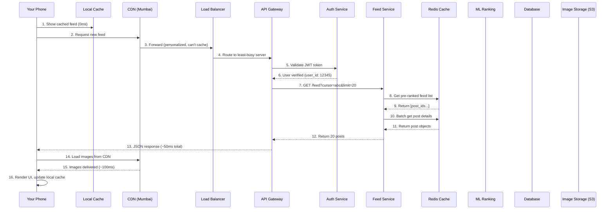

### The Three Golden Rules of Feed Systems

```
Rule 1: NEVER compute the feed in real-time
         → Pre-compute it in the background

Rule 2: NEVER hit the database for every request
         → Cache everything in Redis/Memcached

Rule 3: NEVER send full-size images
         → Use CDN + multiple image sizes
```

---

## 2. Frontend Architecture

### 2.1 How the Mobile App Works

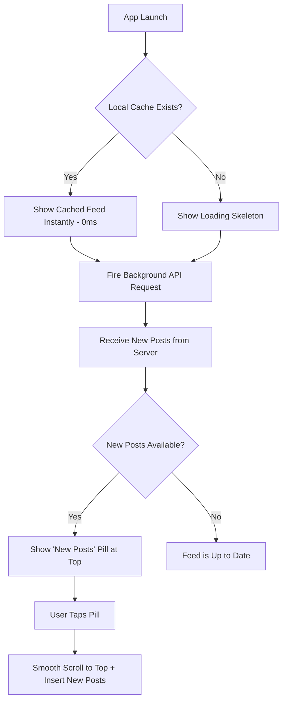

### 2.2 Local Storage on Your Phone

Every social media app stores data locally on your device:

```
Phone Storage (~200-500MB per app)
├── SQLite Database (structured data)
│   ├── feed_items table (last 200 posts - text, metadata)
│   ├── users table (profiles you've seen)
│   ├── comments table (recent comments)
│   └── notifications table
│
├── Image Cache (disk)
│   ├── thumbnails/ (150x150px, ~5KB each)
│   ├── feed_images/ (600x600px, ~50KB each)
│   └── profile_pics/ (100x100px, ~3KB each)
│
├── Video Cache
│   ├── Reels buffer (next 3-5 videos pre-loaded)
│   └── Stories buffer (next story pre-loaded)
│
└── Preferences (SharedPreferences / UserDefaults)
    ├── auth_token (JWT)
    ├── last_seen_cursor
    ├── scroll_position
    └── user_settings
```

### 2.3 Pull-to-Refresh Implementation

```
STEP BY STEP:

1. User pulls down on screen
   → Touch event detected
   → Spinner animation starts
   → Haptic feedback (vibration)

2. API call fires
   → GET /api/v1/feed?cursor=last_seen_id_abc123
   → cursor = ID of the newest post you've already seen
   → Server returns ONLY posts newer than this cursor

3. Response arrives (20-100ms)
   → Parse JSON
   → Compare with local cache
   → Insert ONLY new items at the top

4. UI updates
   → RecyclerView (Android) / UICollectionView (iOS)
   → Only renders visible items (virtualization)
   → Images lazy-load as you scroll

5. Local cache updated
   → New posts saved to SQLite
   → Old posts (>500) pruned from cache
   → Scroll position saved
```

### 2.4 Infinite Scroll (Pagination)

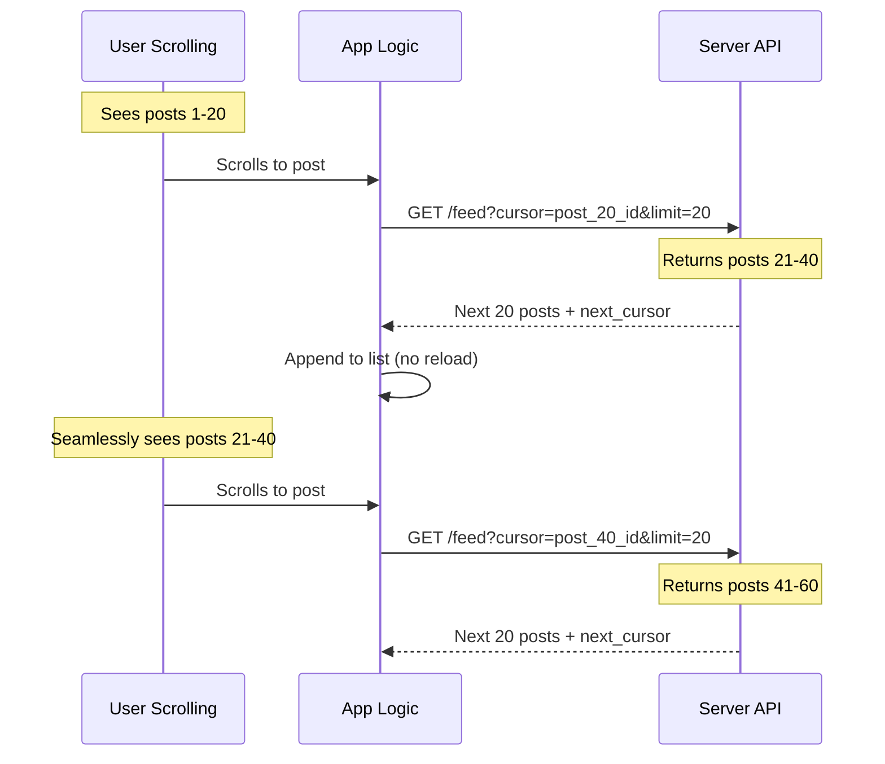

**Why cursor-based, not page-based?**
```
PAGE-BASED (Bad for feeds):
  Page 1: posts 1-20
  Page 2: posts 21-40
  Problem: If 5 new posts are added while you're reading,
           Page 2 will repeat 5 posts from Page 1!

CURSOR-BASED (Good for feeds):
  "Give me 20 posts AFTER post_id_xyz"
  No matter how many new posts are added,
  you'll never see duplicates.
```

### 2.5 Image Loading Pipeline

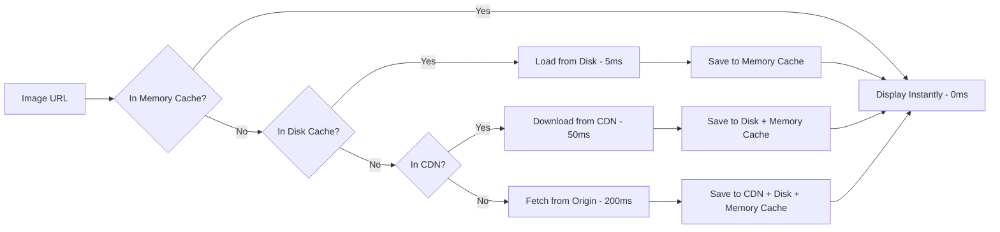

**Image sizes served by Instagram:**
```
Original upload:     4032 x 3024px  (~5MB)
Feed display:        1080 x 1080px  (~200KB)
Thumbnail:            150 x 150px   (~10KB)
Story:               1080 x 1920px  (~300KB)
Profile pic (small):   50 x 50px    (~2KB)
Profile pic (large):  320 x 320px   (~30KB)

The server generates ALL sizes when you upload.
Your phone only downloads the size it needs.
```

---

## 3. Backend Architecture

### 3.1 Microservices Architecture

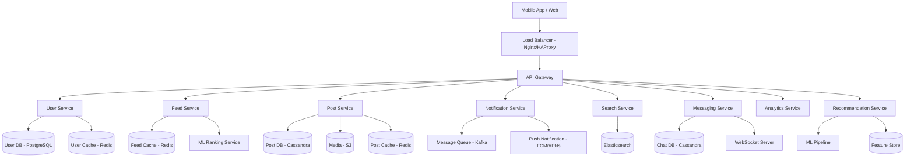

### 3.2 What Each Service Does

```
USER SERVICE
├── Registration, login, authentication
├── Profile CRUD (create, read, update, delete)
├── Follow/unfollow logic
├── JWT token generation and validation
└── Rate: ~50,000 requests/second

FEED SERVICE (Most complex)
├── Generates personalized feed per user
├── Merges posts from followed accounts
├── Applies ML ranking
├── Handles pagination (cursor-based)
├── Pre-computes feeds in background
└── Rate: ~500,000 requests/second (most hit service)

POST SERVICE
├── Create, edit, delete posts
├── Handle image/video upload pipeline
├── Generate thumbnails and variants
├── Store metadata (caption, tags, location)
├── Trigger fan-out to followers' feeds
└── Rate: ~10,000 writes/second (Instagram)

NOTIFICATION SERVICE
├── Push notifications (likes, comments, follows)
├── In-app notification feed
├── Email/SMS notifications
├── Batching (don't send 100 notifications for 100 likes)
└── Rate: ~200,000 notifications/second

SEARCH SERVICE
├── User search (by name, username)
├── Hashtag search
├── Location search
├── Content search (captions, comments)
├── Powered by Elasticsearch
└── Rate: ~100,000 queries/second
```

### 3.3 API Gateway Pattern

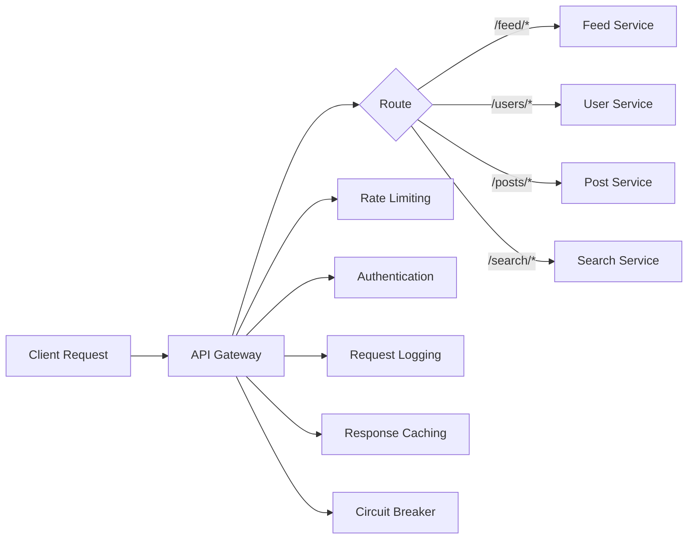

**What the API Gateway does:**
```
1. RATE LIMITING
   - 200 requests/minute per user
   - Prevents abuse and DDoS
   - Uses Token Bucket algorithm

2. AUTHENTICATION
   - Validates JWT token on every request
   - Extracts user_id, permissions
   - Rejects expired/invalid tokens

3. ROUTING
   - Routes /feed/* to Feed Service
   - Routes /users/* to User Service
   - Load balances across multiple instances

4. CIRCUIT BREAKER
   - If Feed Service is down, return cached response
   - Don't let one broken service crash everything
   - Auto-retry after cooldown period
```

### 3.4 Load Balancer Deep Dive

```
WHAT: Distributes incoming requests across multiple servers
WHY: No single server can handle millions of users

                    ┌─────────────┐
                    │   Incoming   │
                    │  1M req/sec  │
                    └──────┬──────┘
                           │
                    ┌──────▼──────┐
                    │    Load     │
                    │  Balancer   │
                    └──────┬──────┘
              ┌────────┬───┴───┬────────┐
              ▼        ▼       ▼        ▼
         ┌────────┐┌────────┐┌────────┐┌────────┐
         │Server 1││Server 2││Server 3││Server 4│
         │250K/s  ││250K/s  ││250K/s  ││250K/s  │
         └────────┘└────────┘└────────┘└────────┘

ALGORITHMS:
1. Round Robin       - Each server takes turns (simple)
2. Least Connections - Send to server with fewest active requests
3. IP Hash           - Same user always goes to same server
4. Weighted          - Better servers get more traffic

LAYERS:
L4 (Transport) - Routes based on IP/port (faster, simpler)
L7 (Application) - Routes based on URL/headers (smarter)

Instagram uses: L7 Load Balancing with Least Connections
```

---

## 4. Database Layer

### 4.1 Which Database for What?

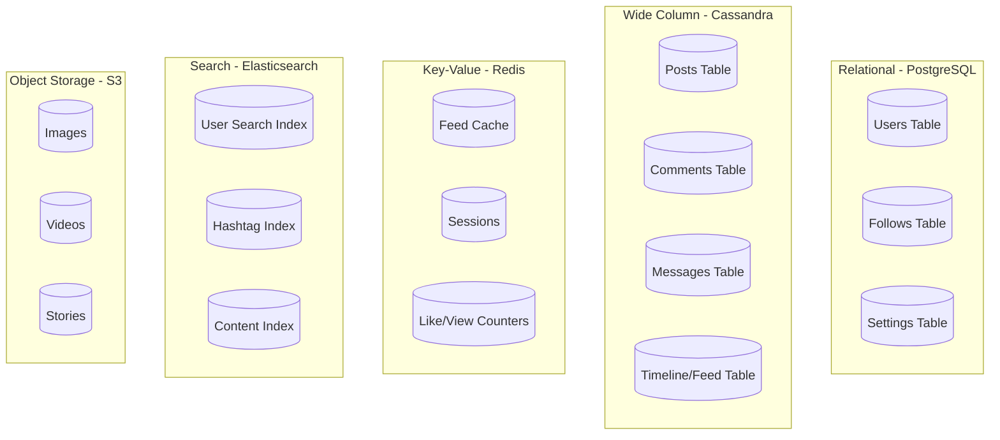

### 4.2 Why Different Databases?

```
POSTGRESQL (Relational)
├── Best for: Structured data with relationships
├── Used for: Users, follows, settings
├── Why: ACID transactions (follow must be atomic)
├── Scale: Vertical + read replicas
├── Instagram: 100+ PostgreSQL instances
└── Example query:
    SELECT * FROM users WHERE user_id = 12345;
    SELECT follower_id FROM follows WHERE following_id = 12345;

CASSANDRA (Wide Column / NoSQL)
├── Best for: High write throughput, time-series data
├── Used for: Posts, comments, feed timelines, messages
├── Why: Handles millions of writes/second
├── Scale: Horizontal (just add more nodes)
├── Twitter: 1000+ Cassandra nodes
└── Example:
    Key: user_123_feed
    Columns: [timestamp_1: post_456, timestamp_2: post_789, ...]

REDIS (In-Memory Key-Value)
├── Best for: Ultra-fast reads, caching, counters
├── Used for: Feed cache, sessions, rate limiting, leaderboards
├── Why: 1ms reads (100x faster than PostgreSQL)
├── Scale: Redis Cluster (sharding)
├── Speed: 100,000+ operations/second per node
└── Example:
    GET feed:user_12345 → [post_id_1, post_id_2, ...]
    INCR likes:post_456 → 10001

ELASTICSEARCH (Search Engine)
├── Best for: Full-text search, fuzzy matching
├── Used for: User search, hashtags, content search
├── Why: Can search "Sachn Tendlkr" and find "Sachin Tendulkar"
├── Scale: Horizontal (sharding + replicas)
└── Example:
    Search "budget 2026" → returns matching posts, users, hashtags

S3 (Object Storage - AWS)
├── Best for: Large binary files (images, videos)
├── Used for: All media content
├── Why: Virtually unlimited storage, 99.999999999% durability
├── Cost: ~$0.023/GB/month
├── Instagram: Stores 100+ petabytes of images
└── Example:
    s3://instagram-media/images/user_123/post_456_1080.jpg
```

### 4.3 Database Schema Examples

```sql
-- USERS TABLE (PostgreSQL)
CREATE TABLE users (
    user_id        BIGINT PRIMARY KEY,
    username       VARCHAR(30) UNIQUE NOT NULL,
    email          VARCHAR(255) UNIQUE NOT NULL,
    password_hash  VARCHAR(255) NOT NULL,
    display_name   VARCHAR(100),
    bio            TEXT,
    profile_pic_url VARCHAR(500),
    follower_count  INT DEFAULT 0,
    following_count INT DEFAULT 0,
    post_count      INT DEFAULT 0,
    is_verified     BOOLEAN DEFAULT FALSE,
    created_at      TIMESTAMP DEFAULT NOW(),
    updated_at      TIMESTAMP DEFAULT NOW()
);

-- FOLLOWS TABLE (PostgreSQL)
-- "Who follows whom?"
CREATE TABLE follows (
    follower_id   BIGINT NOT NULL,      -- Person who follows
    following_id  BIGINT NOT NULL,      -- Person being followed
    created_at    TIMESTAMP DEFAULT NOW(),
    PRIMARY KEY (follower_id, following_id)
);
-- Index for "get all followers of user X"
CREATE INDEX idx_following ON follows(following_id);

-- POSTS TABLE (Cassandra - different syntax)
-- Partition key: user_id (all posts by one user on same node)
-- Clustering key: created_at DESC (newest first)
CREATE TABLE posts (
    user_id       BIGINT,
    post_id       UUID,
    created_at    TIMESTAMP,
    media_urls    LIST<TEXT>,
    caption       TEXT,
    location      TEXT,
    like_count    COUNTER,
    comment_count COUNTER,
    PRIMARY KEY (user_id, created_at)
) WITH CLUSTERING ORDER BY (created_at DESC);
```

### 4.4 Database Sharding (Splitting Data Across Servers)

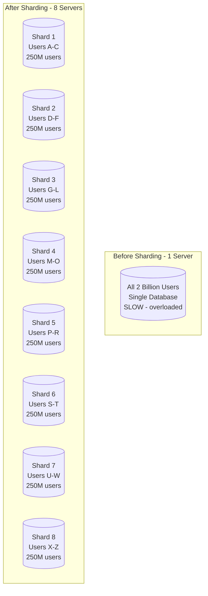

```
HOW SHARDING WORKS:

1. HASH-BASED SHARDING (Most common)
   shard_number = hash(user_id) % number_of_shards

   User 12345 → hash(12345) % 8 = 5 → Goes to Shard 5
   User 67890 → hash(67890) % 8 = 2 → Goes to Shard 2

   Pro: Even distribution
   Con: Adding new shard requires rehashing (use consistent hashing)

2. RANGE-BASED SHARDING
   Users 1-1M       → Shard 1
   Users 1M-2M      → Shard 2
   Users 2M-3M      → Shard 3

   Pro: Simple, range queries possible
   Con: Uneven load (celebrities create hotspots)

3. GEOGRAPHIC SHARDING
   India users      → Mumbai datacenter
   US users         → Virginia datacenter
   Europe users     → Frankfurt datacenter

   Pro: Low latency for users
   Con: Cross-region follows are complex

Instagram uses: Hash-based sharding with consistent hashing
Twitter uses:   Hash-based sharding on user_id
```

---

## 5. Caching

### 5.1 The Caching Hierarchy

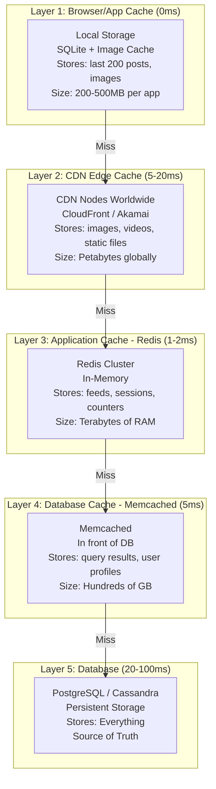

### 5.2 Redis Deep Dive

```
WHAT IS REDIS?
Redis = Remote Dictionary Server
It's a database that stores everything in RAM (memory),
making it 100x faster than disk-based databases.

SPEED COMPARISON:
PostgreSQL read:  ~5-20ms   (data on disk, needs disk I/O)
Redis read:       ~0.1-1ms  (data in RAM, no disk I/O)

WHY RAM IS FASTER THAN DISK:
RAM access:   ~100 nanoseconds
SSD access:   ~100,000 nanoseconds (1000x slower)
HDD access:   ~10,000,000 nanoseconds (100,000x slower)
```

**Redis Data Structures Used in Social Media:**

```
1. STRINGS - Simple key-value
   SET session:token_abc '{"user_id": 123, "expires": "2025-03-01"}'
   GET session:token_abc
   → Used for: sessions, simple caching

2. LISTS - Ordered list of items
   LPUSH feed:user_123 post_456    (add to front)
   LRANGE feed:user_123 0 19       (get first 20 items)
   → Used for: feed timelines, recent activity

3. SORTED SETS - Scored + sorted items
   ZADD trending 9500 "#Budget2026"
   ZADD trending 8200 "#Cricket"
   ZREVRANGE trending 0 9          (top 10 trending)
   → Used for: trending topics, leaderboards, ranked feeds

4. HASHES - Object-like storage
   HSET user:123 name "Sonu" followers 500 posts 42
   HGET user:123 name              → "Sonu"
   HGETALL user:123                → all fields
   → Used for: user profiles, post metadata

5. SETS - Unique collections
   SADD user:123:following 456 789 101
   SISMEMBER user:123:following 456  → true
   SINTER user:123:following user:456:following  → mutual follows
   → Used for: follow lists, mutual friends, "who liked this"

6. HYPERLOGLOG - Approximate counting
   PFADD post:456:views user_123 user_456 user_789
   PFCOUNT post:456:views          → ~3 (approximate unique views)
   → Used for: view counts (approximate but memory-efficient)
     12 bytes to count billions of unique items!
```

### 5.3 How Instagram Uses Redis for Feeds

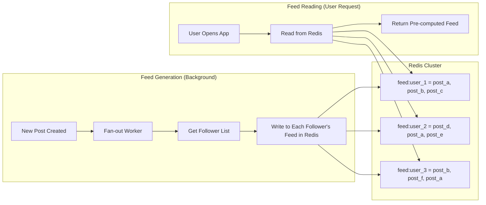

```
CONCRETE EXAMPLE:

Virat Kohli posts a photo (100M followers)

STEP 1: Post saved to Cassandra (post database)
STEP 2: Fan-out service reads follower list
STEP 3: For each follower, LPUSH to their Redis feed list

  LPUSH feed:user_001 post_virat_abc
  LPUSH feed:user_002 post_virat_abc
  LPUSH feed:user_003 post_virat_abc
  ... (100 million times!)

STEP 4: When user_001 opens Instagram:
  LRANGE feed:user_001 0 19  → returns latest 20 post IDs
  MGET post:virat_abc post:friend_xyz ...  → batch get post details

Total read time: ~3ms (all from Redis, no database hit!)

PROBLEM: 100M writes for one celebrity post takes too long!
SOLUTION: Fan-out on READ for celebrities (see Section 7)
```

### 5.4 Cache Invalidation (The Hardest Problem)

```
"There are only two hard things in Computer Science:
 cache invalidation and naming things."
 — Phil Karlton

THE PROBLEM:
  User changes profile pic
  → Database updated instantly
  → But Redis still has OLD profile pic URL
  → Other users see stale data!

SOLUTIONS:

1. TTL (Time To Live) - Simplest
   SET user:123:profile '{"pic": "old.jpg"}' EX 300  (expires in 5 min)
   → After 5 min, cache auto-deletes
   → Next read goes to database, gets fresh data
   → Tradeoff: up to 5 min of stale data

2. Write-Through Cache - Best consistency
   Update database → THEN update cache immediately
   → Both always in sync
   → Tradeoff: slower writes (2 operations)

3. Write-Behind Cache - Best write performance
   Update cache → return success → async update database later
   → Ultra-fast writes
   → Tradeoff: risk of data loss if cache crashes before DB write

4. Cache-Aside (Lazy Loading) - Most common
   Read: Check cache → miss → read DB → write to cache → return
   Write: Update DB → delete cache key → next read will refresh
   → Simple and effective
   → Tradeoff: first read after invalidation is slow

WHAT INSTAGRAM USES:
  Feed cache:    TTL (5 minutes) + Write-through on new posts
  User profiles: Cache-aside with TTL (60 seconds)
  Like counts:   Write-behind (batch update DB every 5 seconds)
```

---

## 6. CDN

### 6.1 How CDN Works

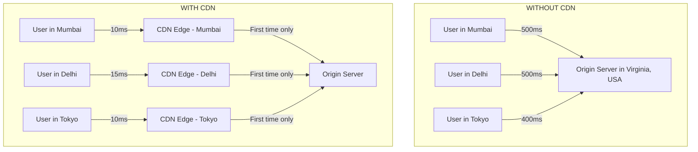

### 6.2 CDN Explained Simply

```
ANALOGY: Amazon Warehouse

Without CDN = One warehouse in USA
  Every order ships from USA to India → 2 weeks delivery

With CDN = Local warehouses in every city
  Popular items stocked locally → next-day delivery
  Rare items still shipped from USA → 2 weeks

CDN does the SAME thing for digital content:
  Popular images cached at 300+ locations worldwide
  First user in Mumbai requests image → fetched from US origin (500ms)
  Image cached at Mumbai CDN edge
  Second user in Mumbai → served from local cache (10ms)
```

### 6.3 What Gets Cached at CDN vs What Doesn't

```
CACHED AT CDN (Static, same for everyone):
✅ Profile pictures
✅ Post images and videos
✅ Story thumbnails
✅ App assets (JavaScript, CSS, fonts)
✅ Emoji packs
✅ Static HTML pages

NOT CACHED AT CDN (Dynamic, personalized):
❌ Your personalized feed (different for every user)
❌ Search results
❌ Notification list
❌ Direct messages
❌ User session data
❌ Real-time data (like counts, online status)
```

### 6.4 Image Processing Pipeline

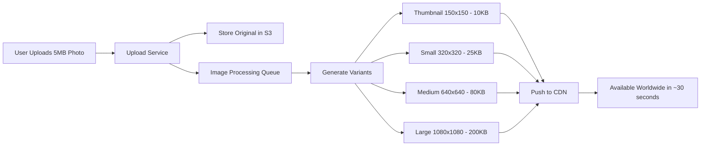

---

## 7. Feed Generation

### 7.1 The Two Approaches: Fan-out on Write vs Read

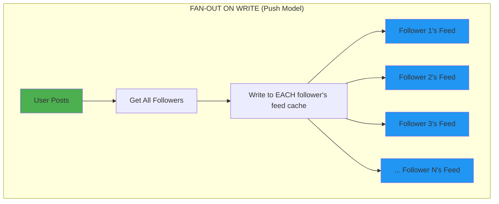

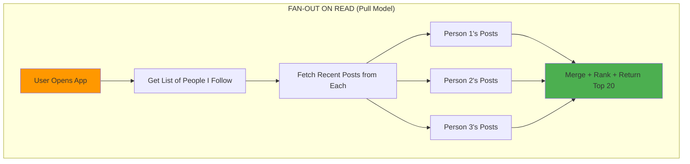

### Comparison

```
                    FAN-OUT ON WRITE         FAN-OUT ON READ
                    (Push Model)             (Pull Model)

When work happens:  At POST time             At READ time
Read speed:         Ultra fast (pre-computed) Slower (computed on demand)
Write speed:        Slower (write to N feeds) Fast (single write)
Storage:            High (N copies of post)   Low (single copy)
Best for:           Users with few followers  Celebrities (millions of followers)
Used by:            Twitter (for normal)      Twitter (for celebrities)
                    Facebook
Memory usage:       High                      Low

EXAMPLE:
Normal user (500 followers) posts:
  Fan-out on write: Write to 500 feeds → 500 writes → takes 50ms
  ✅ Good! 500 writes is cheap

Celebrity (50M followers) posts:
  Fan-out on write: Write to 50M feeds → 50M writes → takes MINUTES
  ❌ Bad! Too expensive!

  Fan-out on read: Store once, merge at read time
  ✅ Good! One write, compute on demand
```

### 7.2 Twitter's Hybrid Approach

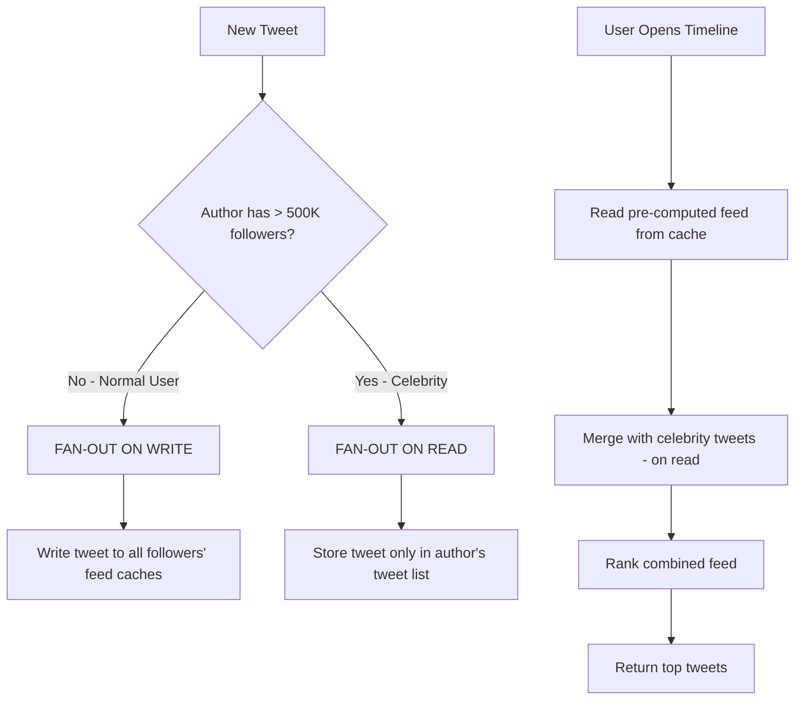

```
TWITTER'S ACTUAL NUMBERS (from their engineering blog):

- 500M tweets/day
- 200M daily active users
- Each timeline request: ~300ms
- Pre-computed feeds stored in Redis
- Fan-out threshold: ~500K followers

WHEN YOU OPEN TWITTER:
1. Read your pre-computed timeline from Redis        (~2ms)
2. Fetch latest tweets from celebrities you follow   (~50ms)
3. Merge both lists                                  (~5ms)
4. Apply ML ranking model                            (~50ms)
5. Return top tweets                                 (~2ms)
Total: ~110ms server-side
```

### 7.3 Feed Generation Pipeline (Complete)

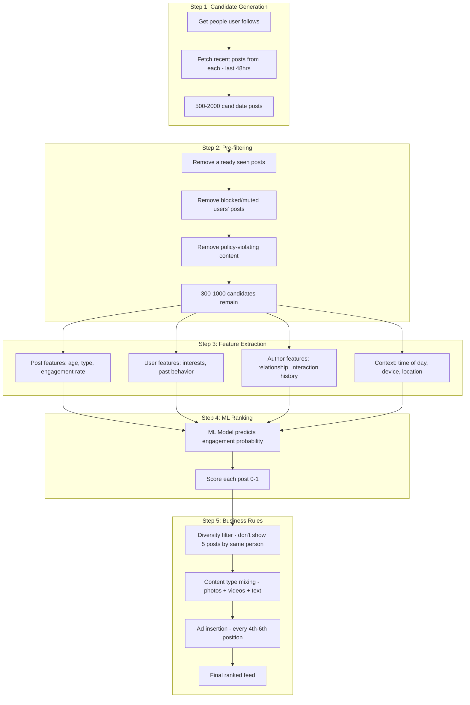

---

## 8. ML and Ranking

### 8.1 The Ranking Model

```
WHAT THE ML MODEL PREDICTS:

For each post in your candidate set, the model predicts:

  P(like)      = probability you'll like this post      (0.0 - 1.0)
  P(comment)   = probability you'll comment              (0.0 - 1.0)
  P(share)     = probability you'll share                (0.0 - 1.0)
  P(save)      = probability you'll save                 (0.0 - 1.0)
  P(click)     = probability you'll click/expand         (0.0 - 1.0)
  P(dwell_30s) = probability you'll view for 30+ seconds (0.0 - 1.0)
  P(hide)      = probability you'll hide this post       (0.0 - 1.0)

FINAL SCORE = weighted combination:
  score = (w1 × P(like)) + (w2 × P(comment)) + (w3 × P(share))
        + (w4 × P(save)) + (w5 × P(click)) + (w6 × P(dwell_30s))
        - (w7 × P(hide))

Instagram's approximate weights:
  Like:    1.0x
  Comment: 5.0x    (comments are 5x more valuable than likes)
  Share:   10.0x   (shares are most valuable)
  Save:    8.0x    (saves indicate high quality)
  Click:   0.5x
  Dwell:   2.0x
  Hide:    -50.0x  (strongly penalize content user would hide)
```

### 8.2 Features Used for Ranking

```mermaid
graph TB
    subgraph "Post Features"
        PF1[Post age - minutes since published]
        PF2[Media type - photo/video/carousel/text]
        PF3[Caption length]
        PF4[Number of hashtags]
        PF5[Has location tag?]
        PF6[Current engagement rate]
        PF7[Engagement velocity - likes per minute]
    end

    subgraph "User Features - YOU"
        UF1[Your interests - topics you engage with]
        UF2[Time spent on app today]
        UF3[Your engagement patterns - like vs comment ratio]
        UF4[Content type preference - video vs photo]
        UF5[Active hours - when you're most active]
        UF6[Your social graph strength]
        UF7[Device type - phone model affects video quality]
    end

    subgraph "Author Features"
        AF1[Your relationship with author]
        AF2[How often you interact with them]
        AF3[Author's overall engagement rate]
        AF4[Author's follower count]
        AF5[Time since last post by author]
        AF6[Is author in your Close Friends?]
    end

    subgraph "Cross Features"
        CF1[Has user liked author's post before?]
        CF2[Has user commented on author recently?]
        CF3[Do they DM each other?]
        CF4[Mutual followers count]
        CF5[How long since user saw author's post?]
    end

    PF1 --> Model[ML Ranking Model]
    UF1 --> Model
    AF1 --> Model
    CF1 --> Model
    Model --> Score[Engagement Score 0-1]
```

### 8.3 The ML Architecture

```
INSTAGRAM'S RANKING MODEL EVOLUTION:

2012: Chronological (newest first, no ML)
2016: Simple logistic regression (few hundred features)
2018: Deep learning (neural networks, thousands of features)
2020: Multi-task learning (predict like + comment + share together)
2023: Transformer-based models (similar to ChatGPT architecture)
2024+: LLM-enhanced understanding (content understanding via LLMs)

CURRENT ARCHITECTURE (Simplified):

Input Features (1000+)
    │
    ▼
┌─────────────────────────┐
│ Embedding Layers        │  Convert categorical features to vectors
│ (user_id → 128-dim)     │  Convert text to vectors
│ (post_id → 64-dim)      │  Convert images to vectors (CNN)
└───────────┬─────────────┘
            │
┌───────────▼─────────────┐
│ Feature Interaction     │  Learn which feature combinations matter
│ (Deep & Cross Network)  │  "Users who like cricket AND are from Mumbai
│                         │   tend to engage with IPL content"
└───────────┬─────────────┘
            │
┌───────────▼─────────────┐
│ Multi-Task Towers       │  Separate prediction heads
│ ┌──────┐ ┌──────┐       │
│ │ Like │ │Comment│ ...   │  Each predicts independently
│ │ Head │ │ Head │       │  but shares underlying features
│ └──┬───┘ └──┬───┘       │
└────┼────────┼───────────┘
     │        │
     ▼        ▼
  P(like)  P(comment) P(share) P(save) P(hide)
     │        │           │       │       │
     └────────┼───────────┼───────┼───────┘
              │
     Weighted Combination
              │
         Final Score
```

### 8.4 Training the Model

```
TRAINING DATA:

Every interaction you make is logged:
  {user_id: 123, post_id: 456, action: "like", timestamp: "2025-02-01 10:30:00"}
  {user_id: 123, post_id: 789, action: "scroll_past", timestamp: "2025-02-01 10:30:05"}
  {user_id: 123, post_id: 101, action: "comment", timestamp: "2025-02-01 10:31:00"}
  {user_id: 123, post_id: 202, action: "hide", timestamp: "2025-02-01 10:32:00"}

POSITIVE LABELS: like, comment, share, save, long_dwell
NEGATIVE LABELS: scroll_past, hide, "not interested"

TRAINING PIPELINE:
  1. Collect billions of interaction logs daily
  2. Extract features for each (user, post) pair
  3. Label: positive (engaged) vs negative (ignored)
  4. Train model on GPU cluster (100+ GPUs)
  5. Evaluate on held-out test set
  6. A/B test: new model vs current model on 1% of users
  7. If metrics improve → roll out to 100% of users

RETRAINING FREQUENCY:
  Instagram: Daily model updates
  TikTok: Near real-time model updates
  Twitter: Weekly model updates
```

### 8.5 Embedding Models — How ML "Understands" Content

```
WHAT ARE EMBEDDINGS?

Embeddings convert things into numbers (vectors) so that
similar things have similar numbers.

Example - Word Embeddings:
  "cricket"  → [0.8, 0.2, 0.1, 0.9, 0.3]
  "IPL"      → [0.7, 0.3, 0.1, 0.8, 0.4]  ← similar to cricket!
  "cooking"  → [0.1, 0.8, 0.9, 0.1, 0.2]  ← very different

Example - User Embeddings:
  User who likes cricket → [0.9, 0.1, 0.8, ...]
  User who likes cooking → [0.1, 0.9, 0.2, ...]
  Post about IPL         → [0.8, 0.2, 0.7, ...]

  Distance(cricket_user, IPL_post) = 0.1  ← CLOSE → show this post!
  Distance(cooking_user, IPL_post) = 0.9  ← FAR   → skip this post

Example - Image Embeddings (Instagram):
  Photo of beach sunset  → [0.3, 0.8, 0.7, ...]
  Photo of mountain sunset → [0.3, 0.7, 0.8, ...]  ← similar!
  Photo of cat           → [0.9, 0.1, 0.2, ...]    ← different

  Instagram uses this to recommend "Explore" content similar
  to what you've liked before.
```

---

## 9. Real-Time Features

### 9.1 WebSockets vs HTTP

```
HTTP (Request-Response):
  Client: "Any new messages?"      → Server: "No"
  Client: "Any new messages?"      → Server: "No"
  Client: "Any new messages?"      → Server: "Yes! Here's one"
  Client: "Any new messages?"      → Server: "No"
  → Wasteful! Checking constantly even when nothing new.

WEBSOCKETS (Persistent Connection):
  Client ↔ Server: Connection established (stays open)
  Server: "New message arrived!" → Client gets it instantly
  Server: "User X is typing..."  → Client shows typing indicator
  Server: "User X is online"     → Client updates status
  → Efficient! Server pushes only when something happens.

WHAT USES WHAT:
  HTTP:       Feed loading, posting, search, profile views
  WebSocket:  DMs, typing indicators, online status, live video comments
  SSE:        Notification stream, live scores
```

### 9.2 Notification System

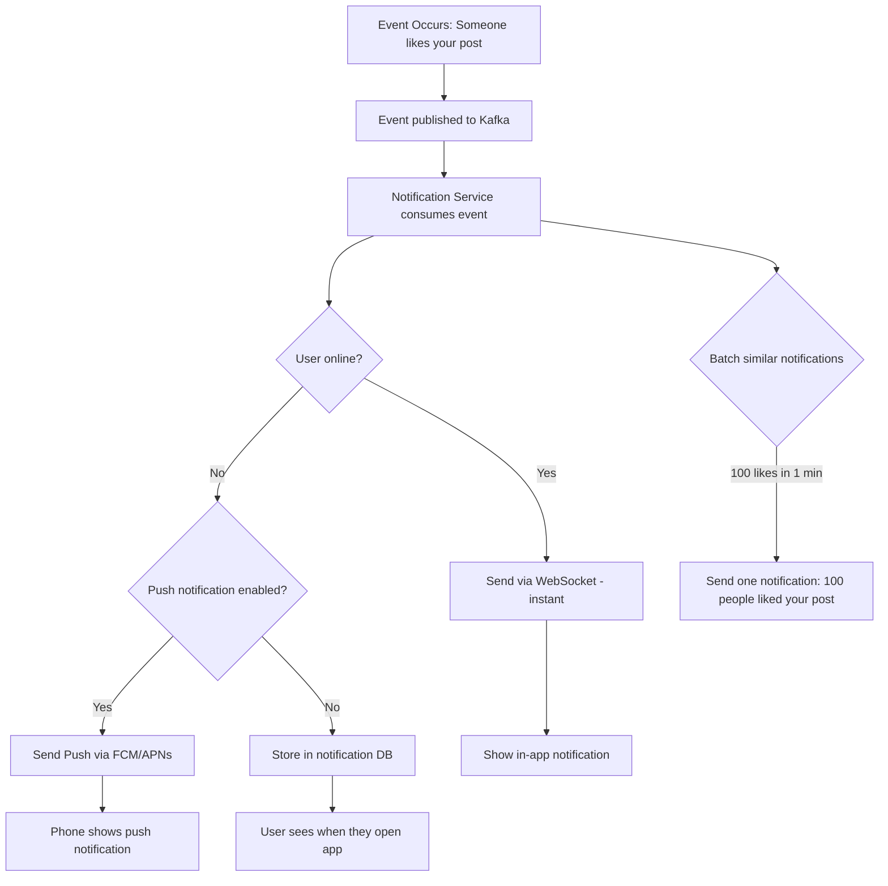

### 9.3 Real-Time Like Count Updates

```
HOW INSTAGRAM SHOWS REAL-TIME LIKE COUNTS:

1. User A likes a post
2. Like event → Kafka message queue
3. Counter service increments Redis counter:
   INCR likes:post_456  → returns 10,001
4. Periodically (every 5 seconds), batch write to database
5. Other users viewing same post:
   - DON'T get real-time updates (too expensive)
   - See updated count on next feed refresh

WHY NOT REAL-TIME FOR EVERYONE?
  Post with 1M viewers × real-time updates = 1M WebSocket messages per like
  At 100 likes/second = 100M messages/second → impossible!

SOLUTION: "Near real-time" — update on next refresh, not instantly
  Only the POST AUTHOR gets real-time notifications
```

---

## 10. Case Study: Instagram

### 10.1 Instagram's Architecture

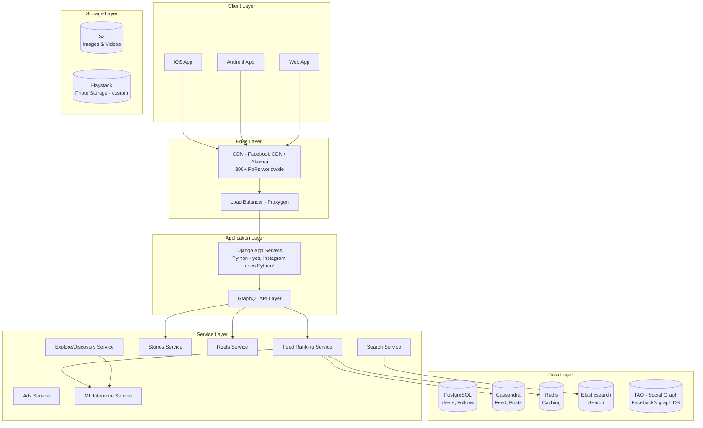

### 10.2 Instagram's Key Numbers

```
SCALE (2024-2025):
  - 2+ billion monthly active users
  - 500M+ daily Stories users
  - 100M+ photos uploaded daily
  - 4.2 billion likes per day
  - 100+ petabytes of photo storage
  - Peak: 1M+ requests per second

TECH STACK:
  Backend:     Python (Django) — yes, Python at this scale!
  Mobile:      Swift (iOS), Kotlin (Android)
  Database:    PostgreSQL, Cassandra, TAO
  Cache:       Redis, Memcached, TAO cache
  Queue:       Kafka, RabbitMQ
  Search:      Elasticsearch
  ML:          PyTorch, Caffe2
  Storage:     S3, Haystack (custom photo storage)
  CDN:         Meta CDN (custom) + Akamai

HOW THEY USE PYTHON AT SCALE:
  - Instagram is the largest Django deployment in the world
  - They modified Python's garbage collector for performance
  - Use Cython for CPU-intensive operations
  - Async I/O for network operations
  - The secret: most time is spent waiting for I/O (DB, cache),
    not CPU computation, so Python's speed doesn't matter much
```

### 10.3 Instagram Feed Algorithm (Detailed)

```
SIGNALS INSTAGRAM USES TO RANK YOUR FEED:

1. INTEREST (highest weight)
   "How much will you care about this post?"
   Based on: Your past behavior with similar content

2. RECENCY
   "How new is this post?"
   Newer posts get a boost, but it's not purely chronological

3. RELATIONSHIP
   "How close are you to the author?"
   Based on: DMs, comments, tags, profile views, mutual engagement

4. FREQUENCY
   "How often do you open Instagram?"
   If you open 20x/day: show more chronological
   If you open 2x/day: show best of since last visit

5. FOLLOWING COUNT
   "How many people do you follow?"
   Following 50 people: see most of their posts
   Following 5000 people: heavily filtered

6. SESSION TIME
   "How long do you usually browse?"
   Short sessions: show only the best
   Long sessions: dig deeper into content
```

---

## 11. Case Study: Twitter/X

### 11.1 Twitter's Architecture

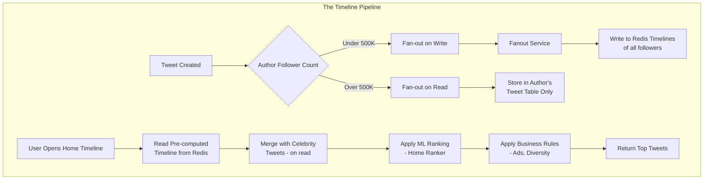

### 11.2 Twitter's Recommendation Algorithm (Open-Sourced!)

Twitter open-sourced their algorithm in March 2023. Here's how it works:

```mermaid
graph TB
    subgraph "Stage 1: Candidate Sources (1500 tweets)"
        IS[In-Network Source<br/>People you follow<br/>~50% of candidates]
        ON[Out-of-Network Source<br/>People you DON'T follow<br/>~50% of candidates]

        IS --> IS1[Real Graph: Predicts likelihood<br/>of engagement between users]
        ON --> ON1[Social Graph: What are people<br/>similar to you engaging with?]
        ON --> ON2[Embedding Spaces: SimClusters<br/>Community-based similarity]
        ON --> ON3[Trending: High engagement<br/>velocity tweets]
    end

    subgraph "Stage 2: Ranking (~48M model parameters)"
        IS1 --> RANK[Neural Network Ranker]
        ON1 --> RANK
        ON2 --> RANK
        ON3 --> RANK
        RANK --> |Predicts| PRED[P(like), P(retweet),<br/>P(reply), P(engage)]
    end

    subgraph "Stage 3: Filtering & Mixing"
        PRED --> FILTER[Visibility Filters<br/>Block, Mute, NSFW]
        FILTER --> MIX[Content Mixing<br/>Balance: In-network vs<br/>Out-of-network]
        MIX --> ADS[Ad Insertion]
        ADS --> FINAL[Final Timeline<br/>~20-30 tweets per page]
    end
```

### 11.3 Twitter's Key Technical Details

```
TWITTER'S STACK:
  Backend:    Java (JVM), Scala
  Frontend:   React (Web), Swift (iOS), Kotlin (Android)
  Database:   Manhattan (custom distributed DB), MySQL
  Cache:      Redis, Memcached, Twemcache (custom)
  Queue:      Kafka
  Search:     Earlybird (custom Lucene-based)
  ML:         TensorFlow, custom inference engine
  Storage:    HDFS, S3

KEY NUMBERS:
  - 500M tweets/day
  - 200M+ daily active users
  - Peak: 20,000 tweets/second (during events like World Cup)
  - Timeline generation: ~300ms
  - Fanout: process 500M+ timeline writes/day
  - Redis: 50TB+ of timeline data in memory

TWITTER'S SIMCLUSTERS (Community Detection):
  Groups users into ~150,000 "communities" based on behavior:
  - Community 12345: "Indian Cricket Fans"
  - Community 67890: "Startup Founders"
  - Community 11111: "Political Commentators"

  You belong to multiple communities with different scores:
  User Sonu = {Indian_Cricket: 0.8, Tech_AI: 0.9, Startups: 0.5}

  Posts are also mapped to communities:
  Tweet about GPT-5 = {Tech_AI: 0.95, Startups: 0.3}

  Match score = dot product of user vector × tweet vector
  = (0.9 × 0.95) + (0.5 × 0.3) = 0.855 + 0.15 = 1.005
  → High match! Show this tweet to Sonu.
```

---

## 12. Case Study: YouTube

### 12.1 YouTube's Recommendation System

```mermaid
graph TB
    subgraph "Stage 1: Candidate Generation (Millions → Hundreds)"
        A[Billions of Videos on YouTube] --> B[Candidate Generation NN]
        B --> C[User's Watch History]
        B --> D[Search History]
        B --> E[Demographics]
        B --> F[~500 Candidate Videos]
    end

    subgraph "Stage 2: Ranking (Hundreds → Dozens)"
        F --> G[Deep Neural Network Ranker]
        G --> H[Video Features:<br/>freshness, length, CTR]
        G --> I[User Features:<br/>watch history, language]
        G --> J[Context:<br/>time of day, device]
        G --> K[~30 Ranked Videos for Homepage]
    end

    subgraph "Stage 3: Re-ranking"
        K --> L[Diversity Filter:<br/>Don't show 5 cooking videos in a row]
        L --> M[Freshness Boost:<br/>Mix in some new content]
        M --> N[Final Homepage]
    end
```

### 12.2 YouTube's Deep Neural Network

```
YOUTUBE'S TWO-STAGE MODEL (from their famous 2016 paper):

STAGE 1: CANDIDATE GENERATION
  Input: User's last 50 watched videos + search queries + context
  Model: Deep Neural Network with embedding layers
  Output: Top 500 videos from a pool of millions

  How it works:
  1. User's watch history → video embeddings → average pooling
  2. Search terms → word embeddings → average pooling
  3. User demographics → embedding
  4. Concatenate all embeddings
  5. Pass through 3 hidden layers (ReLU activation)
  6. Output: user embedding vector (256-dim)
  7. Nearest neighbor search against ALL video embeddings
  8. Return top 500 closest videos

STAGE 2: RANKING
  Input: 500 candidate videos + rich features
  Model: Deep Neural Network (much larger than Stage 1)
  Output: Predicted watch time for each video

  KEY INSIGHT: YouTube optimizes for WATCH TIME, not clicks!

  Why? Click optimization → clickbait thumbnails
  Watch time optimization → actually good content

  Features used (100+):
  - Video age (freshness)
  - Channel subscriber count
  - Number of previous views of this video
  - Time since user's last visit
  - User's average watch time
  - How many videos user has watched from this channel
  - Video embedding similarity to user's interests
  - Thumbnail click-through rate
  - Like-to-dislike ratio

RANKING FORMULA (simplified):
  Expected Watch Time = P(click) × Expected(duration_watched | clicked)

  Video A: 80% click probability × 2 min watched = 1.6 min
  Video B: 30% click probability × 8 min watched = 2.4 min
  → Video B ranks higher despite lower click probability!
```

### 12.3 YouTube's Scale

```
YOUTUBE'S NUMBERS:
  - 500+ hours of video uploaded every minute
  - 1 billion hours of video watched per day
  - 2.7 billion monthly active users
  - Serves video in 100+ countries, 80 languages
  - Uses ~10% of all internet bandwidth
  - Storage: Exabytes (1 EB = 1,000 PB = 1,000,000 TB)

VIDEO STREAMING:
  - Adaptive Bitrate Streaming (ABR)
  - Video split into 2-10 second segments
  - Each segment available in multiple qualities:
    144p, 240p, 360p, 480p, 720p, 1080p, 1440p, 4K
  - Client automatically switches quality based on bandwidth
  - Buffering: pre-loads next 30 seconds
```

---

## 13. Case Study: TikTok

### 13.1 Why TikTok's Algorithm is Different

```
INSTAGRAM / TWITTER:
  "Here are posts from people you FOLLOW"
  → Follow graph is the primary signal
  → You must follow someone to see their content

TIKTOK:
  "Here are videos you'll ENJOY, regardless of who posted them"
  → Content similarity is the primary signal
  → You can go viral with 0 followers
  → This is why TikTok is so addictive — pure content match
```

### 13.2 TikTok's For You Page (FYP) Algorithm

```mermaid
graph TB
    subgraph "Step 1: Every New Video Gets a Test"
        A[Creator Uploads Video] --> B[Show to ~500 Random Users]
        B --> C{Measure Engagement}
        C -->|High: >10% completion rate| D[Expand to ~5,000 Users]
        C -->|Low: <3% completion rate| E[Stop Promoting]
        D --> F{Still High Engagement?}
        F -->|Yes| G[Expand to ~50,000 Users]
        F -->|No| H[Cap Distribution]
        G --> I{Going Viral?}
        I -->|Yes| J[Millions of Users]
        I -->|No| K[Stable Audience]
    end
```

```mermaid
graph TB
    subgraph "Step 2: User Modeling"
        L[Your Behavior] --> M[Watch Time: How long you watched]
        L --> N[Rewatches: Did you loop the video?]
        L --> O[Shares: Did you send to friends?]
        L --> P[Comments: Did you comment?]
        L --> Q[Follows: Did you follow after watching?]
        L --> R[Scroll Speed: How fast you swiped past]

        M --> S[User Interest Model]
        N --> S
        O --> S
        P --> S
        Q --> S
        R --> S

        S --> T[Your Interest Vector:<br/>Cooking: 0.9, Dance: 0.7,<br/>Comedy: 0.8, News: 0.2]
    end
```

### 13.3 TikTok's Key Innovation: Real-Time Interest Modeling

```
TRADITIONAL APPROACH (Instagram, Twitter):
  Train model once a day on yesterday's data
  → Stale by evening

TIKTOK'S APPROACH:
  Update user interest model AFTER EVERY SWIPE

  Video 1: Cooking (watched 100%) → Interest in cooking: 0.5 → 0.7
  Video 2: Dance (watched 20%)    → Interest in dance: 0.5 → 0.4
  Video 3: Cooking (watched 100%) → Interest in cooking: 0.7 → 0.85
  Video 4: Cooking (shared!)      → Interest in cooking: 0.85 → 0.95

  By video 10, TikTok already knows your preferences.
  By video 50, it feels like it reads your mind.

  This is why TikTok is scary good at recommendations:
  It learns in REAL-TIME, not batch (daily/weekly).

FEATURE WEIGHTS (approximate):
  Video completion rate:  10x  (most important signal!)
  Rewatch/loop:           8x
  Share:                  7x
  Comment:                5x
  Like:                   3x
  Follow:                 4x
  Scroll past quickly:   -5x  (negative signal)
  "Not Interested":     -20x  (strong negative)
```

### 13.4 TikTok's Technical Stack

```
STACK:
  Backend:    Go (Golang) + Python (ML)
  Mobile:     Swift, Kotlin + cross-platform framework
  Database:   MySQL, Redis, ByteGraph (custom graph DB)
  Queue:      Kafka, RocketMQ
  ML:         PyTorch, custom inference (ByteNN)
  CDN:        Custom CDN + third-party
  Video:      Custom transcoding pipeline

KEY NUMBERS:
  - 1.5 billion monthly active users
  - Average session: 52 minutes/day (highest of any app)
  - 34 million videos uploaded daily
  - Recommendation latency: <100ms
  - Video processing: uploaded → available in <30 seconds

VIDEO PROCESSING PIPELINE:
  Upload (raw video, ~50MB)
    → Transcode to multiple qualities (720p, 1080p)
    → Extract audio (for music matching)
    → Generate thumbnail options
    → Run content moderation AI
    → Extract visual features (scene, objects, text)
    → Extract audio features (speech, music genre)
    → Index for recommendation
    → Push to CDN
  Total time: 10-30 seconds
```

---

## 14. Scaling

### 14.1 From 1 to 1 Billion Users

```mermaid
graph TB
    subgraph "Stage 1: 0-1K Users"
        A1[Single Server<br/>App + DB + Cache<br/>One laptop could handle this]
    end

    subgraph "Stage 2: 1K-100K Users"
        A2[Separate App & DB Servers]
        B2[Add Redis Cache]
        C2[Add CDN for images]
    end

    subgraph "Stage 3: 100K-1M Users"
        A3[Multiple App Servers + Load Balancer]
        B3[Database Read Replicas]
        C3[Dedicated Redis Cluster]
        D3[Message Queue for async tasks]
    end

    subgraph "Stage 4: 1M-10M Users"
        A4[Microservices Architecture]
        B4[Database Sharding]
        C4[Multiple Data Centers]
        D4[Full CDN Coverage]
    end

    subgraph "Stage 5: 10M-1B Users"
        A5[Global Distribution]
        B5[Custom Infrastructure]
        C5[ML at Scale]
        D5[Edge Computing]
    end

    A1 --> A2
    A2 --> A3
    A3 --> A4
    A4 --> A5
```

### 14.2 Detailed Scaling Journey

```
STAGE 1: THE GARAGE (0 - 1,000 users)
━━━━━━━━━━━━━━━━━━━━━━━━━━━━━━━━━━━━━

Architecture:
  [Users] → [Single Server: App + PostgreSQL + files]

What you need:
  - 1 server ($20/month on DigitalOcean)
  - Django/Express app
  - PostgreSQL database
  - Images stored on same server
  - No caching needed
  - No load balancer needed

Handles: ~100 requests/second
Cost: $20-50/month


STAGE 2: GROWING (1,000 - 100,000 users)
━━━━━━━━━━━━━━━━━━━━━━━━━━━━━━━━━━━━━━━━

Problems:
  - Database becoming slow
  - Images eating all disk space
  - Single server = single point of failure

Solutions:
  [Users] → [App Server] → [PostgreSQL] (separate server)
                         → [Redis] (caching)
                         → [S3] (images)
                         → [CDN] (image delivery)

What you add:
  - Separate database server
  - Redis for caching (sessions, hot data)
  - S3 for image storage
  - CloudFront/CDN for image delivery
  - Database backups

Handles: ~1,000 requests/second
Cost: $200-500/month


STAGE 3: SERIOUS TRAFFIC (100K - 1M users)
━━━━━━━━━━━━━━━━━━━━━━━━━━━━━━━━━━━━━━━━━━

Problems:
  - Single app server can't handle load
  - Database writes becoming bottleneck
  - Need zero-downtime deployments

Solutions:
  [Users] → [Load Balancer]
            ├── [App Server 1]
            ├── [App Server 2]  → [PostgreSQL Primary]
            └── [App Server 3]    ├── [Read Replica 1]
                                  └── [Read Replica 2]
                               → [Redis Cluster]
                               → [Kafka] (async processing)
                               → [Worker Servers] (background jobs)

What you add:
  - Load balancer (Nginx/HAProxy)
  - 3+ app servers
  - Database read replicas (reads go to replicas)
  - Redis cluster (3+ nodes)
  - Message queue (Kafka) for async tasks
  - Worker servers for email, notifications, image processing
  - Monitoring (Grafana, Prometheus)
  - CI/CD pipeline

Handles: ~10,000 requests/second
Cost: $2,000-10,000/month


STAGE 4: MILLIONS OF USERS (1M - 10M users)
━━━━━━━━━━━━━━━━━━━━━━━━━━━━━━━━━━━━━━━━━━━

Problems:
  - Monolithic app becomes unmaintainable
  - Single database can't hold all data
  - Need to deploy different features independently
  - Need multiple data centers for redundancy

Solutions:
  - Break into microservices
  - Shard database across multiple servers
  - Multiple data centers (at least 2)
  - Kubernetes for container orchestration
  - Service mesh for inter-service communication

Handles: ~100,000 requests/second
Cost: $50,000-200,000/month


STAGE 5: GLOBAL SCALE (10M - 1B+ users)
━━━━━━━━━━━━━━━━━━━━━━━━━━━━━━━━━━━━━━━━

What companies like Instagram, Twitter, TikTok do:
  - Custom-built infrastructure (not just AWS)
  - Own data centers on multiple continents
  - Custom databases (TAO, Manhattan)
  - Custom CDN networks
  - Thousands of microservices
  - ML teams of 100+ engineers
  - 10,000+ servers
  - Custom hardware for ML inference
  - Edge computing for latency reduction

Handles: 1,000,000+ requests/second
Cost: $10M-100M+/month in infrastructure
```

### 14.3 Key Scaling Patterns

```
1. HORIZONTAL SCALING (Scale Out)
   Instead of making 1 server bigger,
   add more servers.

   Before: 1 server handling 10K req/s
   After:  10 servers handling 1K req/s each = 10K req/s

   Pro: Unlimited scaling, no single point of failure
   Con: More complex (need load balancer, data consistency)

2. VERTICAL SCALING (Scale Up)
   Make 1 server bigger (more RAM, CPU, disk).

   Before: 8 GB RAM, 4 CPU cores → handles 10K req/s
   After:  256 GB RAM, 64 CPU cores → handles 50K req/s

   Pro: Simple, no code changes
   Con: Has a ceiling, expensive, single point of failure

3. DATABASE REPLICATION
   Primary: handles writes
   Replicas: handle reads (usually 80% of traffic)

   [Write] → [Primary DB]
              ├── [Replica 1] ← [Read queries]
              ├── [Replica 2] ← [Read queries]
              └── [Replica 3] ← [Read queries]

4. CQRS (Command Query Responsibility Segregation)
   Separate systems for writing and reading:

   Write Path: POST /tweet → Tweet Service → Cassandra → Kafka
   Read Path:  GET /feed → Feed Service → Redis (pre-computed)

   Each can be scaled independently.

5. EVENT-DRIVEN ARCHITECTURE
   Services communicate via events (Kafka), not direct calls:

   Post Service: "New post created!" → Kafka
   Feed Service: listens → updates feeds
   Notification Service: listens → sends notifications
   Analytics Service: listens → logs metrics
   Search Service: listens → indexes post

   Each service is independent and can fail without affecting others.
```

---

## 15. Glossary

### Key Terms Explained Simply

```
API (Application Programming Interface)
  A contract between two programs.
  "Give me user 123's data" → API returns the data.
  Like a waiter in a restaurant — takes your order, brings food.

CDN (Content Delivery Network)
  Copies of your images/videos stored in 300+ cities worldwide.
  Mumbai user gets image from Mumbai server, not USA server.
  Like having Amazon warehouses in every city.

Cache
  A fast copy of data that's expensive to compute or fetch.
  Instead of calculating 2+2 every time, remember the answer: 4.
  Redis is the most popular cache technology.

Cassandra
  A database designed for massive write throughput.
  Stores billions of rows across hundreds of servers.
  Used for: tweets, posts, messages, time-series data.

Consistent Hashing
  A way to distribute data across servers so that adding/removing
  a server only moves ~1/N of the data (N = number of servers).
  Critical for scaling Redis and database shards.

Django
  Python web framework. Instagram's entire backend is built on it.
  "The web framework for perfectionists with deadlines."

Elasticsearch
  A search engine that can find "Sachn Tendlkr" when you search
  for "Sachin Tendulkar". Used for user search, hashtag search.

Embedding
  Converting something (word, user, image) into a list of numbers
  so that similar things have similar numbers.
  "cricket" → [0.8, 0.2, 0.1] is close to "IPL" → [0.7, 0.3, 0.1]

Fan-out
  When one action triggers many downstream actions.
  "Fan-out on write": Writing a post triggers writes to all followers' feeds.
  "Fan-out on read": Reading the feed triggers fetching from all followed users.

GraphQL
  Alternative to REST API. Client specifies exactly what data it wants.
  "Give me user name and profile pic only" instead of "give me everything".
  Reduces data transfer, especially on mobile.

HDFS (Hadoop Distributed File System)
  A way to store massive files across thousands of servers.
  YouTube stores exabytes of video data using systems like this.

JWT (JSON Web Token)
  A secure token that proves "I am user 123".
  Sent with every API request in the Authorization header.
  Server can verify without checking a database.

Kafka
  A message queue/event streaming platform.
  Services publish events ("post created") and other services consume them.
  Can handle millions of messages per second.

Kubernetes (K8s)
  Manages thousands of containers (Docker) across hundreds of servers.
  Auto-scales: adds more containers when traffic spikes.
  Auto-heals: restarts containers that crash.

Load Balancer
  Distributes incoming requests across multiple servers.
  If one server dies, traffic goes to the others.
  Like a traffic cop directing cars to different lanes.

Memcached
  Simple in-memory cache (key-value).
  Faster than Redis for simple operations.
  No data structures (just strings), but simpler.

Microservices
  Instead of one big application, split into many small services.
  Feed Service, User Service, Post Service — each independent.
  Each can be developed, deployed, and scaled independently.

PostgreSQL
  Relational database. Stores structured data with relationships.
  ACID compliant (transactions are guaranteed to complete).
  Used for: users, follows, settings.

Rate Limiting
  Limiting how many requests a user can make.
  "200 requests per minute" — prevents abuse and DDoS attacks.
  Usually implemented with Redis (INCR + EXPIRE).

Redis
  In-memory database. Stores data in RAM for ultra-fast reads.
  1ms reads instead of 20ms from PostgreSQL.
  Used for: caching feeds, sessions, counters, rate limiting.

REST API
  Standard way to communicate between client and server.
  GET /users/123 → returns user data
  POST /posts → creates a new post
  DELETE /posts/456 → deletes a post

S3 (Simple Storage Service)
  AWS object storage. Stores files (images, videos) at massive scale.
  99.999999999% durability (11 nines).
  Instagram stores 100+ petabytes here.

Sharding
  Splitting a database across multiple servers.
  Users A-M → Server 1, Users N-Z → Server 2.
  Allows horizontal scaling of databases.

WebSocket
  Persistent two-way connection between client and server.
  Server can push data to client without client asking.
  Used for: chat, typing indicators, live updates.
```

---

## Summary: Architecture Comparison

```
FEATURE          INSTAGRAM      TWITTER/X       YOUTUBE         TIKTOK
━━━━━━━━━━━━━━━━━━━━━━━━━━━━━━━━━━━━━━━━━━━━━━━━━━━━━━━━━━━━━━━━━━━━━
Primary Lang     Python         Java/Scala      Python/C++      Go
Feed Strategy    Fan-out Write  Hybrid          Pre-computed    Content-first
Ranking Signal   Relationship   Engagement      Watch Time      Completion Rate
Update Freq      Daily ML       Weekly ML       Daily ML        Real-time ML
Main DB          PostgreSQL     Manhattan       Bigtable        MySQL
Cache            Redis          Redis+Twemcache Redis           Redis
Search           Elasticsearch  Earlybird       Custom          Custom
Content Type     Photos/Video   Text/Media      Video           Short Video
MAU              2B+            600M+           2.7B+           1.5B+
Key Innovation   Visual-first   Real-time       Watch-time opt  Real-time learning
```

---

*This document covers the complete system design of social media feed personalization, from frontend caching to ML ranking models. Each section builds on the previous one, taking you from beginner concepts (what is a cache?) to advanced architecture (multi-datacenter fan-out with ML ranking).*
